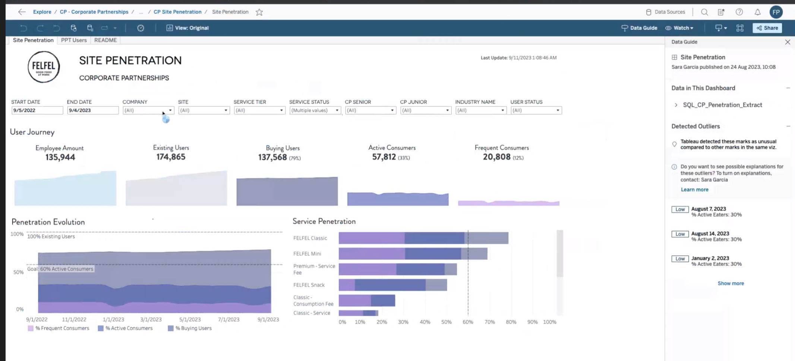

# Tableau Integration

Connect with Tableau to&#x20;

1\) find and document important workbooks

2\) see lineage from tables to workbooks or columns to visualizations

3\) get an overview of what is most used

## Connection Settings

Both Tableau Online or Tableau Server (2019.3 or later) are supported.

### Tableau Online

**Connection**

Hostname expects the url of the online instance. Site expects the site name.

.png>)

**Authentication**

Generate a Personal Access Token with a user who is either "Site Admin Explorer" or "Site Admin Creator".&#x20;

1. Open “My Account Settings“

2\. Go to the section “Personal Access Tokens”

.png>)

3\. Create new token with name “**sled**”

4\. Copy token secret to clipboard and save it. This token is valid for 1 year and will need to be refreshed.

Alternatively Username and Password can be used if no MFA is enabled.&#x20;

### **Tableau Server**

For connecting from the Cloud with Tableau server, please coordinate with our customer success team [hi@sled.so](mailto:hi@sled.so). A typical network setup uses OpenVPN or AWS PrivateLink.

Make sure the meta data API is enabled.&#x20;

[https://help.tableau.com/current/api/metadata\_api/en-us/docs/meta\_api\_start.html#enable-the-tableau-metadata-api-for-tableau-server](https://help.tableau.com/current/api/metadata\_api/en-us/docs/meta\_api\_start.html#enable-the-tableau-metadata-api-for-tableau-server)

