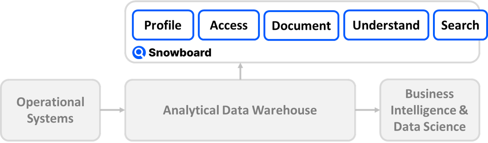

Get Started
===========

## Deployment

1. Install [`docker`](https://docs.docker.com/engine/install/) and [`docker-compose`](https://docs.docker.com/compose/install/)
2. Create a directory called `snowboard`
3. Download the Docker Compose configuration file: [`docker-compose.yml`](https://raw.githubusercontent.com/zurferr/snowboard_software/main/docs/docker-compose.yml "Download file") (not working yet)
4. Start the deployment with `docker-compose up`
5. The Snowboard Data Catalog is now ready on [https://localhost](https://localhost) or your server address
6. Set a new admin password
7. [Configure Snowflake Database Connection](snowflake_connection.md)
8. Configure SSL Certificate _(optional)_

## Overview

The Snowboard Data Catalog connects directly with your cloud data warehouse.
It needs access to the system database and tables of the warehouse (e.g. in `SNOWFLAKE.ACCOUNT_USAGE`).

Snowboard then provides the ability to quickly and automatically: 
- profile data
- view access rights and ownership
- document information objects 
- understand relationships between tables
- search everything

