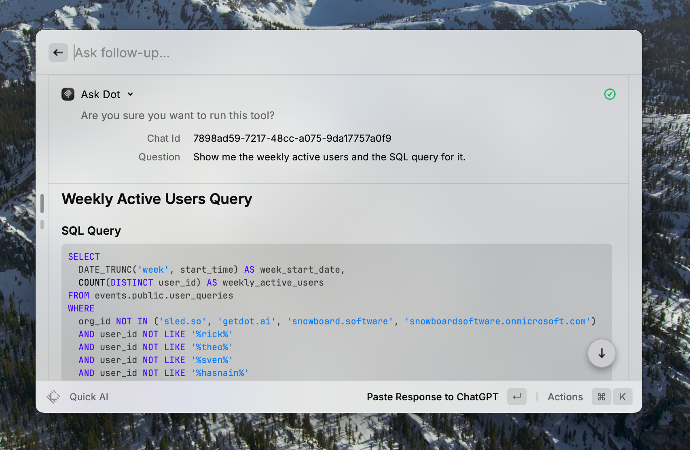

# Asset Sale (Ownership Transfer)

**Definition (short).** You earn money by selling a product once and transferring ownership. After that upfront payment, obligations are limited (warranty, support). Classic manufacturing/retail: revenue = units × price.

**Recent examples.** Apple Inc. exemplifies asset sales: [**51% of Apple’s \~$391 billion FY 2024 revenue came from iPhone hardware**](https://www.businessofapps.com/data/apple-statistics/?utm_source=chatgpt.com), a one-time purchase product line. Automakers like Toyota and consumer electronics giants such as Samsung also rely on outright product sales as their core revenue engines.

**Historical example.** The Ford Model T sold [**over 15 million units between 1908 and 1927**](https://en.wikipedia.org/wiki/Ford_Model_T), proving that scale manufacturing plus a single upfront price could transform affordability—and a company’s economics.

<figure><figcaption></figcaption></figure>

#### KPI Definitions (matches the nodes above)

1.  **Profitable Growth (composite)**

    _EN:_ Balanced growth in revenue with healthy profitability.

    _Pseudo:_  `w1 * Revenue_Growth% + w2 * Net_Profit_Margin%` or `Grow revenue while NPM ≥ threshold`.

    _Why:_ Forces trade-off clarity—no growth-at-all-costs or margin-at-all-costs blind spots.

    _Benchmark:_ Exec teams often set explicit weights or guardrails (e.g., “≥10% growth AND NPM ≥20%”).
2. **Revenue Growth %**\
   &#xNAN;_&#x45;N:_ YoY % change in product revenue.\
   &#xNAN;_&#x50;seudo:_ `(Rev_t − Rev_{t−1}) / Rev_{t−1} * 100`\
   &#xNAN;_&#x57;hy:_ First read on demand, pricing power, and market share shifts. Sustained high growth buys strategic optionality.\
   &#xNAN;_&#x42;enchmark:_ Mature manufacturers often grow \~5–8% YoY, while top-decile durables can exceed 20% in expansion phases.
3. **Gross Margin %**\
   &#xNAN;_&#x45;N:_ Share of revenue retained after COGS.\
   &#xNAN;_&#x50;seudo:_ `(Revenue − COGS) / Revenue * 100`\
   &#xNAN;_&#x57;hy:_ Core unit economics; funds SG\&A, R\&D, profit.\
   &#xNAN;_&#x42;enchmark:_ Consumer electronics median ≈ 30%; Apple’s overall gross margin hit **\~46.9% in Q1 FY25**.
4. **Units Sold**\
   &#xNAN;_&#x45;N:_ Total items delivered in period.\
   &#xNAN;_&#x50;seudo:_ `Σ units_sold`\
   &#xNAN;_&#x57;hy:_ Volume driver; reveals penetration and lifecycle stage.\
   &#xNAN;_&#x42;enchmark:_ Flagship auto models sell \~1 M units/year; niche B2B devices sell in the thousands.
5. **Average Selling Price (ASP)**\
   &#xNAN;_&#x45;N:_ Realized average price per unit after discounts.\
   &#xNAN;_&#x50;seudo:_ `Revenue / Units_Sold`\
   &#xNAN;_&#x57;hy:_ Signals pricing power and mix (premium vs entry). Rising ASP can offset flat volume.\
   &#xNAN;_&#x42;enchmark:_ iPhone ASP ≈ $800, while global smartphone ASP sits near $285–300.
6. **Net Profit Margin %**\
   &#xNAN;_&#x45;N:_ Net income as % of revenue.\
   &#xNAN;_&#x50;seudo:_ `Net_Income / Revenue * 100`\
   &#xNAN;_&#x57;hy:_ Bottom-line health; compresses strategy + execution into one number.\
   &#xNAN;_&#x42;enchmark:_ Premium hardware firms \~15–25%; big-box retail often 2–4%. Apple FY 24 \~24–25%.
7. **Operating Expense Ratio %**\
   &#xNAN;_&#x45;N:_ SG\&A + R\&D as % of revenue.\
   &#xNAN;_&#x50;seudo:_ `Opex / Revenue * 100`\
   &#xNAN;_&#x57;hy:_ Cost leverage; shows whether scale translates to profit.\
   &#xNAN;_&#x42;enchmark:_ Lean manufacturers 10–15%; many tech-heavy hardware players hover \~20%.
8. **Inventory Turnover (x)**\
   &#xNAN;_&#x45;N:_ Times inventory turns per year.\
   &#xNAN;_&#x50;seudo:_ `COGS / Avg_Inventory`\
   &#xNAN;_&#x57;hy:_ Working-capital efficiency; slow turns trap cash and risk obsolescence.\
   &#xNAN;_&#x42;enchmark:_ Durable goods 5–8x; fast fashion >10x.
9. **Number of Customers**\
   &#xNAN;_&#x45;N:_ Distinct purchasing customers in period.\
   &#xNAN;_&#x50;seudo:_ `COUNT(DISTINCT customer_id)`\
   &#xNAN;_&#x57;hy:_ Market breadth and concentration risk indicator.\
   &#xNAN;_&#x42;enchmark:_ B2C brands = millions; capital equipment vendors = dozens/hundreds.
10. **Units per Customer**\
    &#xNAN;_&#x45;N:_ Average quantity each customer buys.\
    &#xNAN;_&#x50;seudo:_ `Units_Sold / Customers`\
    &#xNAN;_&#x57;hy:_ Captures repeat purchase and bundle depth.\
    &#xNAN;_&#x42;enchmark:_ Big-ticket durables ≈1; consumables/accessories 3–5+.
11. **List Price**\
    &#xNAN;_&#x45;N:_ MSRP before discounts.\
    &#xNAN;_&#x50;seudo:_ `MSRP_value`\
    &#xNAN;_&#x57;hy:_ Psychological anchor; defines promo headroom.\
    &#xNAN;_&#x42;enchmark:_ Premium brands often list 20–50% above category medians.
12. **Discount Rate %**\
    &#xNAN;_&#x45;N:_ Average markdown from list to realized price.\
    &#xNAN;_&#x50;seudo:_ `(List − Realized) / List * 100`\
    &#xNAN;_&#x57;hy:_ Tracks promo dependency and margin leakage.\
    &#xNAN;_&#x42;enchmark:_ Consumer electronics promos 10–15%; luxury <5% except controlled clearance.
13. **COGS per Unit**\
    &#xNAN;_&#x45;N:_ Direct cost per unit.\
    &#xNAN;_&#x50;seudo:_ `COGS / Units_Sold`\
    &#xNAN;_&#x57;hy:_ Every dollar saved drops to gross margin; core lean initiative.\
    &#xNAN;_&#x42;enchmark:_ Targets of 2–5% YoY reduction are common in best-in-class ops.
14. **Days of Inventory (DOI)**\
    &#xNAN;_&#x45;N:_ Average days inventory sits before sale.\
    &#xNAN;_&#x50;seudo:_ `365 / Inventory_Turnover`\
    &#xNAN;_&#x57;hy:_ Cash velocity and obsolescence risk measure.\
    &#xNAN;_&#x42;enchmark:_ Best-in-class electronics <45 days; typical manufacturers 60–90 days.
