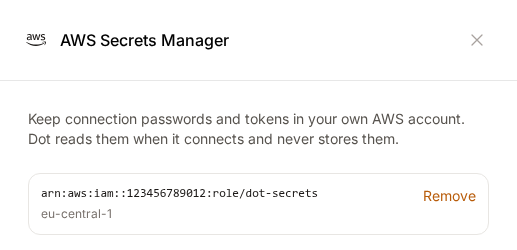
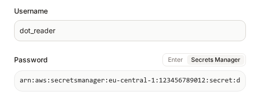
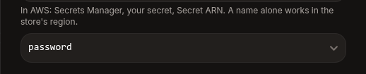

# AWS Secrets Manager

You can keep the passwords, keys and tokens of your connections in your own AWS Secrets Manager instead of typing them into Dot. Dot reads a secret when it connects to your database and never stores it.

Dot signs in to your AWS account without an access key. You register Dot as an identity provider in IAM and create a role that trusts only your Dot workspace. Dot then asks AWS for short-lived access to that role whenever it needs a secret.

## Connect your AWS account

Only admins can set this up. Go to **Settings → Connections**, scroll to **Secret Managers** and open **AWS Secrets Manager**. The card shows the values you need, filled in for your workspace.

### 1. Add Dot as an identity provider

1. In the AWS console, open **IAM → Identity providers → Add provider**.
2. Choose **OpenID Connect**.
3. For **Provider URL**, paste the provider URL from the card, for example `https://app.getdot.ai/api/oidc`.
4. For **Audience**, enter `sts.amazonaws.com`.
5. Click **Add provider**.

### 2. Create a role for Dot

1. In IAM, create a role and choose **Web identity** as the trusted entity.
2. Pick the identity provider you just added and the audience `sts.amazonaws.com`.
3. Replace the role's trust policy with the one on the card. It only lets your workspace in, by its subject `org:<your workspace>`:

```json
{
  "Version": "2012-10-17",
  "Statement": [
    {
      "Effect": "Allow",
      "Principal": { "Federated": "arn:aws:iam::<ACCOUNT_ID>:oidc-provider/app.getdot.ai/api/oidc" },
      "Action": "sts:AssumeRoleWithWebIdentity",
      "Condition": {
        "StringEquals": {
          "app.getdot.ai/api/oidc:aud": "sts.amazonaws.com",
          "app.getdot.ai/api/oidc:sub": "org:<your workspace>"
        }
      }
    }
  ]
}
```

4. Give the role permission to read only the secrets Dot should use. The card suggests keeping them under a `dot/` prefix:

```json
{
  "Version": "2012-10-17",
  "Statement": [
    {
      "Effect": "Allow",
      "Action": "secretsmanager:GetSecretValue",
      "Resource": "arn:aws:secretsmanager:<REGION>:<ACCOUNT_ID>:secret:dot/*"
    }
  ]
}
```

If your secrets are encrypted with your own KMS key, also allow `kms:Decrypt` on that key.


Copy both policies from the card rather than from this page. The card fills in your account, your region and your workspace's exact provider URL and subject.


### 3. Connect the role in Dot

1. On the card, paste the role ARN, for example `arn:aws:iam::123456789012:role/dot-secrets`.
2. Enter the region your secrets live in, for example `eu-central-1`.
3. Optionally, enter a secret you want to try and click **Test**. Dot confirms that it can sign in, and that it can read the secret.
4. Click **Save**.

<figure><figcaption><p>A connected role</p></figcaption></figure>

To use more than one AWS account or role, click **Add a role**. Connections then let you pick which role to use.

## Use a secret in a connection

Once a role is connected, every credential field of a supported connection gets a switch: **Enter** or **Secrets Manager**.

1. Open the connection and click **Secrets Manager** next to the password, key or token.
2. Paste the secret's ARN. In the AWS console you find it under **Secrets Manager →** your secret **→ Secret ARN**. The secret's name also works if it lives in the region you entered on the card.
3. Dot reads the secret and lists its keys, without their values. Pick the key that holds this credential. Dot picks the matching one for you when it can, such as `password`.
4. Fill in the other fields and click **Connect**.

<figure><figcaption><p>A password read from AWS Secrets Manager</p></figcaption></figure>

<figure><figcaption><p>Pick the key that holds the password</p></figcaption></figure>

A secret that holds plain text instead of key/value pairs is used as it is. If Dot cannot read a secret, the reason from AWS shows right below the field.

Each connection points to its own secrets. With several databases, give each one its own secret, or let them share one secret and pick different keys.

### Supported connections

- Snowflake: password, private key and passphrase
- BigQuery: service account key
- Postgres, Redshift, Supabase, Microsoft SQL Server, MySQL / MariaDB, Oracle, SAP HANA and Clickhouse: password
- Databricks: access token
- Microsoft Fabric: password or client secret
- AWS Athena: secret access key
- Firebolt: client secret
- SSH tunnels: password and private key
- dbt Repository, Code Repository and Malloy repository: personal access token

## How Dot handles your secrets

- Dot fetches a secret when it connects and keeps it in memory for up to five minutes. It is never written to Dot's database.
- When you rotate a secret in AWS, Dot uses the new value within five minutes.
- The access Dot gets from AWS lasts at most an hour, and the token Dot uses to ask for it lasts five minutes.
- A role only trusts the workspace named in its trust policy. Another workspace, or another Dot customer, cannot use it.
- Every workspace has its own subject. When you copy a workspace, add the new workspace's subject to the role's trust policy. Dot tells you the subject when it copies the workspace.
- You can't remove a role while connections still use it. Switch those connections to another role or back to **Enter** first.
