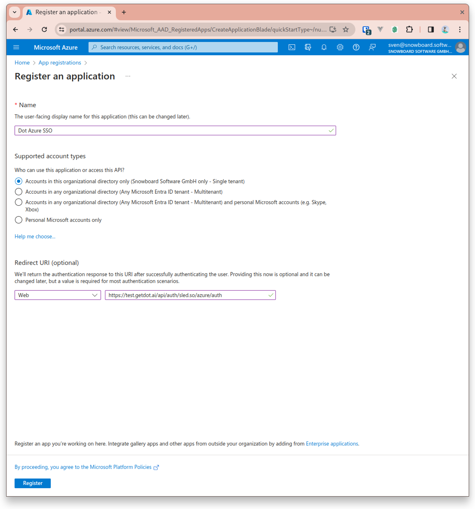
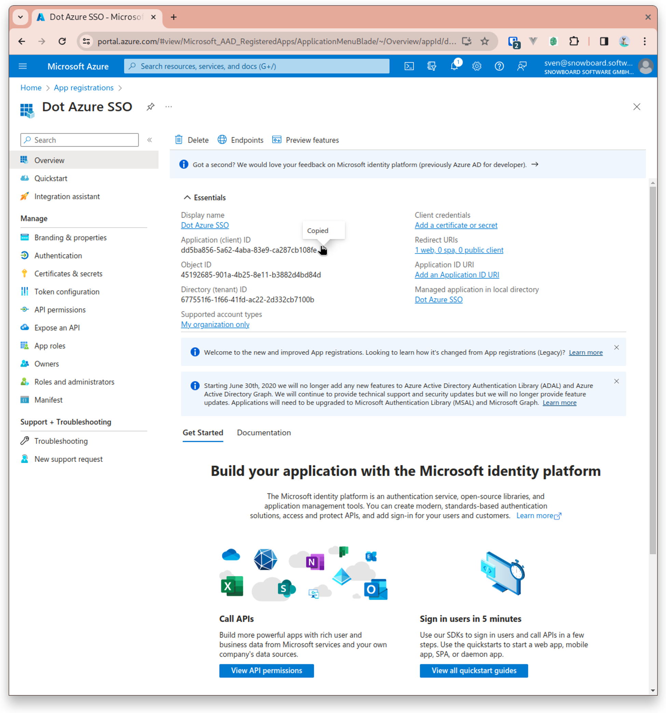
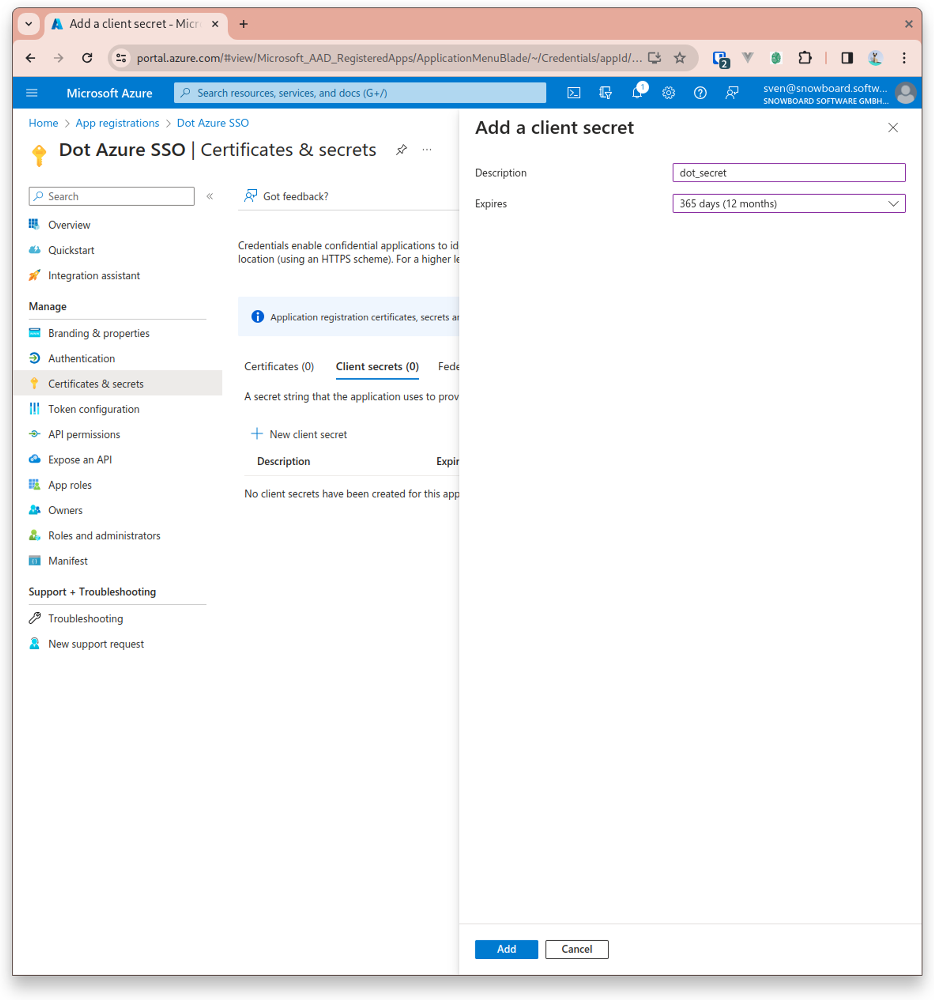
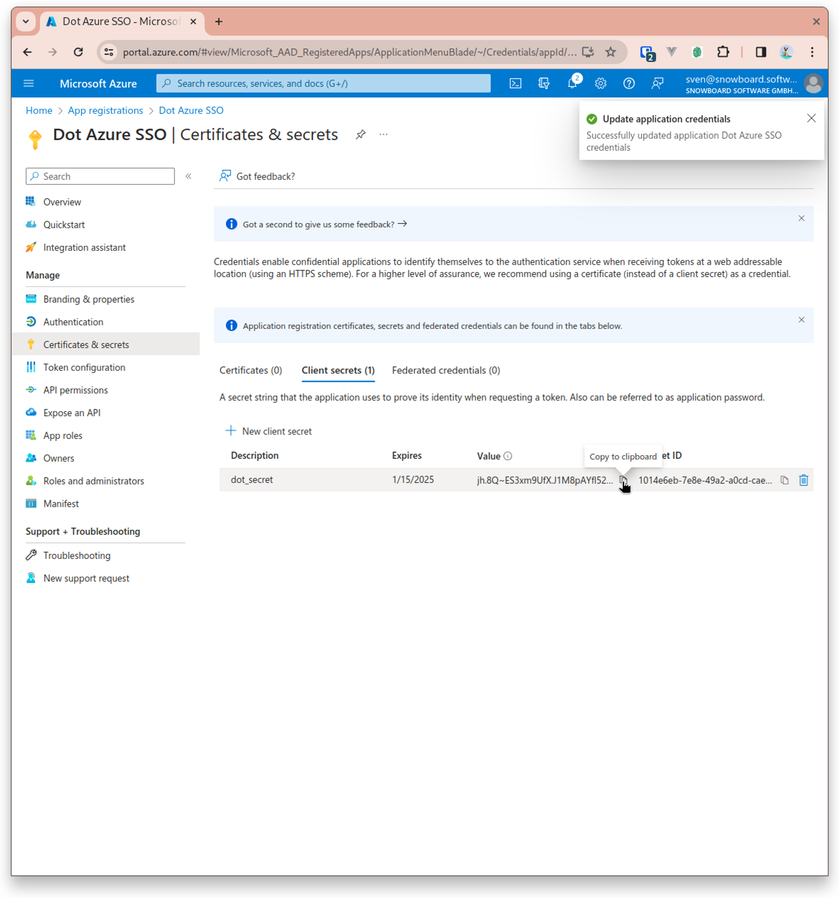

# Azure Active Directory

## Integrating Single Sign-On (SSO) with Azure for Dot

Follow these steps to create and configure a Single Sign-On (SSO) integration with Microsoft Azure for the Dot application.

### Step 1: Register a New Application in Azure

1. Go to the Azure portal and navigate to **Azure Active Directory** > **App registrations**.
2. Click on **New registration**.

### Step 2: Application Registration

1. Enter the name of the application, for example, `Dot Azure SSO`.
2. Under **Supported account types**, select the relevant option for your organization.
3. For the **Redirect URI**, input the URI provided by your Dot settings.

<figure><figcaption></figcaption></figure>

### Step 3: Application Overview

1. Once the application is registered, you will be redirected to the application's overview page.
2. Copy the **Application (client) ID** and **Directory (tenant) ID** and save it for later use.

<figure><figcaption></figcaption></figure>

### Step 4: Certificates & Secrets

1. In the application's menu, click on **Certificates & secrets**.
2. Click on **New client secret**.
3. Add a description for the secret and set an expiry as required.
4. Once created, copy the value of the client secret.

<figure><figcaption></figcaption></figure>

### Step 5: Adding the Client Secret

1. You can now see the newly created client secret listed.
2. Note the secret's value, as it will be used in the Dot application configuration.

<figure><figcaption></figcaption></figure>

### Step 6: Integrating with Dot

1. With the **Application (client) ID** and **Client Secret** copied, navigate to your Dot settings.
2. Paste these values into the corresponding fields in the Dot Azure SSO settings.

### Step 7: Metadata URL

1. The Metadata URL is essential for SSO operations. Construct it using your Azure tenant ID that you have got in step 3:
   * Format: `https://login.microsoftonline.com/{tenant-id}/v2.0/.well-known/openid-configuration`

### Finalizing the Integration

Once you've completed the above steps:

1. Save the configuration in Dot.
2. Test the SSO integration to ensure that it's functioning correctly.

## Configure Which Users Get Access

1. In Azure, go to the "Enterprise application" created for Dot authentication and on the left change to "Manage" -> "Users and Groups"
2. Press "Add user / group" and then add single users or groups that should be able to login

<figure><figcaption></figcaption></figure>

3. Then on the left change to "Manage" -> "Properties"

<figure><figcaption></figcaption></figure>

4. Activate "Assignment required" → Now only users directly assign to this application by user or group can use the SSO in Dot to login
