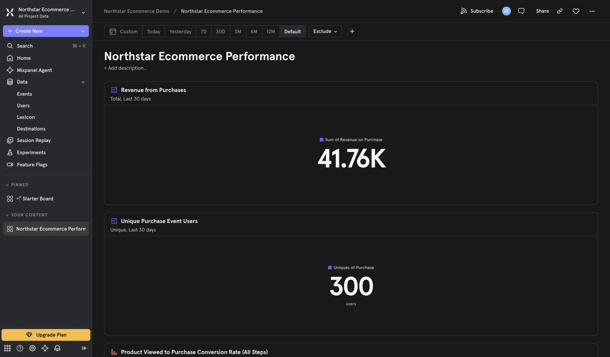
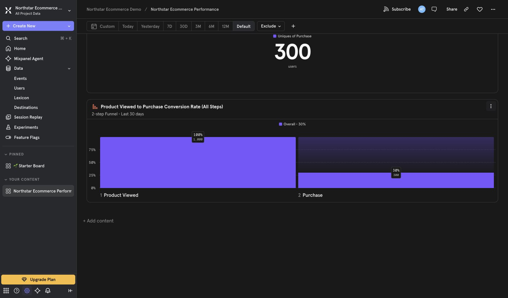
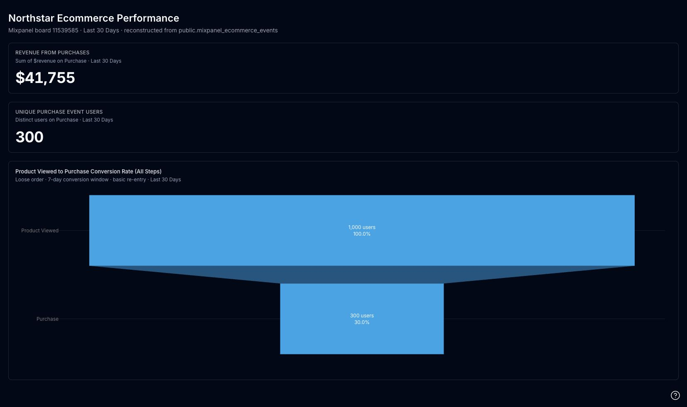
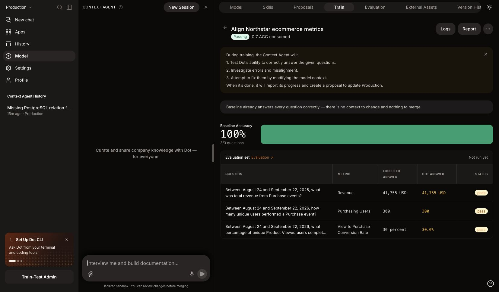

# BI Tools

Connect the BI tools your team already uses, like Tableau, Metabase, Sigma, and Qlik. Dot reads your dashboards to learn how your business defines its metrics. That way its answers match the numbers people already trust.

Once a BI tool is connected, there's a second thing you can do: rebuild one of its dashboards as a Dot app.

## Migrate a dashboard to Dot

You can turn a Tableau, Metabase, Sigma, or Mixpanel dashboard into a Dot app. Ask Dot to migrate a dashboard by name and it recreates it piece by piece, with the same metrics, charts, and layout, but now backed by live SQL you can question and change in plain language.

Why do this? Some teams want to move off their BI tool and keep the dashboards they rely on. Others just want a live, conversational version sitting next to the original, so anyone can drill in without opening the BI tool.

Dot checks its own work as it goes. For each tile it compares its result against the original and marks whether the two match. When every tile matches, the migration is a true copy of the dashboard. If a tile can't be matched exactly, Dot tells you which one, so you can decide whether the difference matters.

To try it, connect the BI tool first, then ask Dot something like "migrate our Weekly Revenue dashboard from Tableau."

## Mixpanel

Connect Mixpanel when you want Dot to read dashboards, report definitions, event definitions, cohorts, funnels, and saved report results. Dot reads this information when it needs it. It does not import events or change your Mixpanel project.

Dot can rebuild a Mixpanel board as a Dot app. It reads the board layout and every saved report definition, then maps those definitions to the same events in your connected warehouse. If your Mixpanel plan includes Query API access, Dot can also read report values directly from Mixpanel. Without Query API access, Dot can still rebuild the board after you explicitly accept warehouse reconstruction.

### Before you connect

Create a service account for the project you want to connect:

1. Open **Organization Settings** in Mixpanel.
2. Select **Projects**, then open the project.
3. Open **Service Accounts**.
4. Select **Add Service Account**.
5. Name it after the connection, for example `dot-northstar-reader`.
6. Choose the **Consumer** project role and scope it only to the project you want Dot to read.
7. Save the username and secret. Mixpanel shows the secret once.

Consumer is enough for this connection. Do not grant Admin just to connect Mixpanel to Dot.

<figure><figcaption>
Use a project-scoped Consumer service account.
</figcaption></figure>

### Connect the project in Dot

1. Open **Settings → Connections**.
2. Search for **Mixpanel** and open the connection.
3. Enter the service account username and secret.
4. Enter the Mixpanel Project ID.
5. Select the Mixpanel project region. Dot uses this to send requests to the right regional API.
6. Enter the Data View workspace ID only if the project uses Data Views. Otherwise, leave it blank.
7. Select **Connect Mixpanel**.

Dot validates the service account by reading the project's dashboard list. Query API access is not required to connect, discover boards, or read report definitions. It is required only when Dot needs live aggregate values directly from Mixpanel.

<figure><figcaption>
Enter the Consumer service account and the settings for its project.
</figcaption></figure>

There is no manual sync button. Dot reads Mixpanel live when it needs the latest definitions. Use **Edit** to change credentials, project, region, or Data View workspace, and **Remove** to disconnect it.

### Rebuild a board and train Dot

Send Dot the Mixpanel board URL and ask it to rebuild the board as an app. Dot inventories the full board, keeps the report order and settings, maps the event logic to warehouse data, builds the app, and checks that every query renders.

The example below uses a project-scoped Consumer service account on a Mixpanel plan without Query API access. The warehouse reconstruction was explicitly accepted. The Mixpanel board shows $41.76K revenue, 300 purchasers, and 30% conversion from 1,000 product viewers to 300 purchasers.

<figure><figcaption>
Source Mixpanel board: revenue and unique purchasers.
</figcaption></figure>

<figure><figcaption>
Source Mixpanel funnel: 1,000 product viewers, 300 purchasers, and 30% conversion.
</figcaption></figure>

<figure><figcaption>
The rebuilt Dot app preserves all three metrics and their order.
</figcaption></figure>

You can also use the report definitions as evaluation sources in Train. Use fixed, completed dates. Values read directly through the Query API are Mixpanel reads; values computed from the warehouse must be marked as reconstructed and explicitly accepted before they become ground truth.

<figure><figcaption>
Train verifies revenue, unique purchasers, and conversion against the accepted source values.
</figcaption></figure>

## Connect a BI tool

* [Tableau](tableau.md)
* [Metabase](metabase.md)
* [Sigma](sigma.md)
* [Qlik](qlik.md)
* [Mixpanel](#mixpanel)
