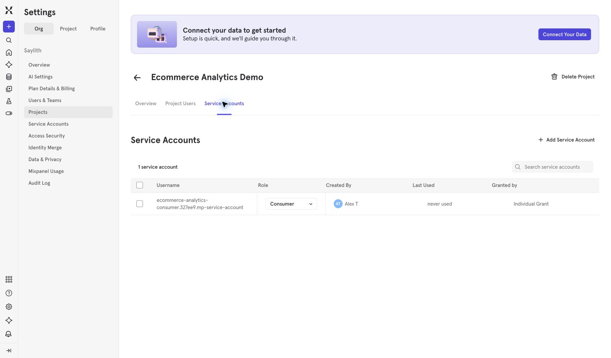
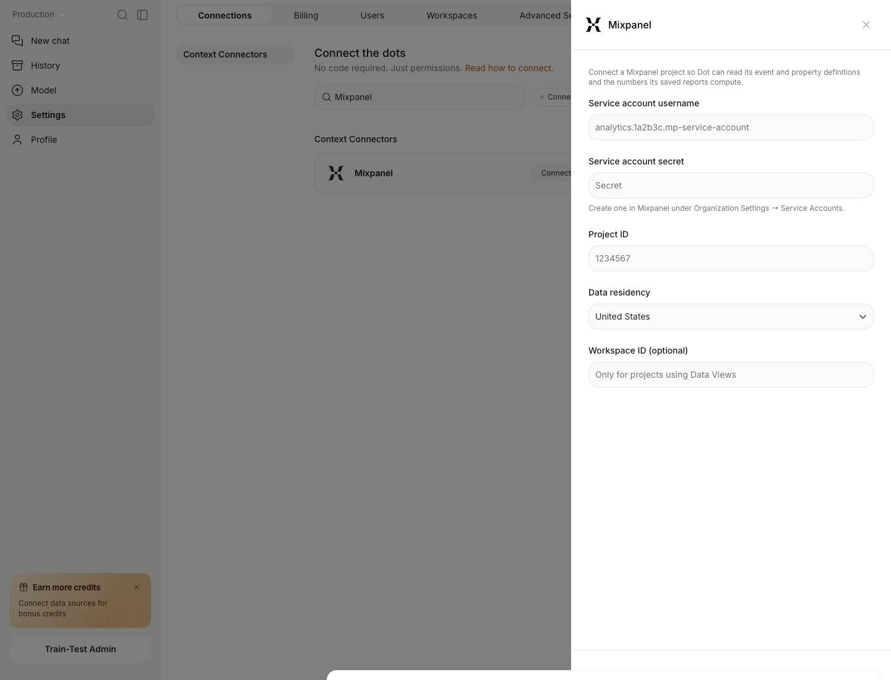

# BI Tools

Connect the BI tools your team already uses, like Tableau, Metabase, Sigma, and Qlik. Dot reads your dashboards to learn how your business defines its metrics. That way its answers match the numbers people already trust.

Once a BI tool is connected, there's a second thing you can do: rebuild one of its dashboards as a Dot app.

## Migrate a dashboard to Dot

You can turn a Tableau, Metabase, or Sigma dashboard into a Dot app. Ask Dot to migrate a dashboard by name and it recreates it piece by piece, the same charts and tables and layout, but now backed by live SQL you can question and change in plain language.

Why do this? Some teams want to move off their BI tool and keep the dashboards they rely on. Others just want a live, conversational version sitting next to the original, so anyone can drill in without opening the BI tool.

Dot checks its own work as it goes. For each tile it compares its result against the original and marks whether the two match. When every tile matches, the migration is a true copy of the dashboard. If a tile can't be matched exactly, Dot tells you which one, so you can decide whether the difference matters.

To try it, connect the BI tool first, then ask Dot something like "migrate our Weekly Revenue dashboard from Tableau."

## Mixpanel

Connect Mixpanel when you want Dot to read your event definitions, cohorts, funnels, and saved report results. Dot reads this information when it needs it. It does not import events or change your Mixpanel project.

### Before you connect

Your Mixpanel plan must include Query API access. Mixpanel rejects these reads on plans without it, even when the service account is valid.

Create a service account for the project you want to connect:

1. Open **Organization Settings** in Mixpanel.
2. Select **Projects**, then open the project.
3. Open **Service Accounts**.
4. Select **Add Service Account**.
5. Choose the **Consumer** project role.
6. Save the username and secret. Mixpanel shows the secret once.

Consumer is enough for this connection. Do not grant Admin just to connect Mixpanel to Dot.

<figure><figcaption>
Use a project-scoped Consumer service account.
</figcaption></figure>

### Connect the project in Dot

1. Open **Settings → Connections**.
2. Search for **Mixpanel** and open the connection.
3. Enter the service account username and secret.
4. Enter the Mixpanel Project ID.
5. Select the project's data residency.
6. Enter a Workspace ID only if the project uses Data Views.
7. Select **Connect Mixpanel**.

Dot saves the connection only after Mixpanel confirms that the account can use the Query API for that project. If the project plan does not include Query API access, Dot tells you to upgrade the plan and leaves the connection unsaved.

<figure><figcaption>
Enter the Consumer service account and the settings for its project.
</figcaption></figure>

## Connect a BI tool

* [Tableau](tableau.md)
* [Metabase](metabase.md)
* [Sigma](sigma.md)
* [Qlik](qlik.md)
* [Mixpanel](#mixpanel)
