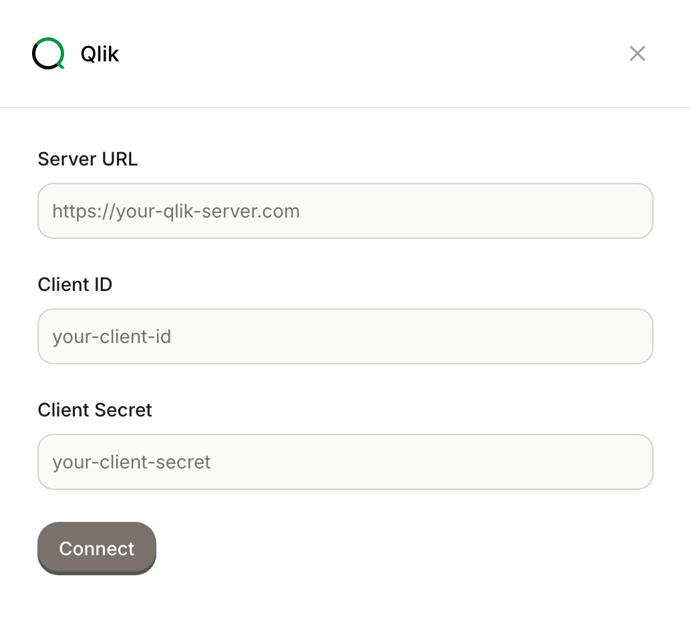

# Qlik

Connect your Qlik Cloud tenant and Dot can read your Qlik apps. It uses them the same way it uses your other BI tools: to learn which metrics your team trusts and how your dashboards define them, so its own answers line up with what people already look at.

## What you need

In your Qlik Cloud tenant, create an OAuth client (Qlik calls this a machine-to-machine OAuth client). From it, get these three values:

* Your Qlik server URL, for example `https://your-tenant.qlikcloud.com`
* The Client ID
* The Client Secret

## Connect it

1. Sign in to Dot as an admin.
2. Open Settings, then Connections, and find the BI Tools section.
3. Click Qlik.
4. Enter your server URL, Client ID, and Client Secret.
5. Click Connect.

<figure><figcaption>
Connect Qlik with your server URL and OAuth client credentials.
</figcaption></figure>

Once connected, Dot syncs your Qlik apps and can reference them when it answers questions and when it builds your data model. To see what it picked up, head over to the Model page.
