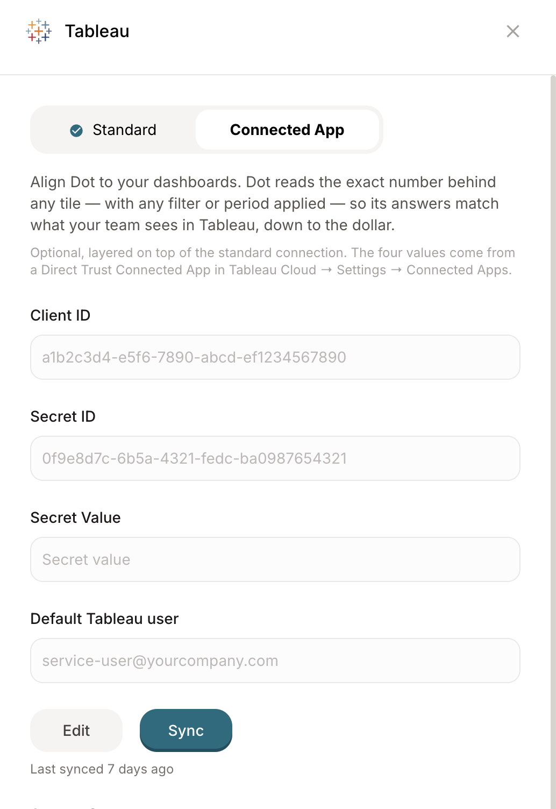

# Tableau

Both Tableau Cloud (Online) or Tableau Server (2019.3 or later) are supported.

## Tableau Online 

**Authentication**

Generate a Personal Access Token with a user who is either "Site Admin Explorer" or "Site Admin Creator".

1. Open “My Account Settings“

2\. Go to the section “Personal Access Tokens”

3\. Create new token

4\. Copy token secret to clipboard and save it. This token is valid for 1 year and will need to be refreshed.

## **Tableau Server** 

The setup is identical to Tableau Cloud. If your server is not reachable from the internet, please coordinate with our customer success team [hi@getdot.ai](mailto:hi@getdot.ai) — a typical network setup uses OpenVPN.

## Connected App 

A site administrator sets it up in Tableau:

1. Go to **Settings → Connected Apps** and create a new app of type **Direct Trust**. On Tableau Server this lives in the site settings and requires version 2022.1 or later (earlier versions expose connected apps only via the REST API).
2. Add the Dot host your workspace runs on to the app's domain allowlist — Tableau refuses the embed otherwise.
3. Generate a secret and copy three values: **Client ID**, **Secret ID** and **Secret Value**. Secret ID and Secret Value are easy to mix up.

## Connect in Dot

Enter your details, hit connect and watch it sync. As soon as it's done, you can head over to **Model /External assets** to further curate what Dot should know about.

<figure><figcaption></figcaption></figure>

Open the connection's **Connected App** tab, paste the three values from Tableau and enter the email of a Tableau admin user.

<figure><figcaption></figcaption></figure>

Use an existing licensed Tableau login, ideally an admin so it can see every workbook — Dot does not create a user and does not need an extra licence. When someone asks a question, Tableau applies that person's own permissions, so everyone sees exactly what they already see in Tableau.

## What Dot needs access to 

The same three things apply to Tableau Cloud and Tableau Server:

1. The **Metadata API** is enabled. On Tableau Cloud it always is. On Tableau Server an administrator enables it once with `tsm maintenance metadata-services enable` — see [Tableau's guide](https://help.tableau.com/current/api/metadata_api/en-us/docs/meta_api_start.html#enable-the-tableau-metadata-api-for-tableau-server). Without it Dot still lists workbooks and views, but loses the lineage to warehouse tables and can't see calculated-field definitions.

2. Dot's IPs are allowlisted: `5.78.211.110` and `178.105.217.177`.
3. The paths Dot needs are reachable: `/api/*` for catalog and metadata, and — for exact tile values — `/javascripts/*`, `/views/*`, `/vizql/*` and `/vizportal/*`. If only `/api/*` is reachable, the connection looks healthy and the catalog syncs, while exact values silently don't work.
