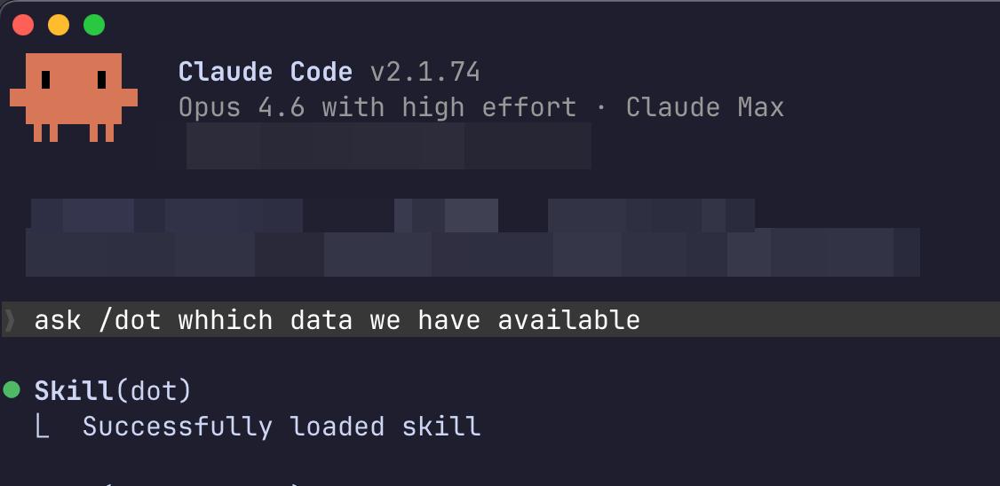

# CLI & AI Agent Skill

Most data questions interrupt your flow. You leave your editor, open Dot in the browser, wait for an answer, copy it back. The Dot skill eliminates that loop entirely.

Once installed, your AI coding assistant can query your company's databases directly. Ask Claude Code "what were our top customers last quarter?" and it writes SQL, runs the query, and gives you the answer — without you ever leaving the terminal.

<figure><figcaption><p>Type /dot in Claude Code to query your company data</p></figcaption></figure>

It works with **Claude Code**, **Cursor**, **OpenAI Codex**, and **Gemini CLI**. The installer detects which agents you have and configures the skill for each of them automatically.

You can also use it standalone from any terminal:

```bash
dot "What were total sales last month?"
```

### How it works

The Dot CLI is a native binary. The installer puts it on your PATH and drops a `SKILL.md` file into the right location for each AI agent. That skill file is what teaches your coding assistant when and how to call `dot` — it's the bridge between a natural language question and your data warehouse.

When an AI agent invokes the skill, it runs `dot` under the hood. Dot writes SQL, executes it against your database, and returns a structured answer: text explanation, the SQL query, a data preview, a chart PNG, and a CSV file. The agent reads all of this and uses it in context.

### Install

**macOS / Linux:**

```bash
curl -fsSL https://app.getdot.ai/install.sh | sh
```

**Windows (PowerShell):**

```powershell
irm https://app.getdot.ai/install.ps1 | iex
```

Then authenticate:

```bash
dot login
```

This opens your browser. Your token is saved locally at `~/.config/dot/config.json`.


You can also install from the **Set Up CLI** page in your Dot dashboard (`/cli-setup`). It generates a one-line command with your auth token embedded, so you skip the login step.


**Self-hosted Dot:**

```bash
curl -fsSL https://your-dot-instance.com/install.sh | sh
```

**CI / headless servers:**

```bash
dot login --token <YOUR_API_TOKEN>
```

### Using with AI agents

#### Claude Code

Type **`/dot`** followed by your question:

```
/dot What data sources do we have?
```

Or just ask naturally — Claude Code will invoke the skill when it recognizes a data question:

* "What were our top 10 customers by revenue last quarter?"
* "Check the database — is the orders table growing?"
* "Show me monthly active users for the past year"

#### Cursor, Codex, and Gemini CLI

These work the same way. The installer configures each agent it detects. No manual setup needed — the skill file tells the agent what `dot` can do and when to use it.

### Commands

#### Ask a question

```bash
dot "What were total sales last month?"
```

Returns: a text explanation, the SQL query, a data preview, a chart (PNG), CSV data, a link to the full analysis in Dot, and suggested follow-ups.

#### Follow-up questions

Every response includes a chat ID. Continue the conversation:

```bash
dot "Now break down by region" --chat cli-m1abc2d-x4y5z6
```

#### View available data

```bash
dot catalog
```

Instant response (no AI call). Shows your connections, tables, column counts, row counts, and any external assets like Looker dashboards.

#### Update

```bash
dot update
```

Dot checks for updates automatically once a day. Run this to update immediately.

#### Other commands

```bash
dot status          # Login status and token info
dot logout          # Clear credentials
dot --version       # Show version
dot --help          # Show all options
```

### Caching

Responses are cached on disk. Repeated questions return instantly:

```bash
dot "question" --no-cache    # Skip cache, force fresh
dot --clear-cache            # Clear all cached responses
```

Follow-ups (`--chat`) and `dot catalog` are never cached.

Cache lives at `~/.cache/dot/`, scoped per user.

### Security

* Tokens stored locally at `~/.config/dot/config.json` with `600` permissions
* One token per user — generating a new one revokes the old one
* Tokens expire after 365 days
* All Dot permissions and row-level security rules are enforced
* All queries are logged for compliance

### Troubleshooting

**"Not authenticated"** — Run `dot login` or check with `dot status`.

**"Connection failed"** — Check your network. For custom servers: `dot login --server https://your-server.com`.

**Slow responses** — First query takes 10-30 seconds (full AI pipeline). Identical queries return instantly from cache after that.
