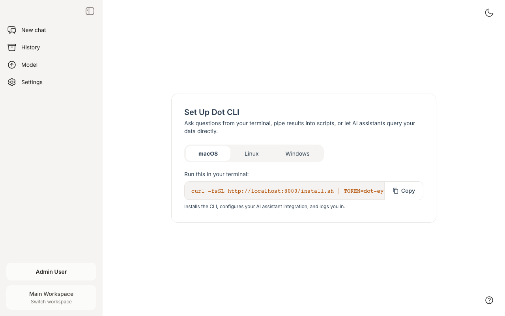
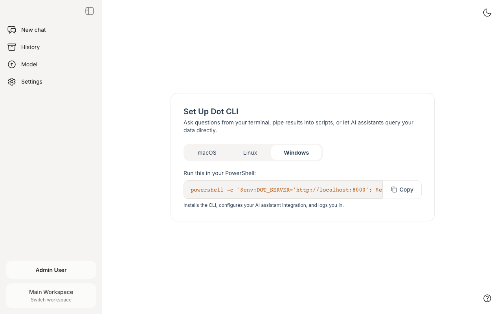
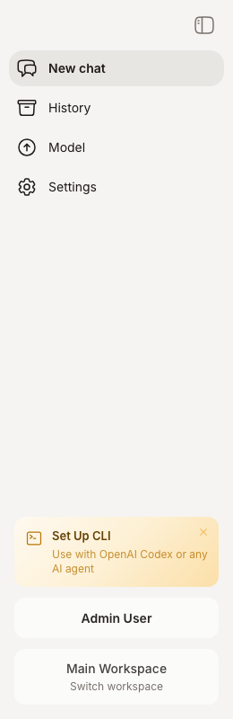

# CLI

### What is the Dot CLI?

The Dot CLI lets you query your company's databases directly from the terminal. Dot writes SQL, runs queries, generates charts, and explains results — all from a single command.

It works standalone in any terminal, and integrates with AI coding assistants like **Claude Code**, **Cursor**, and **OpenAI Codex** through a skill file that teaches them when and how to use it.

### Why use the CLI?

* **Stay in your flow** — ask data questions without switching to a browser
* **AI coding assistants** — Claude Code, Cursor, and Codex can query your data autonomously while coding
* **Scriptable** — pipe output to other tools, automate reports
* **Cached** — repeated questions return instantly from local cache
* **Secure** — credentials stored locally with restrictive permissions, tokens scoped per user

### Quick Start

The fastest way to get started is through the **web setup page** — it generates a single command that installs the CLI and logs you in automatically.

#### One-Click Setup (Recommended)

1. Open **Set Up CLI** from the sidebar in your Dot dashboard, or navigate to `/cli-setup`
2. Copy the one-line command for your operating system
3. Paste it into your terminal

<figure><figcaption><p>The setup page generates a personalized install command with your auth token embedded</p></figcaption></figure>

The setup page auto-detects your operating system and shows the right command. You can switch between macOS, Linux, and Windows tabs.

<figure><figcaption><p>Windows users get a PowerShell command</p></figcaption></figure>

A banner in the sidebar reminds you to set up the CLI until you dismiss it:

<figure><figcaption><p>Dismissible sidebar banner with rotating hints</p></figcaption></figure>

#### Manual Install

If you prefer to install manually, or need to install on a remote server:

**macOS / Linux:**

```bash
curl -fsSL https://app.getdot.ai/install.sh | sh
```

**Windows (PowerShell):**

```powershell
irm https://app.getdot.ai/install.ps1 | iex
```

This installs a native binary — no Node.js or other runtime required. Supports macOS (ARM & Intel), Linux (x64 & ARM), and Windows (x64 & ARM). The installer also sets up the Claude Code skill automatically.

Then log in:

```bash
dot login
```

This opens your browser to authenticate with your Dot account. Your token is saved locally at `~/.config/dot/config.json`.

For environments without a browser (CI, remote servers):

```bash
dot login --token <YOUR_API_TOKEN>
```

**Custom server URL (self-hosted):**

```bash
curl -fsSL https://your-dot-instance.com/install.sh | SERVER=https://your-dot-instance.com sh
```

Or on Windows:

```powershell
$env:DOT_SERVER='https://your-dot-instance.com'; irm https://your-dot-instance.com/install.ps1 | iex
```

#### 3. Ask a question

```bash
dot "What were total sales last month?"
```

### Using with Claude Code

Claude Code automatically discovers Dot's CLI through the `SKILL.md` file. Once `dot` is installed and authenticated, Claude Code can:

* Query your company data when you ask data questions
* Run `dot catalog` to understand what tables are available
* Use follow-up questions with `--chat` to refine results
* Read chart PNGs and CSV files from the output

**Example prompts for Claude Code:**

* "What were our top 10 customers by revenue last quarter?"
* "Check the database — is the orders table growing?"
* "Ask Dot to show me monthly active users for the past year"


The installer automatically places a `SKILL.md` file at `~/.claude/skills/dot/SKILL.md` which tells Claude Code when and how to invoke the CLI. No additional configuration is needed — just install and login.


### Using with Cursor

Cursor IDE also supports skill files. After installing `dot`, Cursor's AI can use it the same way as Claude Code — discovering the tool and querying data when relevant.

### Commands

#### Ask a question

```bash
dot "What were total sales last month?"
```

The output includes:
* **Text explanation** — natural language answer
* **SQL query** — the exact SQL that was executed
* **Data preview** — first rows with column statistics
* **Chart** — saved as PNG to a local temp path
* **CSV data** — saved locally for further analysis
* **Dot URL** — link to the full interactive analysis in the browser
* **Suggested follow-ups** — use these to dig deeper

#### Follow-up questions

Every response includes a chat ID. Use `--chat` to continue the conversation:

```bash
dot "Now break down by region" --chat cli-m1abc2d-x4y5z6
```

#### View available data

```bash
dot catalog
```

Returns instantly (no AI call) and shows:
* Available capabilities (SQL, visualizations, scheduled reports)
* Custom skills configured for your org
* Data source connections with table counts
* Active tables with descriptions, column counts, and row counts
* External assets (Looker dashboards, etc.)

#### Other commands

```bash
dot status          # Show login status and token info
dot logout          # Clear credentials
dot --version       # Show version
dot --help          # Show all options
```

### Caching

Ask responses are cached permanently on disk so repeated questions return instantly:

* `dot "question"` — cached forever until `--clear-cache`
* Follow-ups with `--chat` are never cached (always fresh)
* `dot catalog` is never cached (already fast, no AI call)

```bash
dot "question" --no-cache    # Force fresh request
dot --clear-cache            # Clear all cached responses
```

Cache is stored at `~/.cache/dot/` and is scoped to your user identity — different users on the same machine won't see each other's cached results.

### Security

#### Token Management

* Tokens are stored locally at `~/.config/dot/config.json` with `600` file permissions
* One CLI token per user — generating a new token revokes the previous one
* Tokens expire after 365 days
* Run `dot logout` to clear credentials immediately

#### Data Access

* The CLI respects all your Dot permissions and user group restrictions
* Queries run within your organization's scope
* All data filtering rules (row-level security) are enforced
* All queries are logged in Dot for compliance

### Troubleshooting

**"Not authenticated" error**

Run `dot login` to authenticate, or check your token with `dot status`.

**"Connection failed" error**

* Check your network connection
* If using a custom server, verify the URL: `dot login --server https://your-server.com`

**Slow responses**

First queries take 10-30 seconds (Dot runs the full AI analysis pipeline). Subsequent identical queries return instantly from cache. Use `dot catalog` first to understand available data — more specific questions get faster answers.

**Custom server URL**

For self-hosted Dot instances:

```bash
dot login --server https://your-dot-instance.com
```
