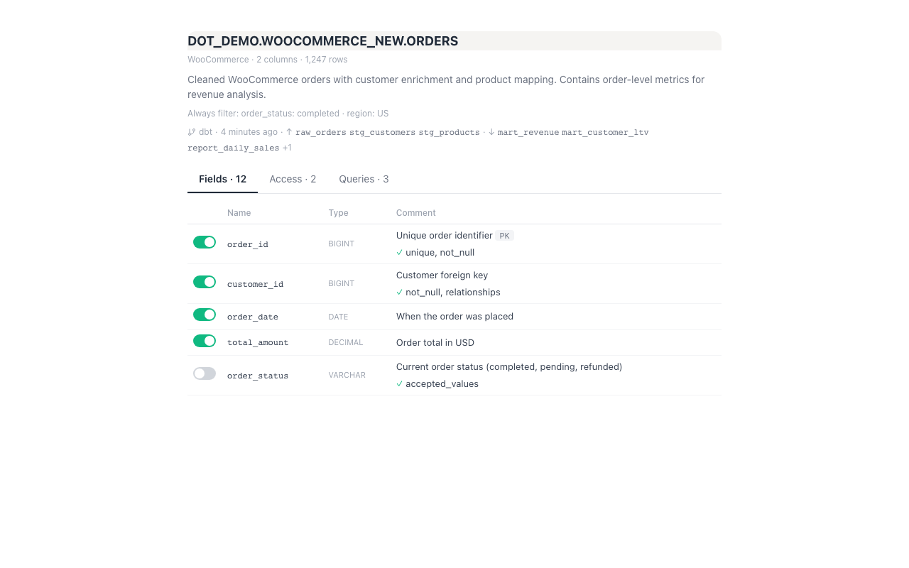
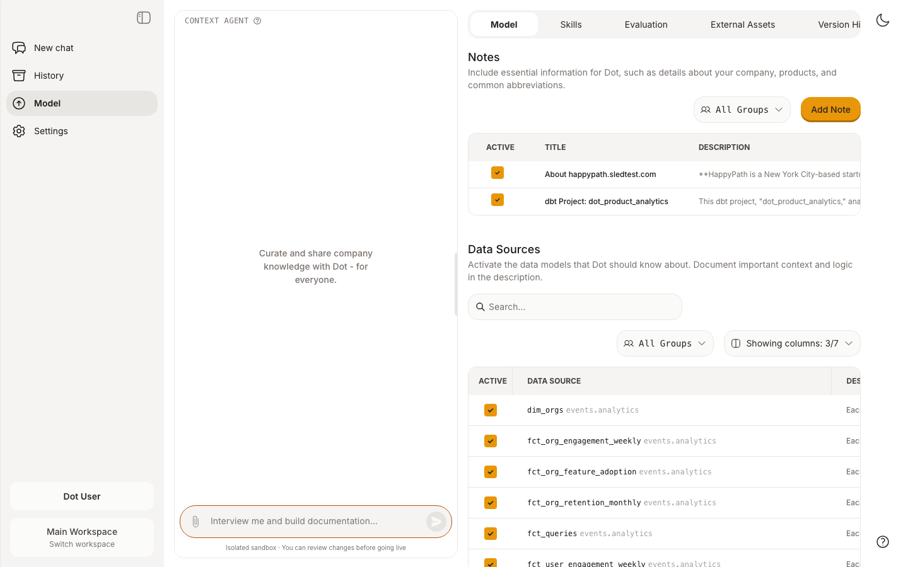

# dbt Core

Connect a dbt project repository so Dot understands your transformation logic, lineage, and data sources. This leads to better answers -- Dot can write more accurate SQL, explain where data comes from, and answer broader questions across your data stack.


**Requirements**

* A **dbt project** hosted in a Git repository (GitHub, GitLab, Bitbucket, or any HTTPS-accessible repo)
* A **database connection** already configured in Dot that matches the dbt project's target database


## Connect Your dbt Repository

Go to **Settings** > **Connections** and scroll to find **dbt Repository**.

### Option A: Via GitHub App (recommended)

1. Click **Connect GitHub** and install the Dot GitHub App on your organization
2. Select your **repository** from the dropdown
3. Set the **branch** (defaults to `main`)
4. Select the **Linked Database Connection** -- this tells Dot which database the dbt models target
5. Click **Connect**

### Option B: Manual

1. Click **Enter manually**
2. Enter the **Repository URL** (e.g., `https://github.com/your-org/dbt-analytics`)
3. Enter an **Access Token** (optional for public repos; for private repos, use a GitHub PAT with repo read access)
4. Set the **branch** (defaults to `main`)
5. Select the **Linked Database Connection**
6. Click **Connect**

Dot clones the repository, parses the dbt project, and matches models to your existing tables.

## What Gets Synced

Dot extracts the following from your dbt project:

* Model and column descriptions
* Model SQL
* Upstream/downstream lineage
* Root data sources
* Tags and governance metadata

Dot re-syncs periodically, or you can trigger a manual sync from the connection settings.

## What It Looks Like

Each matched table shows a compact dbt indicator with sync time and lineage:

<figure><figcaption>
dbt metadata appears as a single line below the table description
</figcaption></figure>

On the Model page, enriched tables are listed with their dbt descriptions:

<figure><figcaption>
Tables enriched from the dbt project appear with descriptions from your models
</figcaption></figure>

## Linked Database Connection

The **Linked Database Connection** dropdown tells Dot which database to match models against. For example, if your dbt project targets a Snowflake warehouse, select your Snowflake connection. Dot matches models by comparing the model name to table names in that connection.

## Allow Dot IPs

If your organization uses IP allowlisting to manage Git access, Dot will only access your repository through the following IPs:

* `3.229.110.216`
* `3.122.135.165`
