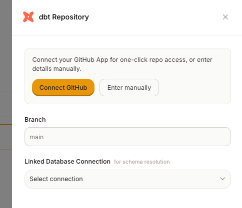
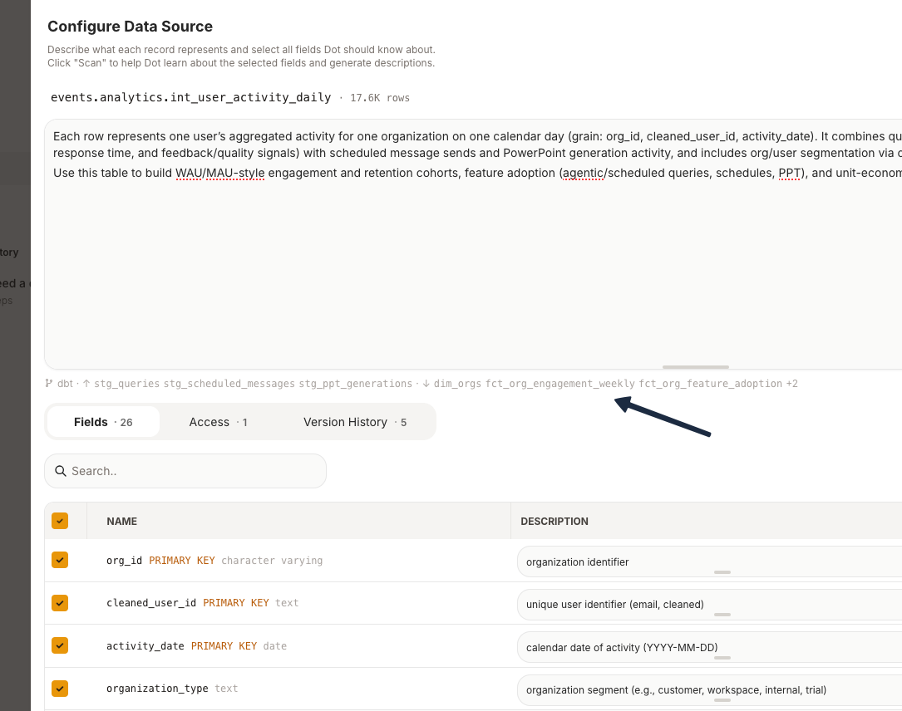

# dbt Core

Connect a dbt project repository so Dot understands your transformation logic, lineage, and data sources. This leads to better answers -- Dot can write more accurate SQL, explain where data comes from, and answer broader questions across your data stack.


**Requirements**

* A **dbt project** hosted in a Git repository (GitHub, GitLab, Bitbucket, or any HTTPS-accessible repo)
* A **database connection** already configured in Dot that matches the dbt project's target database


## Connect Your dbt Repository

Go to **Settings** > **Connections** and scroll to find **dbt Repository**.

<figure><figcaption>
The dbt Repository connection form
</figcaption></figure>

### Option A: Via GitHub App (recommended)

1. Click **Connect GitHub** and install the Dot GitHub App on your organization
2. Select your **repository** from the dropdown
3. Set the **branch** (leave blank for the repository's default branch)
4. Select the **Linked Database Connection** -- this tells Dot which database the dbt models target
5. Click **Connect**

### Option B: Manual

1. Click **Enter manually**
2. Enter the **Repository URL** (e.g., `https://github.com/your-org/dbt-analytics`)
3. Enter an **Access Token** (optional for public repos; for private repos, use a GitHub PAT with repo read access)
4. Set the **branch** (leave blank for the repository's default branch)
5. Select the **Linked Database Connection**
6. Click **Connect**

Dot clones the repository, parses the dbt project, and matches models to your existing tables.

Dot reads the project with `dbt parse`, so make sure your project parses. If a few files fail, Dot works around them and shows a workaround count next to **Last synced**. Hover over the count to see which files. If the project still doesn't parse, the sync fails.

## What Gets Synced

Dot extracts the following from your dbt project:

* Model and column descriptions
* Column tests, such as `unique` and `not_null`
* Model SQL
* Upstream/downstream lineage
* Root data sources
* Tags and governance metadata

Dot syncs the repository once a day. To choose your own frequency and time, open the **dbt Repository** connection and turn on **Schedule sync**. To sync right away, click **Sync**.

## What It Looks Like

Each matched table shows enriched descriptions, fields, and a compact dbt lineage indicator:

<figure><figcaption>
A table enriched with dbt metadata -- descriptions, fields, and upstream/downstream lineage
</figcaption></figure>

## Linked Database Connection

The **Linked Database Connection** dropdown tells Dot which database to match models against. For example, if your dbt project targets a Snowflake warehouse, select your Snowflake connection. Dot matches each model to the table dbt builds for it in that connection, by schema and table name. The table name is the model's `alias` if it has one, otherwise the model name.

## Allow Dot IPs

If your organization uses IP allowlisting to manage Git access, Dot will only access your repository through the following IPs:

* `5.78.211.110`
* `178.105.217.177`
