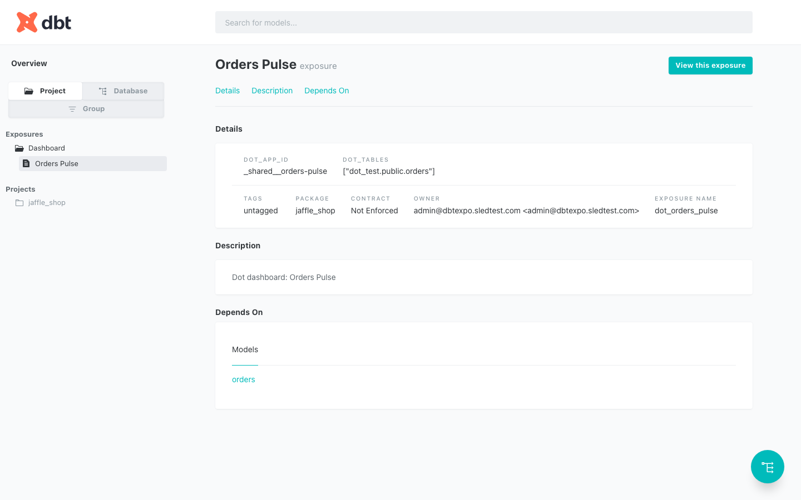
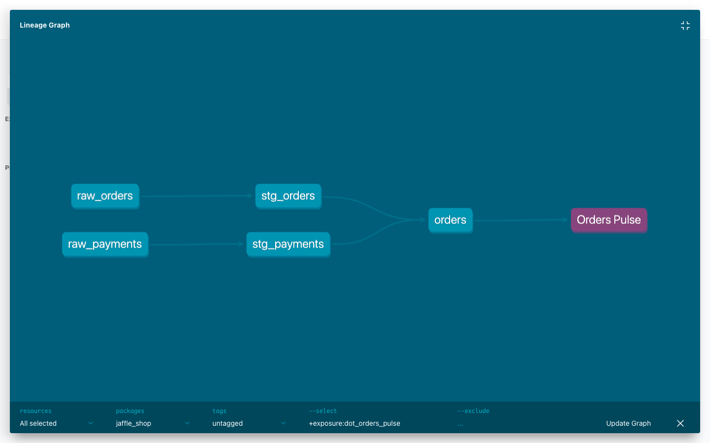

# dbt Exposures

The [dbt Core integration](dbt-core.md) teaches Dot about your models. This does the reverse: it exports Dot back into your **dbt project** as [exposures](https://docs.getdbt.com/docs/build/exposures) — the dbt resource that represents a downstream consumer of your models.

Commit the generated file and Dot becomes a first-class citizen of your dbt DAG. Every shared Dot dashboard — and Dot itself — shows up in `dbt docs`, `dbt ls`, and your lineage graphs, sitting downstream of the exact models it reads from.

The payoff is **impact analysis**: before you change, rename, or deprecate a model, you can see which Dot dashboards depend on it — and catch breakage in your dbt CI instead of from a confused stakeholder.


**Requirements**

* A **dbt repository connected** to Dot (see [dbt Core](dbt-core.md)) — this is what lets Dot validate every `ref()` against your project's manifest.
* **Dashboards enabled** for your workspace (exposures are derived from your shared Dot dashboards).
* An **admin or modeler [API token](../../whats-dot/api/README.md)**. Viewer tokens are rejected with `401`.


## What Dot exports

Dot returns a dbt v2 `exposures.yml` containing two kinds of exposures.

**One exposure per shared dashboard** (`type: dashboard`). Its `depends_on` lists the dbt models behind the dashboard's queries. Lineage is derived from each dashboard's **compiled SQL**, so the model list is exact — not guessed from names.

**One aggregate "Dot Model" exposure** (`name: dot_model`, `type: application`). Its `depends_on` is *every* active dbt model Dot has a table doc for. This represents Dot-as-a-whole as a consumer, so Dot appears in your DAG even for models that no dashboard references yet.

<figure><figcaption><p>A shared Dot dashboard, rendered as an exposure in <code>dbt docs</code></p></figcaption></figure>

## Export the exposures file

Authenticate with the `X-API-KEY` header and write the response straight into your dbt project's model paths:

```bash
curl -sf -H "X-API-KEY: $DOT_API_KEY" \
  "https://app.getdot.ai/api/dbt/exposures" \
  -o models/dot_exposures.yml
```


Use the host for your region: `app.getdot.ai` (US) or `eu.getdot.ai` (EU).


### Query parameters

| Parameter | Values | Description |
|-----------|--------|-------------|
| `format` | `yaml` (default), `json` | `yaml` returns a ready-to-commit `exposures.yml`. `json` returns the same payload plus an `apps_without_dbt_models` list for coverage debugging. |
| `connection_id` | a dbt repo connection id | Required **only** when your org has more than one dbt repository connected. With a single repo it is selected automatically. |

The generated file looks like this:

```yaml
# Generated by Dot — dbt exposures declaring Dot and its dashboards as
# downstream consumers of your dbt models. Fetch from GET /api/dbt/exposures
# (X-API-KEY auth) and place under your dbt project's model-paths, e.g.
# models/dot_exposures.yml.
version: 2
exposures:
- name: dot_orders_pulse
  label: Orders Pulse
  type: dashboard
  url: https://app.getdot.ai/apps/_shared__orders-pulse
  description: 'Dot dashboard: Orders Pulse'
  owner:
    name: data-team@yourcompany.com
    email: data-team@yourcompany.com
  depends_on:
  - ref('orders')
  meta:
    dot_app_id: _shared__orders-pulse
    dot_tables:
    - analytics.public.orders
- name: dot_model
  label: Dot Model
  type: application
  url: https://app.getdot.ai/apps
  description: Dot AI data analyst — downstream consumer of every dbt model Dot has table documentation for. Changes to these models can affect Dot's answers, dashboards, and scheduled reports.
  owner:
    name: Dot
  depends_on:
  - ref('customers')
  - ref('orders')
  meta:
    dot_aggregate: true
    dot_model_count: 2
```

## Add it to your dbt project

Drop the file anywhere under your configured `model-paths` (e.g. `models/dot_exposures.yml`), validate, and commit:

```bash
dbt parse   # validates every ref() resolves
git add models/dot_exposures.yml
git commit -m "Add Dot exposures"
```

Run `dbt docs generate` and Dot's dashboards appear alongside your models.

## Impact analysis

This is where exposures earn their keep. Once the file is committed, dbt's own selectors reveal Dot's dependence on any model:

```bash
# Which exposures — Dot dashboards and Dot itself — depend on fct_orders?
dbt ls --select fct_orders+ --resource-type exposure
```

The same relationship shows up visually in the lineage graph, where each Dot dashboard sits at the downstream end of the DAG:

<figure><figcaption><p>A Dot dashboard as the downstream endpoint of a dbt lineage graph (<code>+exposure:dot_orders_pulse</code>)</p></figcaption></figure>

Wire this into your dbt CI and a pull request that touches an upstream model will surface exactly which Dot dashboards it puts at risk — before it merges.

## Keep it in sync

Dashboards and models change, so re-export on a schedule to keep the file current. A minimal GitHub Actions job:

```yaml
# .github/workflows/dot-exposures.yml
name: Sync Dot exposures
on:
  schedule:
    - cron: "0 6 * * 1-5"   # weekday mornings
  workflow_dispatch:
jobs:
  sync:
    runs-on: ubuntu-latest
    steps:
      - uses: actions/checkout@v4
      - name: Fetch exposures from Dot
        run: |
          curl -sf -H "X-API-KEY: ${{ secrets.DOT_API_KEY }}" \
            "https://app.getdot.ai/api/dbt/exposures" \
            -o models/dot_exposures.yml
      - name: Validate
        run: dbt parse
      - name: Commit if changed
        run: |
          git config user.name  "dot-bot"
          git config user.email "dot-bot@users.noreply.github.com"
          git add models/dot_exposures.yml
          git diff --cached --quiet || git commit -m "chore: sync Dot exposures"
          git push
```

## Safe by construction

The export is designed to never break your dbt project:

* **Every `ref()` is validated** against the dbt manifest captured at sync time. A model that isn't in the manifest — renamed, disabled, or versioned — is **withheld** into `meta.dot_unresolved_models` on the affected exposure rather than emitted, so `dbt parse` always succeeds. (Tables that match more than one Dot table doc are likewise reported under `meta.dot_ambiguous_tables` instead of being guessed.)
* **Deterministic output** — no timestamps or run-specific ordering, so re-exports diff clean in your repo and only change when your dashboards or models actually change.
* **Nothing is silently dropped.** Dashboards built only on non-dbt or data-only sources can't produce `ref()`s; request `?format=json` to see them listed under `apps_without_dbt_models`.

## Surface data-quality incidents on dashboards

Exposures tell dbt what Dot depends on. The reverse channel lets dbt (and other tools) tell **Dot** when that upstream data is currently failing — so viewers see it in context.

After a `dbt build`, send Dot your run results together with the manifest. Dot opens incidents for failing models and tests and stale sources, and clears them automatically when they pass again or leave the manifest:

```bash
dbt build   # writes target/run_results.json and target/manifest.json

jq -n \
  --slurpfile run target/run_results.json \
  --slurpfile manifest target/manifest.json \
  '{run_results: $run[0], manifest: $manifest[0]}' > dot_run.json

curl -sf -X POST "https://app.getdot.ai/api/dbt/run_results" \
  -H "X-API-KEY: $DOT_API_KEY" \
  -H "Content-Type: application/json" \
  --data @dot_run.json
```

Not on dbt? `POST /api/quality/incidents` accepts incidents from any source (Airflow, Monte Carlo, your own checks):

```bash
curl -sf -X POST "https://app.getdot.ai/api/quality/incidents" \
  -H "X-API-KEY: $DOT_API_KEY" \
  -H "Content-Type: application/json" \
  -d '{
        "source": "airflow",
        "items": [
          {
            "table": "analytics.public.orders",
            "check": "freshness",
            "status": "open",
            "severity": "warning",
            "message": "orders load is 6h late",
            "url": "https://airflow.yourcompany.com/dags/orders"
          }
        ]
      }'
```

Any Dot dashboard built on an affected table then shows a subtle **"N data issues"** indicator in its top bar, with the details on hover — so viewers know upstream data is currently failing before they trust the numbers.
