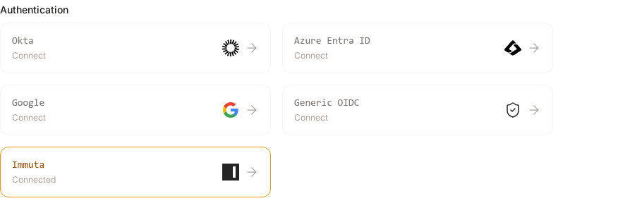
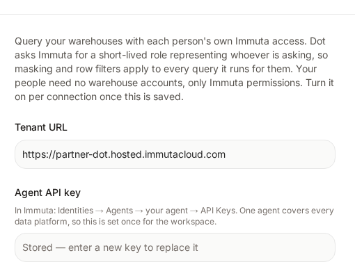
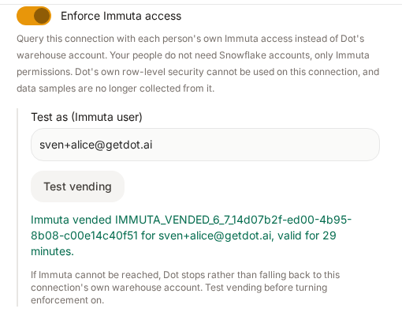

# Immuta

Immuta enforces access policies inside your warehouse. It masks columns and filters rows based on who is asking.

Without this integration, Dot queries Snowflake with one service account. Every person who asks Dot a question sees whatever that one account can see, no matter what Immuta says about them.

With it, Dot asks Immuta for a short-lived role that represents the person asking, then runs their query with that role. Immuta's masking and row filters apply to every query Dot runs for them. Your people do not need Snowflake accounts at all, only Immuta permissions.

Two people can ask Dot the same question and get different answers, because Immuta gives them different access to the same table.

This works with Snowflake today.

## Before you start

You need:

* An Immuta tenant, and admin rights in it
* Admin rights in Snowflake
* Your Snowflake data registered in Immuta, under **Data** then **Connections**

## Create the agent in Snowflake

Dot connects to Snowflake as a single service user. Immuta vends roles onto that user, one per person asking.

Generate a key pair. Keep the private key somewhere safe.

```bash
openssl genrsa 2048 | openssl pkcs8 -topk8 -inform PEM -out dot_agent_key.p8 -nocrypt
openssl rsa -in dot_agent_key.p8 -pubout -out dot_agent_key.pub
```

Create the user in Snowflake. Paste the public key without its header and footer lines.

```sql
create user "DOT_AGENT" must_change_password = false;
alter user "DOT_AGENT" set type = service;
alter user "DOT_AGENT" set rsa_public_key = '<public key>';
```

Give it a role that can read your catalog. Dot uses this role to sync table names and descriptions. It never uses it to answer a question.

```sql
create role "DOT_AGENT_ROLE";
grant usage on warehouse example_wh to role "DOT_AGENT_ROLE";
grant usage on database example_db to role "DOT_AGENT_ROLE";
grant usage on schema example_db.example_schema to role "DOT_AGENT_ROLE";
grant select on all tables in schema example_db.example_schema to role "DOT_AGENT_ROLE";
grant role "DOT_AGENT_ROLE" to user "DOT_AGENT";
alter user "DOT_AGENT" set default_role = "DOT_AGENT_ROLE";
```

## Create the agent in Immuta

1. Go to **Identities**, then **Agents**, then **New Agent**.
2. Open the agent and go to **External Mapping**. Enter `DOT_AGENT`, the Snowflake user you just created.
3. Go to **API Keys** and generate a key. Copy it now. Immuta shows it once.

Mapping the agent makes Immuta create a role for it in Snowflake. That role needs to use your warehouse, so grant it now that it exists.

```sql
grant usage on warehouse example_wh to role "<the role Immuta created>";
```

This is the only warehouse grant you make. The roles Immuta vends per person are generated, with names like `IMMUTA_VENDED_6_7_c7148ee7-caad-4ee7-893d-4e669c5fcb9e`, and you never grant to them by hand.


The agent API key vends a role for any person it names. Treat it like a password.


## Turn it on in Dot

Go to **Settings**, then **Connections**, and open the **Immuta** card under Authentication.

<figure><figcaption><p>Immuta sits with your other identity providers.</p></figcaption></figure>

Enter your **tenant URL** and the **agent API key** from the step above, and save. You do this once for the whole workspace, as an admin. One agent's External Mapping holds a username per technology, so the same key covers every warehouse Immuta governs for you. Sub-workspaces have no card of their own and do not inherit this one: their people are different people, with different Immuta policies.

**Remove** clears the tenant and key for the whole workspace and turns enforcement off on every connection at once, so nothing is left claiming an access check Dot can no longer make.

<figure><figcaption><p>Dot never shows the key again. It only tells you one is stored.</p></figcaption></figure>

Now add your Snowflake connection. Connect as `DOT_AGENT` using key pair authentication with the private key from the first step, and turn on **Enforce Immuta access**.

Check it works before you rely on it. Put an Immuta user's email in **Test as** and click **Test vending**. Dot asks Immuta for a role for that person and tells you what came back.

<figure><figcaption><p>A successful vend proves the whole chain: your key, the agent mapping, and the warehouse grant.</p></figcaption></figure>


**Test as** must be someone Immuta knows. If you leave it empty, Dot vends for your own Dot login. If you are not an Immuta user yourself, that fails with a user not found message, and it means the key is fine and only the person named is unknown.



A Snowflake connection you add **after** saving the Immuta card turns enforcement on by itself, as long as a test vend succeeds. Dot never enables it on a guess: a working vend is the only thing that also proves the agent mapping and the warehouse grant are in place.

Connections you already had are left for you to turn on yourself, because enabling clears collected data samples and refuses any row-level rule you have set.


## What changes on this connection

Turning on enforcement changes four things.

**Dot's own row-level security is refused.** Immuta filters rows in the warehouse, so Dot skips its own rules on this connection. A rule here would look like protection that is not applied. Dot rejects one if you try to save it, and rejects one written into your model repository too.

**Data samples are no longer collected.** Samples are read with the service account and shown to everyone in table context, which would publish the exact column values Immuta masks. Dot also clears samples it already collected when you turn enforcement on. Turn Immuta on before your first sync, or those samples are collected and then thrown away.

**Secondary roles are turned off.** The vended role already covers everything Immuta granted the person. Inherited roles would widen it.

**A question with no clear asker is refused.** Dot needs one person to ask Immuta about. Scheduled queries carry their owner, so they work. A shared Slack or Teams channel has no single asker, so Dot answers that it cannot tell whose access to apply, and reads nothing. Someone asking Dot directly is always a single person, whichever surface they use.

If Immuta cannot be reached, Dot stops. It never falls back to the connection's own warehouse account.

## Check which role ran

Snowflake's query history shows the role behind each query.

```sql
select query_text, user_name, role_name, execution_status, start_time
from table(example_db.information_schema.query_history())
where user_name = 'DOT_AGENT'
order by start_time desc;
```

In Immuta, **Identities**, then **Agents**, then your agent, then **Activity** maps each of those roles back to the person it was vended for.
