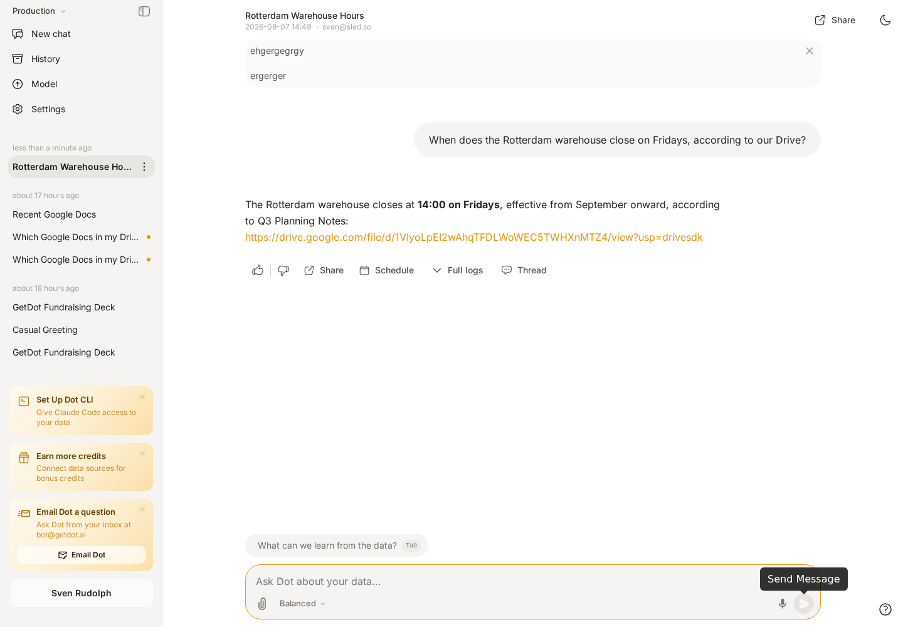

# Google Drive

Connect [Google Drive](https://drive.google.com) so Dot can search across your documents and read them while answering questions — the pricing doc, the runbook, the QBR deck, the spec nobody can find.

The connector is **read-only**. Dot never creates, edits, or deletes anything in Drive.

## Two ways to scope access

You choose per connection, when you connect. Most workspaces want the first.

### A folder or shared drive (default)

You share **one folder** (or a shared drive) with a service account, and everyone you grant access to sees it. The credential can reach nothing else — not because Dot filters it, but because Google never gave it access to anything else. Sharing applies to everything inside the folder, so subfolders come along automatically.

Different teams get different content: repeat the setup with a **separate service account per scope**. Each becomes its own connection with its own Access Groups, so Finance sees the Finance folder and nobody else's.


**Why this is the default.** Dot chooses which credential to use; Google decides what that credential can see. Dot keeps no copy of your Drive permissions, so nothing can drift out of sync with them. It needs no Workspace admin — sharing a folder is something anyone who owns one can do, on every Workspace edition — and it works in Slack and Teams.


### Each user's own Drive

Every request is made **as the person asking**, so each user sees exactly the files they could open in a browser. The strongest confidentiality, and the right answer for some companies.

What it costs: a Workspace **super-admin** must authorize the service account, that key can then read any file in the domain, and it can't be used from Slack or Teams — those run under a shared bot identity, and this mode needs a specific person.

## Prerequisites

- **Google Workspace** — personal Gmail accounts aren't supported.
- A **Google Cloud project** to hold a service account.
- A **Dot admin** account.
- For per-user mode only: a **Google Workspace super-admin**.

## Set up

### 1. Create a service account (both modes)

1. In [Google Cloud → Service accounts](https://console.cloud.google.com/iam-admin/serviceaccounts), create a service account and download a **JSON key**.
2. Enable the [Google Drive API](https://console.cloud.google.com/apis/library/drive.googleapis.com) on the same project.

### 2a. Folder or shared drive mode

In Google Drive, right-click the folder you want Dot to read → **Share**, and add the service account's **`client_email`** as a **Viewer**. Untick *Notify people* — a service account has no inbox. If your edition has shared drives, adding it as a member of one works the same way.

What you shared *is* the scope — there is nothing else to configure, and nothing else is reachable.

### 2b. Per-user mode

In the [Admin console](https://admin.google.com/ac/owl/domainwidedelegation) (**Security → Access and data control → API controls → Domain-wide delegation**), click **Add new**:

| Field | Value |
|---|---|
| Client ID | the service account's numeric Unique ID |
| OAuth scopes | `https://www.googleapis.com/auth/drive.readonly` |


**This entry is the boundary, not the key file.** The service account can only ever do what you authorize here. Grant the read-only Drive scope and nothing else.


### 3. Connect in Dot

Go to **Settings → Connections → Google Drive**, pick the mode, paste the key, and click **Connect**.

<figure><figcaption>
The setup steps change with the mode you pick.
</figcaption></figure>

Dot verifies against Google **before saving**. If the account can't see anything yet, the connect is refused and the error names the exact address to share with — so a half-finished setup can't sit there looking connected and then fail for everyone later.

<figure><figcaption>
The card names the scope, and Access Groups decides who can use it.
</figcaption></figure>

### 4. Choose who can use it

Set **Access Groups** on the connection. Only users in those groups can reach that content through Dot.

## Using it

Just ask. Dot decides when Drive is relevant:

- *"Search Drive for the Q3 pricing doc and summarise it."*
- *"Which documents mention the Acme migration?"*
- *"What changed in the onboarding runbook recently?"*

Dot searches **Drive's own full-text index**, which covers the contents of Docs, Sheets, Slides and PDFs — not just file names. If you can reach several drives, one search covers all of them and each result says which drive it came from.

<figure><figcaption>
Answers cite the file they came from.
</figcaption></figure>

## What Dot can do

Each action is a separately governed permission under **Model → Skills → Drive**.

| Permission | What it allows | Default |
|---|---|---|
| `drive.search` | Full-text search across Drive contents | On |
| `drive.files.read` | Listing folders, file metadata, reading contents | On |
| `drive.files.download` | Downloading a file to work with it | On |
| `drive.permissions.read` | Seeing who a file is shared with | Off |

Each can also be scoped to specific user groups.


**Why sharing visibility defaults off.** *"Who else can see this file"* is a different and more sensitive question than *"what does this document say"* — useful for governance reviews, but not something to hand out by default.


## How Dot reads your files

Google Docs, Sheets, and Slides have no downloadable text of their own, so Dot converts them on the fly:

| File type | Dot reads it as |
|---|---|
| Google Doc | Markdown |
| Google Slides | Plain text |
| Google Sheet | CSV — **first tab only** |
| Text, Markdown, CSV, JSON | As-is |
| PDF, images, Office files | Downloaded, then read with the right tool |

Long documents are read in pages, so Dot can work through a large file without losing the thread.


**For spreadsheet data, use the Google Sheets connection instead.** Drive reads a sheet's first tab as text, which is fine for context but not for analysis. To filter, aggregate, or join spreadsheet data, connect it as a [data source](../databases/) so Dot can query it properly.


## Limitations

- **Read-only.** Dot cannot create, edit, or delete Drive files.
- **Google Workspace only** — personal Gmail accounts aren't supported.
- **A connection covers everything shared with its service account.** To scope more narrowly, share less — or use a second service account.
- **Sheets are read one tab at a time** (see above).
- **Per-user mode only:** unavailable from Slack and Teams, and a Dot user whose email isn't a Google account in your domain can't use it.
- Very large files are read up to a bounded size, and very large downloads are refused rather than truncated.

## Troubleshooting

| Message | What it means | What to do |
|---|---|---|
| *can't see anything yet* | Nothing has been shared with the service account | Share the folder with its `client_email` as a Viewer |
| *is a member of N shared drives* | One account was added to several drives | Give each drive its own service account |
| *Google would not issue Drive access for &lt;email&gt;* | Per-user mode: the Admin console authorization is missing, or that address isn't a Google account in your domain | Recheck the client ID and scope |
| *Action requires permission `drive.…`* | That action is switched off for this user | Enable it under **Model → Skills → Drive** |
| *Google denied access to this file* | The credential genuinely can't read it | Share the file with the service account, or with the user in per-user mode |
| *Drive is unavailable in Slack and Teams* | Per-user mode has no individual to act as | Use a shared-drive connection, which works there |

## Related

- [Knowledge Bases overview](README.md) — how connectors like this one fit together
- [Root, Dot's Context Agent](../../whats-dot/context-agent.md) — can use Drive to extract business logic from your existing documents
