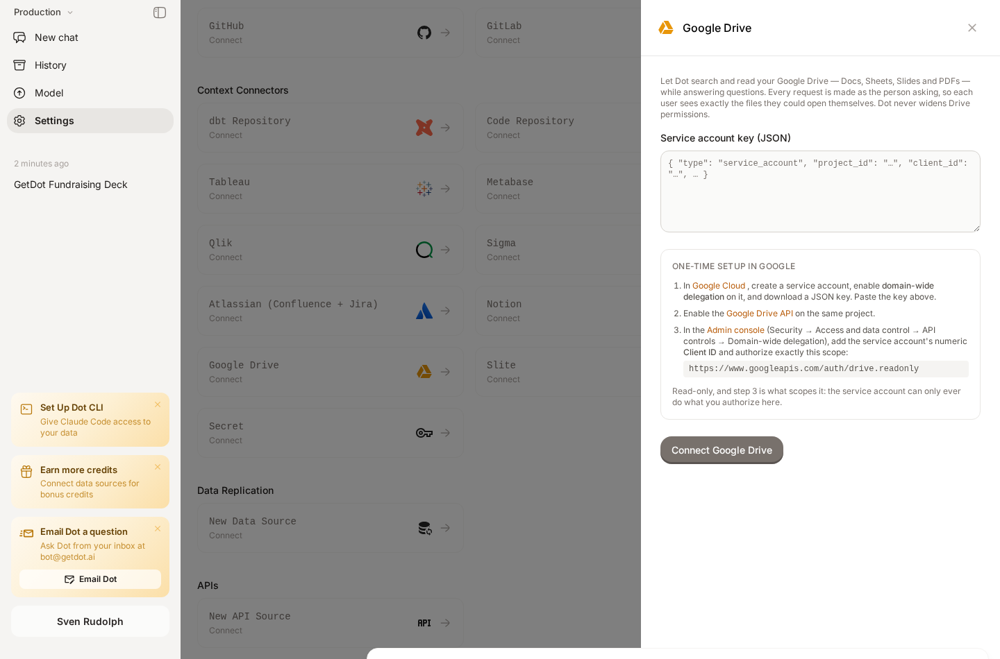
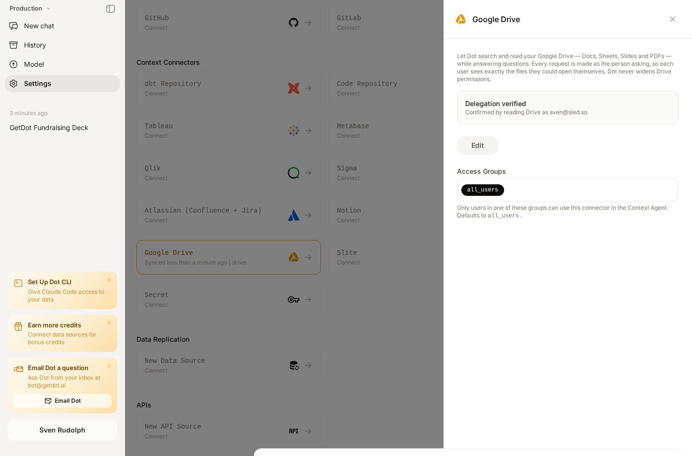

# Google Drive

Connect your [Google Drive](https://drive.google.com) so Dot can search across your documents and read them while answering questions — the pricing doc, the runbook, the QBR deck, the spec nobody can find.

The connector is **read-only**. Dot never creates, edits, or deletes anything in Drive.

## Every request runs as the person asking

This is the part worth understanding before you set it up.

Dot does not hold one shared view of your Drive. Each Drive request is made **as the individual user asking the question**, so everyone sees exactly the files they could open in a browser — no more, no less. A restricted document stays restricted; a file nobody shared with someone simply doesn't appear in their results.

That also means Dot keeps no copy of your Drive permissions. Google evaluates access at the moment of each call, so there is nothing on Dot's side that can drift out of date when you change who can see what.


**Nothing is synced or copied.** Dot reads from Drive when a question needs it. Answers always reflect the current contents of a file, and access always reflects Drive's current sharing.


## Prerequisites

- **Google Workspace** — personal Gmail accounts aren't supported.
- A **Google Workspace super-admin**, who can authorize the connection in the Admin console.
- A **Google Cloud project** to hold a service account.
- A **Dot admin** account.

## Set up in Google

### 1. Create a service account

1. In [Google Cloud → Service accounts](https://console.cloud.google.com/iam-admin/serviceaccounts), create a service account (for example, `dot-drive`).
2. Open it, go to **Keys → Add key → Create new key → JSON**, and download the key file.
3. Note its numeric **Unique ID** — this is the client ID you'll need in step 3.
4. Enable the [Google Drive API](https://console.cloud.google.com/apis/library/drive.googleapis.com) on the same project.

### 2. Authorize the connection

In the Google Admin console, open [Domain-wide delegation](https://admin.google.com/ac/owl/domainwidedelegation) (**Security → Access and data control → API controls → Domain-wide delegation**) and click **Add new**:

| Field | Value |
|---|---|
| Client ID | the service account's numeric Unique ID |
| OAuth scopes | `https://www.googleapis.com/auth/drive.readonly` |


**This entry is the real boundary, not the key file.** The service account can only ever do what you authorize here. Grant the read-only Drive scope and nothing else — anything you don't list is unavailable to Dot, permanently.


### 3. Connect in Dot

Go to **Settings → Connections**, find **Google Drive** under **Context Connectors**, paste the JSON key, and click **Connect Google Drive**.

<figure><figcaption>
The connection form restates the Google setup, including the exact scope to authorize.
</figcaption></figure>

Dot verifies the setup against Google **before saving**: it requests access as you and makes a real Drive call. Only if that succeeds is the connection stored, so a half-finished setup can't sit there looking connected and then fail for everyone later.

<figure><figcaption>
A connection is only saved once Dot has actually read Drive with it.
</figcaption></figure>

If something is missing, nothing is saved and the error names what to fix — including the exact client ID and scope to enter in step 2.

## Using it

Just ask. Dot decides when Drive is relevant:

- *"Search Drive for the Q3 pricing doc and summarise it."*
- *"Which documents mention the Acme migration?"*
- *"What changed in the onboarding runbook recently?"*

Dot searches **Drive's own full-text index**, which covers the contents of Docs, Sheets, Slides, and PDFs — not just file names. Shared drives are included by default, since that's where most company documents live.

## What Dot can do

Each action is a separately governed permission under **Model → Skills → Drive**.

| Permission | What it allows | Default |
|---|---|---|
| `drive.search` | Full-text search across Drive contents | On |
| `drive.files.read` | Listing folders, file metadata, and reading file contents | On |
| `drive.files.download` | Downloading a file to work with it (e.g. a PDF or spreadsheet) | On |
| `drive.permissions.read` | Seeing who a file is shared with | Off |

To change a permission, open **Model → Skills**, expand the **Drive** skill, and toggle it. Each can also be scoped to specific user groups.


**Why sharing visibility defaults off.** *"Who else can see this file"* is a different and more sensitive question than *"what does this document say"* — useful for governance reviews, but not something to hand out by default. Turn it on when you need it.


## How Dot reads your files

Google Docs, Sheets, and Slides aren't ordinary files — they have no downloadable text of their own. Dot converts them on the fly:

| File type | Dot reads it as |
|---|---|
| Google Doc | Markdown |
| Google Slides | Plain text |
| Google Sheet | CSV — **first tab only** |
| Text, Markdown, CSV, JSON | As-is |
| PDF, images, Office files | Downloaded, then read with the right tool |

Long documents are read in pages, so Dot can work through a large file without losing the thread.


**For spreadsheet data, use the Google Sheets connection instead.** Drive reads a sheet's first tab as text, which is fine for context but not for analysis. If you want to filter, aggregate, or join spreadsheet data, connect it as a [data source](../databases/) so Dot can query it properly.


## Limitations

- **Read-only.** Dot cannot create, edit, or delete Drive files.
- **Google Workspace only** — personal Gmail accounts aren't supported.
- **Only real Workspace accounts.** A Dot user whose email isn't a Google account in your domain — an external collaborator, say — can't use Drive.
- **Not available from Slack or Teams.** Those conversations run under a shared bot identity, and Drive access is always tied to a specific person. Ask in the Dot web app instead.
- **Sheets are read one tab at a time** (see above).
- Very large files are read up to a bounded size, and very large downloads are refused rather than truncated.

## Troubleshooting

| Message | What it means | What to do |
|---|---|---|
| *Google would not issue Drive access for &lt;email&gt;* | The Admin console authorization is missing or incomplete, or that address isn't a Google account in your domain | Recheck step 2 — the client ID and scope must match exactly |
| *Google rejected the delegated credentials* | The authorization was removed, or the key was revoked | Re-authorize in the Admin console, or reconnect with a new key |
| *Action requires permission `drive.…`* | That action is switched off for this user | Enable it under **Model → Skills → Drive**, or grant it to one of their groups |
| *Google denied access to this file for your account* | The **user** can't open that file in Drive | Ask the file's owner to share it. Dot can't widen Drive permissions — by design |

## Related

- [Knowledge Bases overview](README.md) — how connectors like this one fit together
- [Root, Dot's Context Agent](../../whats-dot/context-agent.md) — can use Drive to extract business logic from your existing documents
