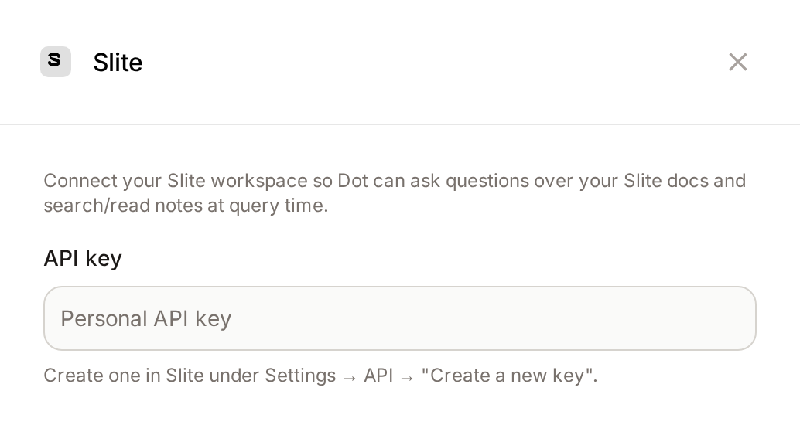
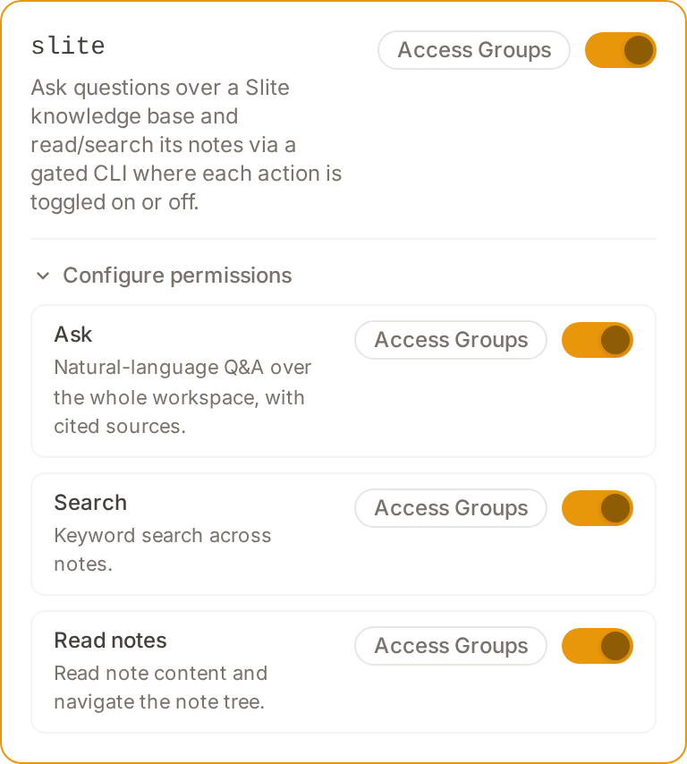

# Slite

Connect your [Slite](https://slite.com) workspace so Dot can answer questions from your company documentation. Slite exposes its own hosted question-answering endpoint, so the fastest path — *"what does our Slite say about X?"* — is a single **ask** call that returns a synthesized answer with cited sources.


**Slite is read-only today.** Dot can ask, search, and read notes. It cannot yet create, edit, archive, or delete Slite content — if you ask it to, it will tell you writing isn't supported rather than attempt a workaround.


## Prerequisites

- A Slite workspace and a Dot admin account.
- A Slite **API key**. Any workspace member can generate a personal key; it inherits that member's access, so use an account that can see the docs you want Dot to reach.

## Get a Slite API key

1. In Slite, open **Settings → API**.
2. Click **Create a new key**.
3. Copy the key — you'll paste it into Dot next.

## Connect in Dot

1. Go to **Settings → Connections** and find **Slite** under **Context Connectors**.
2. Paste your API key into the **API key** field.
3. Click **Connect Slite**. Dot validates the key against your workspace and confirms the connection.

<figure><figcaption>
Paste your Slite API key and click Connect Slite
</figcaption></figure>

## What Dot can do

Each action is a separately governed permission under **Model → Skills → Slite**. All three default **on** — connecting Slite implies you want agent-driven reads.

| Permission | What it allows |
|---|---|
| `slite.ask` | Natural-language Q&A over the whole workspace, with cited sources. The best answer to "what do our docs say about X". |
| `slite.search` | Keyword search across notes. |
| `slite.notes.read` | Reading a note's content and navigating the note tree. |

To turn one off, open **Model → Skills**, expand the **Slite** skill, and toggle the permission. A disabled action is refused with a message naming the permission an admin must re-enable.

<figure><figcaption>
Slite's actions, each independently toggleable under Model → Skills
</figcaption></figure>

## Limitations

- **Read-only.** No create / update / delete / archive path yet.
- Dot reads Slite live at query time — it does not sync or copy notes into Dot, so answers always reflect the current workspace and the connected key's access.
