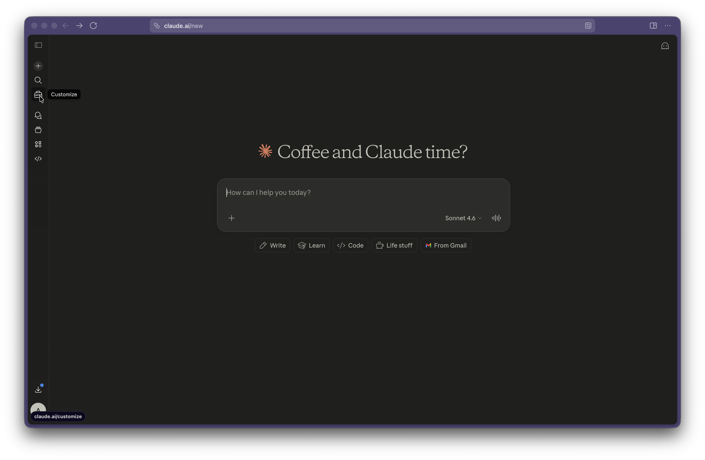
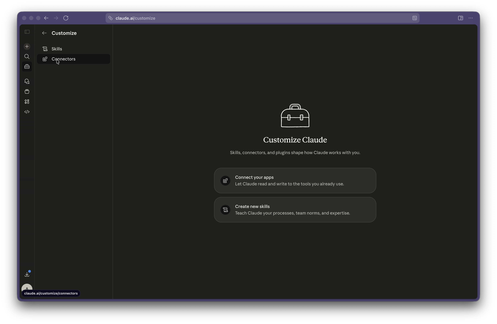
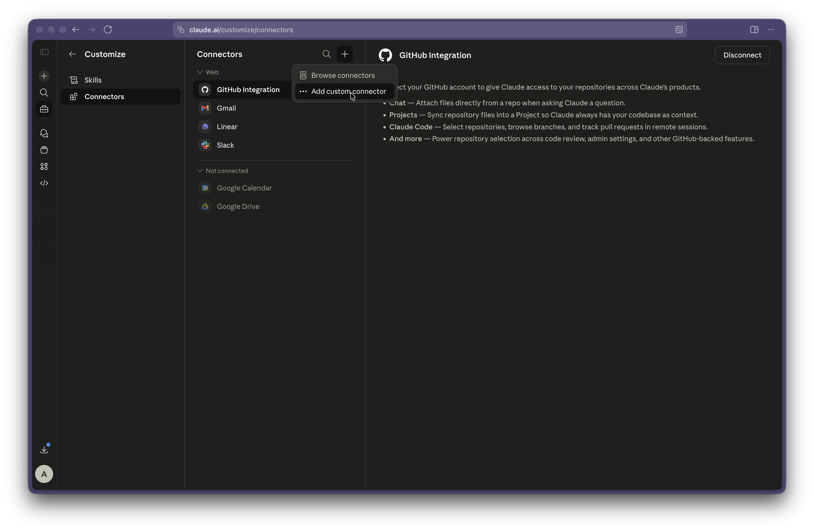
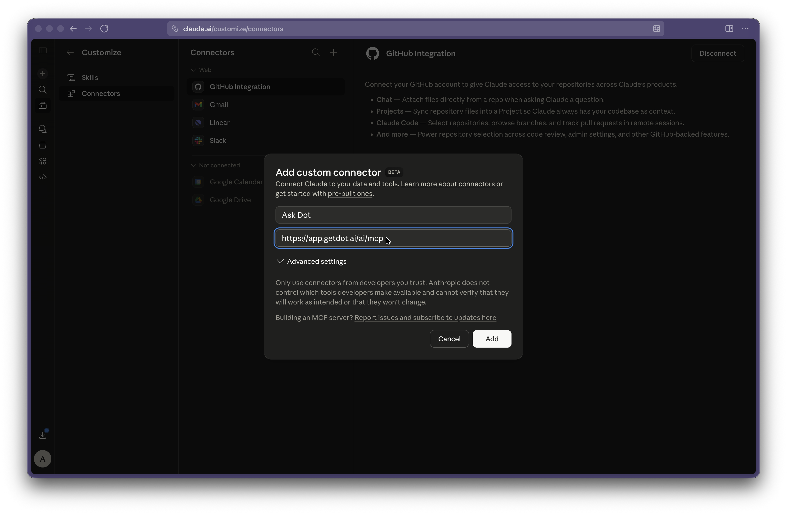
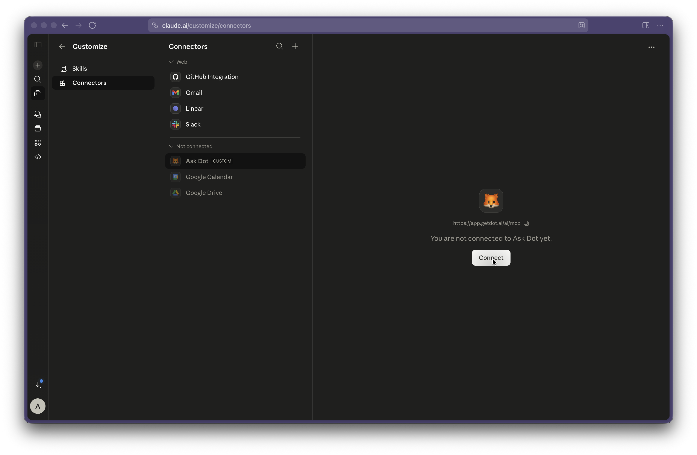
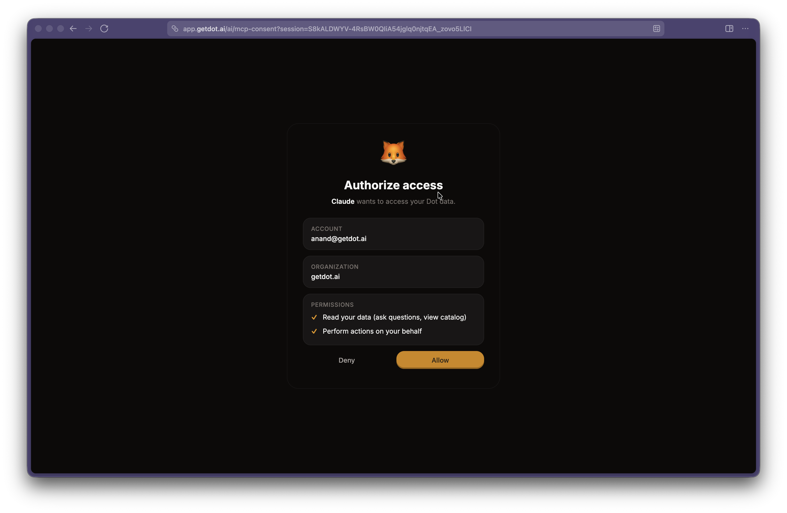
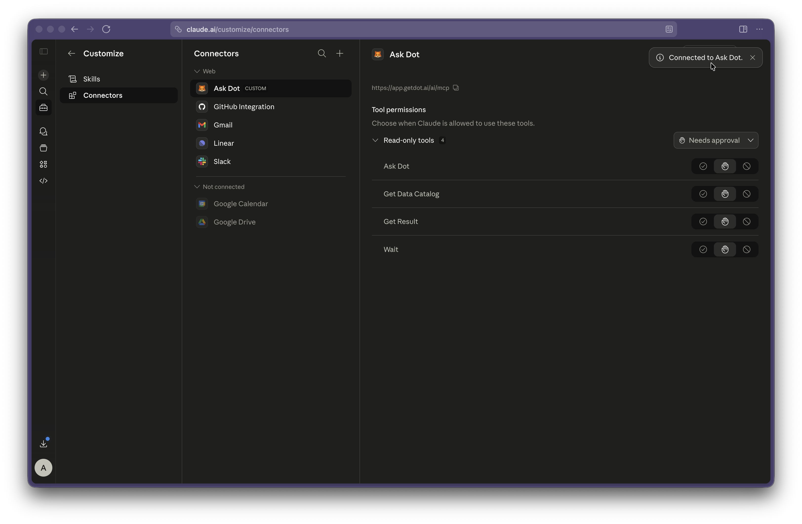
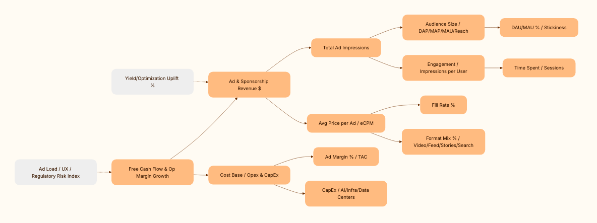

# MCP

### What is MCP?

MCP (Model Context Protocol) lets AI assistants like Claude, Cursor, and ChatGPT connect directly to your data sources through secure connections. With Dot's MCP integration, your assistant can query your business data while respecting all of your existing Dot permissions and setup.

### Your Dot MCP URL

You'll paste this URL into every client below. It depends on which region you sign into Dot from:

* **US**: `https://app.getdot.ai/ai/mcp`
* **EU**: `https://eu.getdot.ai/ai/mcp`

Use the same host you use to sign into Dot in the browser. You can also copy the exact URL from **Settings → Integrations** inside Dot.


**OAuth is the default.** For supported clients (Claude, Cursor, Windsurf), OAuth means no tokens to copy or manage — just sign into Dot in your browser and click **Allow**. Sessions last up to a year.

If OAuth isn't supported by your client (ChatGPT, Raycast, generic MCP clients) or something goes wrong, see [Using an API token](#using-an-api-token).


### Claude (Web, Desktop, Cowork, Mobile)

**Requirements**: Free, Pro, Max, Team, or Enterprise plan. Free users can connect one custom connector at a time.


**You only need to set this up once.** Custom connectors are remote MCP servers hosted by Dot, so Anthropic syncs them across every Claude surface automatically. Adding Dot on claude.ai makes it available in Claude Desktop, Cowork, and the Claude mobile apps with no per-device setup. Prefer to start from Claude Desktop? Open **Settings → Connectors → Add custom connector** and follow the same steps — it'll sync back to the web.






### Open Customize → Connectors

In Claude, click your profile → **Customize** → **Connectors**.

<figure><figcaption></figcaption></figure>

<figure><figcaption></figcaption></figure>



### Add a custom connector

Click the **+** next to the Connectors header and choose **Add custom connector**.

<figure><figcaption></figcaption></figure>



### Name it and paste the URL

Name it **Ask Dot**, paste your Dot MCP URL, then click **Add**.

<figure><figcaption></figcaption></figure>



### Connect

Click **Connect** on the new **Ask Dot** entry.

<figure><figcaption></figcaption></figure>



### Authorize in Dot

A Dot tab opens. Review the requested permissions and click **Allow**.

<figure><figcaption></figcaption></figure>



### Done

Back in Claude, **Ask Dot** now shows as **Connected** with its available tools. Enable it in any chat via the **+** button → **Connectors**.

<figure><figcaption></figcaption></figure>





Team and Enterprise workspaces use a two-step flow: an owner adds the connector once for the organization, then each member connects their own Dot account.

**Owner (one-time setup):**



### Open Organization settings → Connectors

In Claude, go to **Organization settings → Connectors**.



### Add a custom web connector

Click **Add** → **Custom** → **Web**.



### Paste the Dot MCP URL

Name it **Ask Dot**, paste your Dot MCP URL, then click **Add**.



**Each member (once):**



### Open Customize → Connectors

Find **Ask Dot** in the list — it'll be marked **Custom**.



### Connect

Click **Connect**.

<figure><figcaption></figcaption></figure>



### Authorize in Dot

A Dot tab opens. Review the permissions and click **Allow**.

<figure><figcaption></figcaption></figure>





### Claude Code

Run the command from Dot's Integrations page:

```bash
claude mcp add --transport http ask_dot https://app.getdot.ai/ai/mcp
```

OAuth will open your browser to authenticate on first use.


Claude Code with a signed-in Anthropic account also picks up custom connectors synced from your Claude Web/Desktop setup. If you've already connected Dot there, you can skip this command.


### Cursor IDE

The recommended setup uses the [`mcp-remote`](https://www.npmjs.com/package/mcp-remote) stdio proxy — the same approach Linear, Cloudflare, and Sentry recommend for their MCP servers. **Requires [Node.js](https://nodejs.org) installed locally.**

**One-click install:** Click the **Add to Cursor** button on Dot's Integrations page. Cursor will open your browser to authorize.

**Manual install:** Add this to `~/.cursor/mcp.json` (use `https://eu.getdot.ai/ai/mcp` for the EU instance):

```json
{
  "mcpServers": {
    "ask_dot": {
      "command": "npx",
      "args": ["-y", "mcp-remote", "https://app.getdot.ai/ai/mcp"]
    }
  }
}
```

Save the file, then restart Cursor (or toggle the server in **Settings → Tools & Integrations → MCP Tools**). On first connect, Cursor will spawn `mcp-remote`, open your browser to authorize, and cache the session for up to a year.


If you'd rather use a static API token instead of OAuth, see [Using an API token → JSON config](#using-an-api-token) below for the Cursor-specific shape.


### Windsurf

Copy the URL from Dot's Integrations page and add it as an MCP server in Windsurf settings. Windsurf will open your browser to authenticate.

### ChatGPT

**Requirements**: ChatGPT Enterprise, Education, or Team subscription.

ChatGPT supports token-based auth only — see [Using an API token](#using-an-api-token) for how to generate a token. Then in ChatGPT's connector settings, add a new connector:

* **Name**: Ask\_dot
* **Description**: Dot AI-powered data analysis platform. \<Add additional info about the data you have connected and when to use it>
* **MCP Server URL**: the ChatGPT-specific URL from Dot's Integrations page
* **Authentication**: No Auth (the token is carried in the URL)

### Raycast AI

Raycast uses token-based auth — see [Using an API token](#using-an-api-token) to generate one.

1. Run **"Manage MCP Servers"** command in Raycast
2. Press `Cmd + N` to add a new server
3. Paste the configuration from Dot's Integrations page
4. Submit and use by @-mentioning "dot" in Raycast AI

<figure><figcaption></figcaption></figure>

### Other MCP clients

Most MCP clients support URL-based configuration. If your client supports OAuth / MCP authorization, use the plain Dot MCP URL — that's it. Otherwise, follow [Using an API token](#using-an-api-token) and use the token-appended URL.

### Using an API token

Use a token when your client doesn't support OAuth (ChatGPT, Raycast, generic MCP clients) or as a fallback if OAuth isn't working.

#### Generate a token

1. Go to **Settings → Integrations** in Dot
2. Select your client and switch to the **API Token** tab
3. Click **Generate MCP Token** and copy it immediately — you won't see it again

#### Apply the token

Depending on how your client accepts credentials, use one of these:



For clients that take a single URL field, paste your Dot MCP URL with the token on the end:

```
https://app.getdot.ai/ai/mcp?token=YOUR_TOKEN
```

This works for Claude Code, Windsurf, ChatGPT, Raycast, and most generic MCP clients.

```bash
claude mcp add --transport http ask_dot https://app.getdot.ai/ai/mcp?token=YOUR_TOKEN
```



For clients that accept an MCP server block:

1. In Cursor, go to **Settings → Tools & Integration → Add new MCP Server** to open `mcp.json`
2. Grab the URL and API key from the JSON config section under "Others" on Dot's Integrations page
3. Add to `mcpServers`:

```json
{
  "mcpServers": {
    "ask_dot": {
      "url": "https://app.getdot.ai/ai/mcp",
      "headers": {
        "API-KEY": "<your-dot-mcp-api-key>"
      }
    }
  }
}
```



Edit Claude Desktop's config file:

* **macOS**: `~/Library/Application Support/Claude/claude_desktop_config.json`
* **Windows**: `%APPDATA%\Claude\claude_desktop_config.json`

Paste the Dot server block from the **API Token** tab on Dot's Integrations page, save, and restart Claude Desktop. Look for the MCP indicator (hammer icon) in the chat input.



#### Token management

* **Special MCP token with limited scope** — separate from regular API tokens
* **One active token per user** — generating a new token revokes the previous one
* **365-day expiry** — tokens expire after one year
* **Immediate revocation** — admins can delete tokens anytime via the UI

### Asking questions

Once configured, you can ask your AI assistant questions about your data:

* "What were total sales last quarter?"
* "Show me top 10 customers by revenue"
* "Compare this month's performance to last month"
* "What data sources are available?"

### Security

#### OAuth sessions

* OAuth uses industry-standard **OAuth 2.1 with PKCE** for secure authorization
* Access tokens expire after **1 hour** and are automatically refreshed
* Refresh tokens are valid for **1 year** — after that, re-authentication is required
* You can revoke OAuth access anytime by changing your Dot password, which invalidates all sessions
* The consent page shows exactly which permissions the client is requesting before you approve

#### Data access

* MCP respects all your Dot permissions and has the same data permissions as the user
* Queries run within your organization's scope and user scope
* All data filtering rules are enforced
* All queries are logged for compliance

### Troubleshooting

#### OAuth issues

**Browser doesn't open for authentication**

* Ensure your AI client is up to date
* Try the token-based method as a fallback
* Check that your browser isn't blocking pop-ups from Dot

**"Authorization session expired" error**

* The consent page expires after 10 minutes — restart the connection from your AI client

**"Sign in to continue" on consent page**

* You need to be signed into Dot in your browser first
* Click "Open Dot Login", sign in (password or SSO), then click "Continue"

#### Token issues

**"Invalid API token" error**

* Verify you copied the complete token
* Check if token was revoked or replaced
* Ensure you're using the correct Dot URL

**"Token does not have required MCP access" error**

* Generate a new MCP token from Settings → Integrations
* Ensure you're not using a regular API token

#### Connection issues

**Connection timeout**

* Check network connection to Dot
* Verify the Dot instance URL is correct
* Some clients have a tool timeout setting — adjust it accordingly
