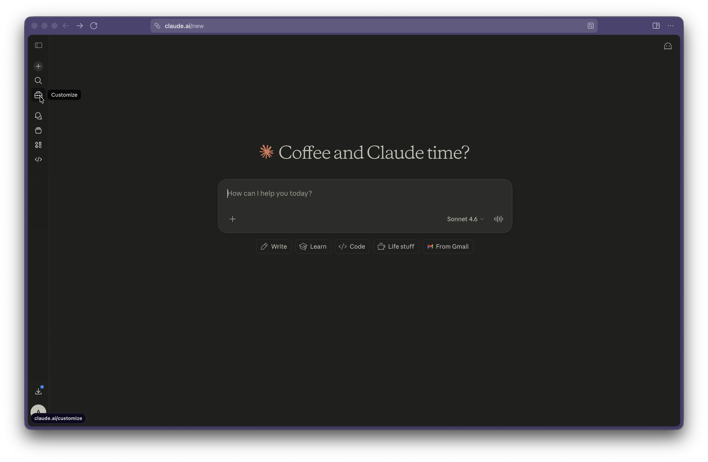
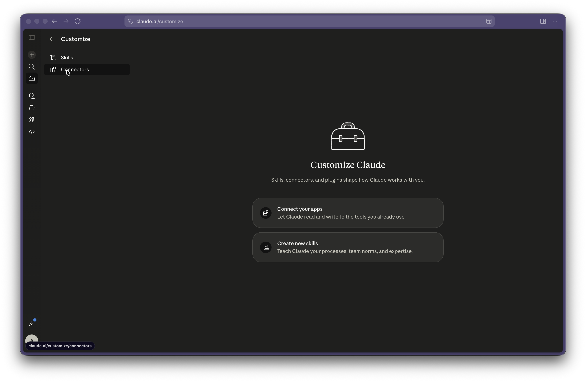
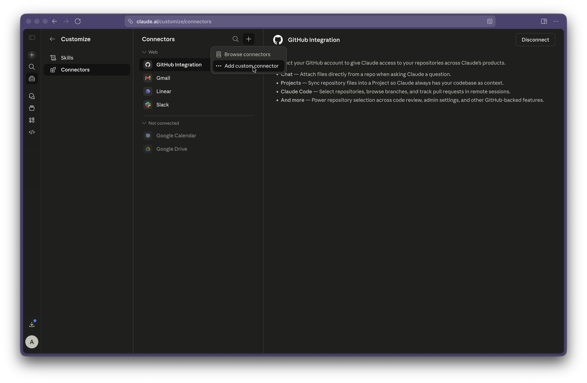
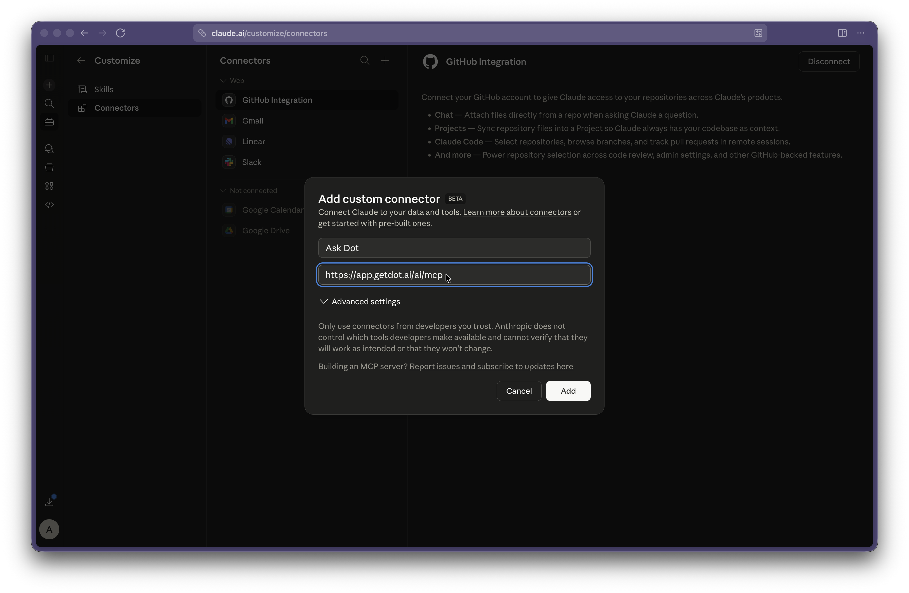
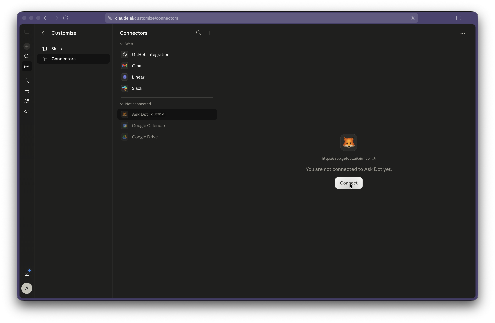
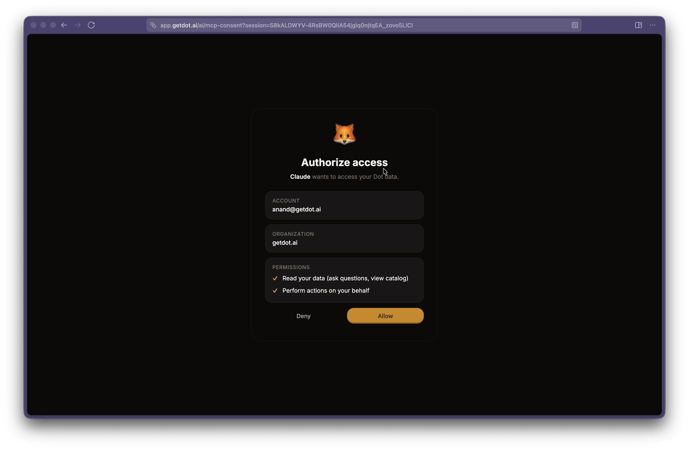
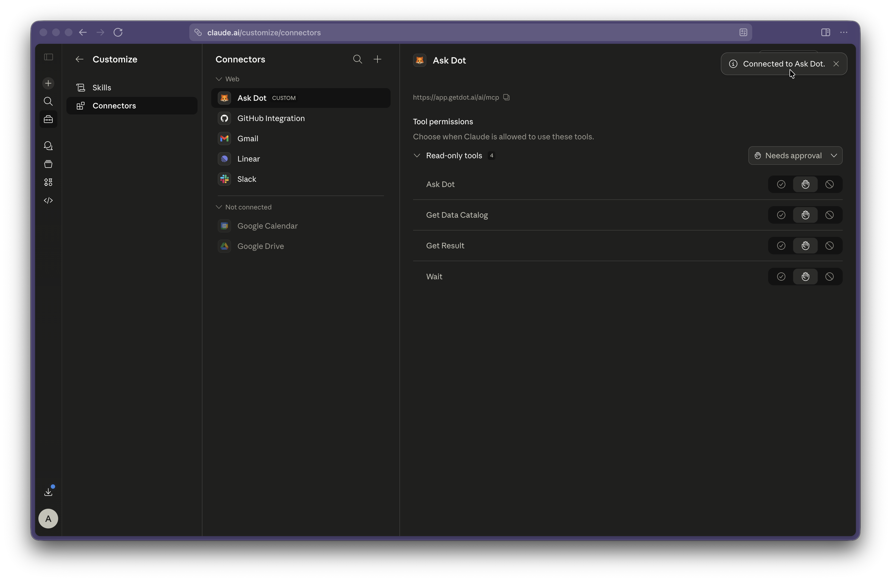
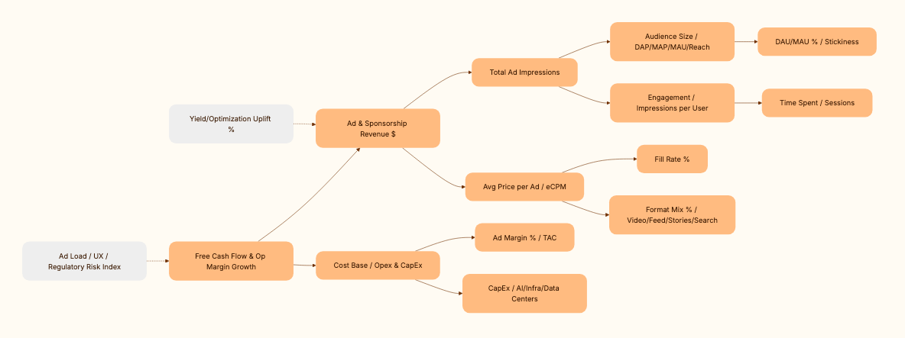

# MCP

### What is MCP?

MCP (Model Context Protocol) lets AI assistants like Claude, Cursor, and ChatGPT connect directly to your data sources through secure connections. With Dot's MCP integration, your assistant can query your business data while respecting all of your existing Dot permissions and setup.

### Your Dot MCP URL

You'll paste this URL into the clients below (ChatGPT uses its own, see [ChatGPT](#chatgpt)). It depends on which region you sign into Dot from:

* **US**: `https://app.getdot.ai/ai/mcp`
* **EU**: `https://eu.getdot.ai/ai/mcp`

Use the same host you use to sign into Dot in the browser. You can also copy the exact URL from your **Profile** in Dot. Open the user menu, choose **Connect Dot**, then **MCP**, or scroll to **Use Dot elsewhere**. It has one tab per client: MCP, CLI, Claude, ChatGPT and Cursor.


**OAuth is the default.** For supported clients (Claude, ChatGPT, Cursor, Windsurf), OAuth means no tokens to copy or manage. Just sign into Dot in your browser and click **Allow**. Sessions last up to a year.

If your client can't do OAuth or something goes wrong, see [Using an API token](#using-an-api-token).


### Claude (Web, Desktop, Cowork, Mobile)

**Requirements**: Free, Pro, Max, Team, or Enterprise plan. Free users can connect one custom connector at a time.


**You only need to set this up once.** Custom connectors are remote MCP servers hosted by Dot, so Anthropic syncs them across every Claude surface automatically. Adding Dot on claude.ai makes it available in Claude Desktop, Cowork, and the Claude mobile apps with no per-device setup. Prefer to start from Claude Desktop? Open **Settings → Connectors → Add custom connector** and follow the same steps — it'll sync back to the web.






### Open Customize → Connectors

In Claude, click your profile → **Customize** → **Connectors**.

<figure><figcaption></figcaption></figure>

<figure><figcaption></figcaption></figure>



### Add a custom connector

Click the **+** next to the Connectors header and choose **Add custom connector**.

<figure><figcaption></figcaption></figure>



### Name it and paste the URL

Name it **Ask Dot**, paste your Dot MCP URL, then click **Add**.

<figure><figcaption></figcaption></figure>



### Connect

Click **Connect** on the new **Ask Dot** entry.

<figure><figcaption></figcaption></figure>



### Authorize in Dot

A Dot tab opens. Review the requested permissions and click **Allow**.

<figure><figcaption></figcaption></figure>



### Done

Back in Claude, **Ask Dot** now shows as **Connected** with its available tools. Enable it in any chat via the **+** button → **Connectors**.

<figure><figcaption></figcaption></figure>





Team and Enterprise workspaces use a two-step flow: an owner adds the connector once for the organization, then each member connects their own Dot account.

**Owner (one-time setup):**



### Open Organization settings → Connectors

In Claude, go to **Organization settings → Connectors**.



### Add a custom web connector

Click **Add** → **Custom** → **Web**.



### Paste the Dot MCP URL

Name it **Ask Dot**, paste your Dot MCP URL, then click **Add**.



**Each member (once):**



### Open Customize → Connectors

Find **Ask Dot** in the list — it'll be marked **Custom**.



### Connect

Click **Connect**.

<figure><figcaption></figcaption></figure>



### Authorize in Dot

A Dot tab opens. Review the permissions and click **Allow**.

<figure><figcaption></figcaption></figure>





### Claude Code

Run this command (the **CLI** tab in Dot also sets up Claude Code):

```bash
claude mcp add --transport http ask_dot https://app.getdot.ai/ai/mcp
```

OAuth will open your browser to authenticate on first use.


Claude Code with a signed-in Anthropic account also picks up custom connectors synced from your Claude Web/Desktop setup. If you've already connected Dot there, you can skip this command.


### Cursor IDE

Cursor connects to Dot directly as a remote MCP server.

**One-click install:** Open the **Cursor** tab in Dot and click **Add to Cursor**. Cursor will open your browser to authorize.

**Manual install:** Add this to `~/.cursor/mcp.json` (use `https://eu.getdot.ai/ai/mcp` for the EU instance):

```json
{
  "mcpServers": {
    "ask_dot": {
      "url": "https://app.getdot.ai/ai/mcp"
    }
  }
}
```

Save the file, then restart Cursor (or toggle the server in **Settings → Tools & Integrations → MCP Tools**). On first connect, Cursor opens your browser to authorize and keeps the session for up to a year.

If you set Dot up earlier with the `npx mcp-remote` proxy, replace that entry with the config above. The proxy could ask you to sign in again and again when more than one Cursor window was open.


If you'd rather use a static API token instead of OAuth, see [Using an API token → JSON config](#using-an-api-token) below for the Cursor-specific shape.


### Windsurf

Copy the URL from the **MCP** tab in Dot and add it as an MCP server in Windsurf settings. Windsurf will open your browser to authenticate.

### ChatGPT

**Requirements**: a paid ChatGPT plan. If you don't see a **Create** button, turn on Developer mode under **Settings → Connectors → Advanced**.

ChatGPT has its own URL, so copy it from the **ChatGPT** tab in Dot:

* **US**: `https://app.getdot.ai/chatgpt/mcp`
* **EU**: `https://eu.getdot.ai/chatgpt/mcp`

1. In ChatGPT, open **Settings → Connectors → Create**.
2. Name it, then paste the ChatGPT URL as the **MCP Server URL**.
3. Choose **OAuth** for authentication. ChatGPT signs you in to Dot.

It is built for ChatGPT's Deep Research. Ask it to research your company data and it queries Dot.

### Raycast AI

Raycast works with the plain MCP URL. If it can't sign in through your browser, generate a token (see [Using an API token](#using-an-api-token)).

1. Run **"Manage MCP Servers"** command in Raycast
2. Press `Cmd + N` to add a new server
3. Paste the URL, or the token configuration, from the **MCP** tab in Dot
4. Submit and use by @-mentioning "dot" in Raycast AI

<figure><figcaption></figcaption></figure>

### Other MCP clients

Most MCP clients support URL-based configuration. If your client supports OAuth / MCP authorization, use the plain Dot MCP URL — that's it. Otherwise, follow [Using an API token](#using-an-api-token) and send the token in a header.

### Using an API token

Use a token when your client doesn't support OAuth or as a fallback if OAuth isn't working.

#### Generate a token

1. In Dot, open your **Profile** and scroll to **Use Dot elsewhere**
2. On the **MCP** tab, open **Client can't do OAuth? Use an API token**
3. Click **Generate token** and copy it immediately. You won't see it again

#### Apply the token

Depending on how your client accepts credentials, use one of these:



Send the token in an `X-API-KEY` header. That's how token auth works now, so use it anywhere your client lets you set request headers.

For Claude Code, pass the header on the add command:

```bash
claude mcp add --transport http ask_dot https://app.getdot.ai/ai/mcp --header "X-API-KEY: YOUR_TOKEN"
```

If your client only takes a plain URL and can't set headers, use OAuth instead (see the top of this page). Putting the token in the URL is no longer supported.



For clients that accept an MCP server block:

1. In Cursor, go to **Settings → Tools & Integration → Add new MCP Server** to open `mcp.json`
2. Generate a token on the **MCP** tab in Dot (see above), which shows the URL and header to use
3. Add to `mcpServers`:

```json
{
  "mcpServers": {
    "ask_dot": {
      "url": "https://app.getdot.ai/ai/mcp",
      "headers": {
        "X-API-KEY": "<your-dot-mcp-api-key>"
      }
    }
  }
}
```




#### Token management

* **Special MCP token with limited scope** — separate from regular API tokens
* **One active token per user** — generating a new token revokes the previous one
* **365-day expiry** — tokens expire after one year
* **Immediate revocation** — admins can delete tokens anytime via the UI

### Charts and apps inside your assistant

Hosts that support MCP Apps, such as Claude, show Dot's answers as a card in the conversation: the charts and tables, drawn the way Dot draws them. When you ask to see a Dot app (a dashboard or report), the assistant opens it live in the conversation. Ask "what apps do I have?" and the assistant lists the ones you can open. Text-only clients such as Claude Code and Codex get the text answer, data preview and links.

### Asking questions

Once configured, you can ask your AI assistant questions about your data:

* "What were total sales last quarter?"
* "Show me top 10 customers by revenue"
* "Compare this month's performance to last month"
* "What data sources are available?"

### Security

#### OAuth sessions

* OAuth uses industry-standard **OAuth 2.1 with PKCE** for secure authorization
* Access tokens expire after **1 hour** and are automatically refreshed
* Refresh tokens are valid for **1 year** — after that, re-authentication is required
* To end MCP access, disconnect or remove Dot in your client, which revokes that session, or delete your MCP token in Settings. Note that changing your Dot password does not revoke existing MCP connections on its own
* The consent page shows exactly which permissions the client is requesting before you approve

#### Data access

* MCP respects all your Dot permissions and has the same data permissions as the user
* Queries run within your organization's scope and user scope
* All data filtering rules are enforced
* All queries are logged for compliance

### Troubleshooting

#### OAuth issues

**Browser doesn't open for authentication**

* Ensure your AI client is up to date
* Try the token-based method as a fallback
* Check that your browser isn't blocking pop-ups from Dot

**"Authorization session expired" error**

* The consent page expires after 10 minutes — restart the connection from your AI client

**"Sign in to continue" on consent page**

* You need to be signed into Dot in your browser first
* Click "Open Dot Login", sign in (password or SSO), then click "Continue"

#### Token issues

**"Invalid API token" error**

* Verify you copied the complete token
* Check if token was revoked or replaced
* Ensure you're using the correct Dot URL

**"Token does not have required MCP access" error**

* Generate a new MCP token from your Profile, under Use Dot elsewhere
* Ensure you're not using a regular API token

#### Connection issues

**Connection timeout**

* Check network connection to Dot
* Verify the Dot instance URL is correct
* Some clients have a tool timeout setting — adjust it accordingly

### Connect other MCP servers to Dot

This is the other direction: you give Dot tools from a remote MCP server so it can use them while answering. Admins set this up under **Settings → Connections**, in **Context Connectors**, on the **MCP server** card. It is in beta, and servers that only sign in with OAuth aren't supported yet.

1. Enter a **Name**, a **Slug** (lowercase letters, digits and underscores), the server's **URL** (it must start with `https://`) and a **Description**. The description tells Dot when to use the server.
2. If the server needs a key, add the **Auth header** name and its **Value**.
3. Click **Save**. Dot loads the server's tools. A server it can't reach isn't saved.

Tools the server declares read-only start switched on. Dot can't enable a tool that can change data. If you know a tool only reads, choose **Mark read-only** next to it first. Use **Refresh tools** to pick up changes. A tool whose definition changed turns off until you review it and switch it back on.
