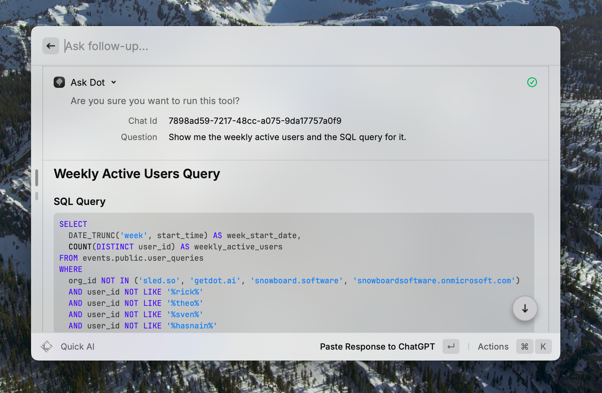

# MCP

### What is MCP?

MCP (Model Context Protocol) enables AI assistants like Claude and ChatGPT to connect directly to your data sources through secure connections. With Dot's MCP integration, AI assistants can query your business data while maintaining all your existing permissions and setup.

### Quick Start

1. **Generate an MCP Token** in Dot (Side Navbar → Profile Menu → Get MCP Config → Generate MCP Token)
2. Select your client and follow on-screen instructions, **copy the token immediately** - you won't see it again
3. **Add to your AI assistant** using the provided URL/instructions
4. **Test the connection** by asking "What data sources are available in Dot?"

### Setup Instructions

#### Step 1: Generate Your MCP Token

1. Click on your profile menu in the sidebar
2. Select **Get MCP Config**
3. Click **Generate MCP Token**
4. **Important**: Copy the token immediately - it won't be shown again

Note: Only one MCP token can be active per user. Generating a new token revokes any existing token.

#### Step 2: Configure Your AI Assistant

Select your AI client from the modal after generating the token, and follow the specific instructions provided.

### Client Setup

#### Claude Desktop

1. Navigate to Settings in Claude Desktop
2. Edit the configuration file:
   * **macOS**: `~/Library/Application Support/Claude/claude_desktop_config.json`
   * **Windows**: `%APPDATA%\Claude\claude_desktop_config.json`
3. Add the Dot server configuration provided in the modal
4. Save and restart Claude Desktop
5. Look for the MCP indicator (hammer icon) in the chat input

#### Claude Web ([claude.ai](http://claude.ai/))

**Requirements**: Pro, Max, Team, or Enterprise plan

1. Navigate to **Settings > Connectors**
2. Click **"Add custom connector"**
3. Enter the URL provided in the modal
4. Click **"Add"** to finish
5. Enable tools via the "Search and tools" button

For Team/Enterprise owners: Toggle to "Organization connectors" to make available for all members.

#### Claude Code

Run the command provided in the modal:

```bash
claude mcp add --transport http ask_dot [YOUR_URL_HERE]
```

#### Cursor IDE

Cursor supports easy installation via deeplinks:

1. Generate your configuration in the modal
2. Click the installation button
3. Cursor will automatically configure MCP

Manual setup:

1. Go to mcp.json via Cursor Settings > Tools & Integration > Add new MCP Server
2. Get the URL and API key from the JSON config section in "Others" for MCP clients in the Get MCP Config dialog box
3. Add to the mcpServers in mcp.json as follows:

```json
{
  "mcpServers": {
    "ask_dot": {
      "url": "<https://app.getdot.ai/ai/mcp>", # or <https://eu.getdot.ai/ai/mcp>
      "headers": {
        "API-KEY": "<your-dot-mcp-api-key>"
      }
    }
  }
}
```

#### ChatGPT

**Requirements**: ChatGPT Enterprise, Education, or Team subscription

1. Go to ChatGPT settings for connectors
2. Add a new connector:
   * **Name**: Ask\_dot
   * **Description**: Dot AI-powered data analysis platform. \<Add additional info about the data you have connected and when to use it>
   * **MCP Server URL**: Use the ChatGPT-specific URL from the modal
   * **Authentication**: No Auth (handled via token in URL)

#### Raycast AI

1. Run **"Manage MCP Servers"** command in Raycast
2. Press `Cmd + N` to add a new server
3. Paste the configuration from the modal
4. Submit and use by @-mentioning "dot" in Raycast AI

<figure><figcaption></figcaption></figure>


#### Other MCP Clients

Most MCP clients support URL-based configuration. Use the URL provided in the modal after generating your token.

### Using MCP with Dot

#### Asking Questions

Once configured, you can ask your AI assistant questions about your data:

* "What were total sales last quarter?"
* "Show me top 10 customers by revenue"
* "Compare this month's performance to last month"
* "What data sources are available?"

### Security

#### Token Management

* Special MCP token with limited scope
* **One active token**: Only one MCP token per user
* **Auto-revocation**: New tokens revoke previous ones
* **365-day expiry**: Tokens expire after one year
* **Immediate revocation**: Delete tokens anytime via the UI (by admins)

#### Data Access

* MCP respects all your Dot permissions and has the same data permissions as the user
* Queries run within your organization's scope and user scope
* All data filtering rules are enforced
* All queries are logged for compliance

### Troubleshooting

#### Connection Issues

**"Invalid API token" error**

* Verify you copied the complete token
* Check if token was revoked or replaced
* Ensure you're using the correct Dot URL

**"Token does not have required MCP access" error**

* Generate a new MCP token from Profile Menu → Get MCP Config
* Ensure you're not using a regular API token

**Connection timeout**

* Check network connection to Dot
* Verify the Dot instance URL is correct
* Some clients have a tool timeout setting - adjust it accordingly

