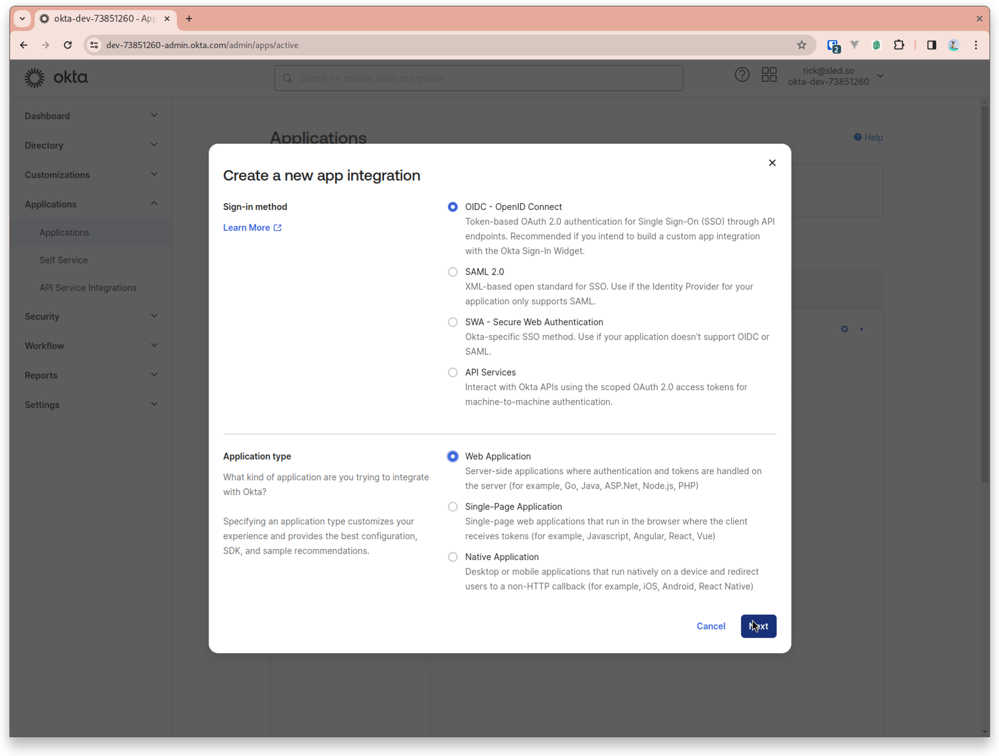
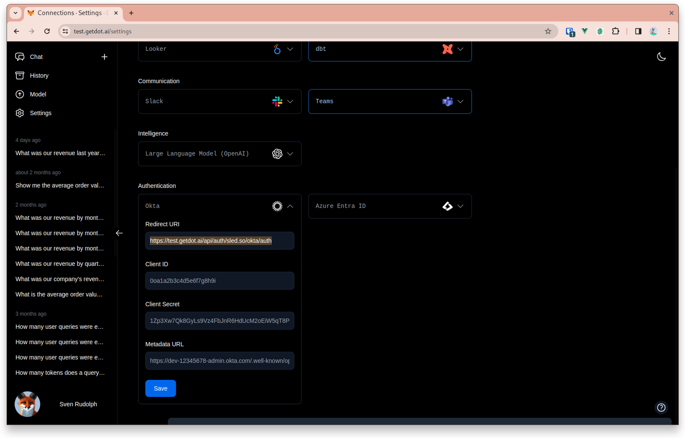
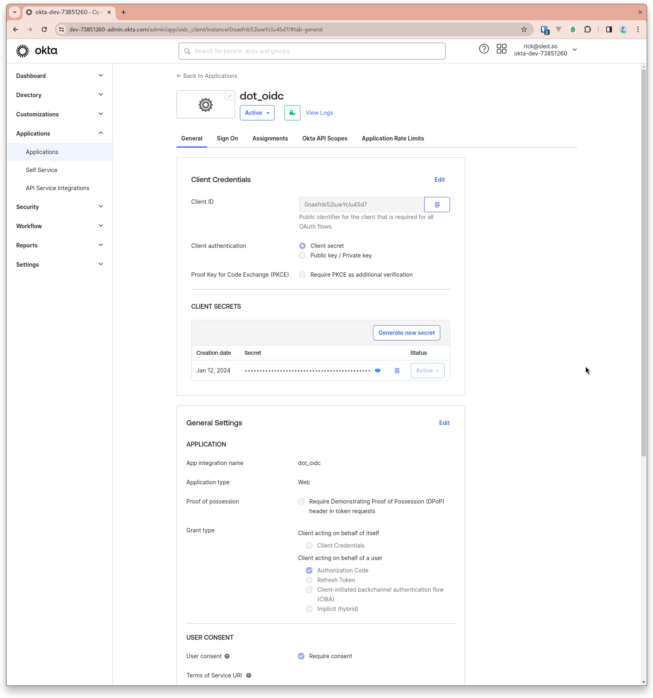
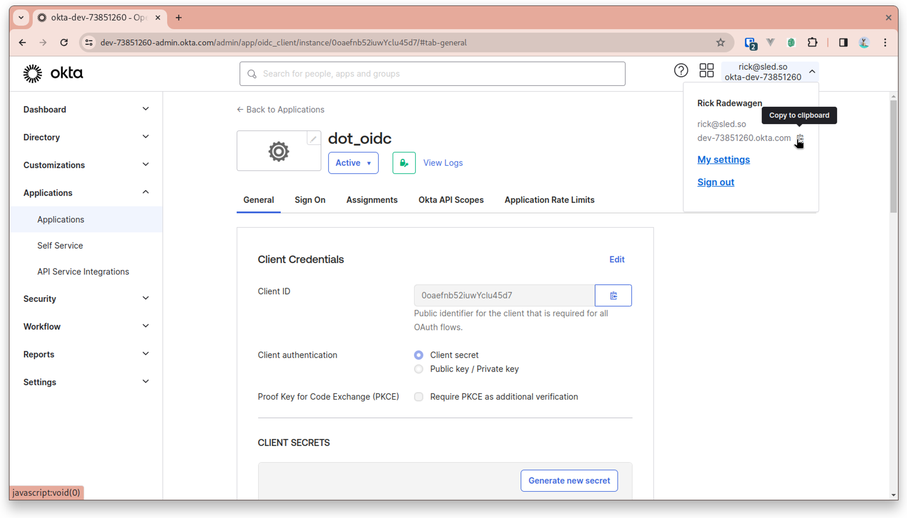

# Okta

## Integrating Single Sign-On (SSO) with Okta for Dot

This guide walks you through the process of creating an app integration in Okta and setting up SSO with Dot.

### Step 1: Create a New App Integration in Okta

1. Log in to your Okta admin dashboard.
2. Navigate to **Applications** > **Applications**.
3. Click on **Create App Integration**.

### Step 2: Configure the App Integration

1. Select the **OIDC - OpenID Connect** option.
2. Choose **Web Application** as the application type and click **Next**.

<figure><figcaption></figcaption></figure>

### Step 3: Set Redirect URI

1. In a separate browser tab, go to your **Dot Settings** > **Okta** section to copy the Redirect URI.
2. Return to the Okta tab and paste the copied URI into the **Sign-in redirect URIs** field.

<figure><figcaption></figcaption></figure>

### Step 4: Configure General Settings

1. Provide a name for your integration, e.g., `Dot SSO Integration`.
2. Add the Redirect URI from the Dot settings to **Sign-in redirect URIs**.
3. Set the **Sign-out redirect URI** to the base domain of Dot:
   * For EU: `https://eu.getdot.ai`
   * For US: `https://app.getdot.ai`
4. Set the logo



<figure><figcaption></figcaption></figure>

### Step 5: Assign Users or Groups

1. Choose to either **Assign** individual users or **Assign to groups** within your organization.

### Step 6: Copy Client Credentials

1. After saving the new app integration, navigate to the **General** tab of your newly created app. 2. Copy the **Client ID** and **Client Secret**.

<figure><figcaption></figcaption></figure>

### Step 7: Configure Dot with Okta Credentials

1. Go back to your Dot Settings > Okta section.
2. Paste the **Client ID** and **Client Secret** into the respective fields.

### Step 8: Metadata URL

1. The Metadata URL is essential for SSO operations. Construct it using your Okta domain:
   * Format: `https://{okta-url}/.well-known/openid-configuration`
   * Example: `https://dev-12345678.okta.com/.well-known/openid-configuration`
2. Your Okta URL can be found in the drop-down menu under your username at the top right corner of the Okta dashboard.

<figure><figcaption></figcaption></figure>

### Finalizing the Integration

After you have entered all the necessary information into Dot's Okta settings:

1. Click **Save** to apply the settings.
2. Test the SSO integration to ensure it's working as expected.

By following these steps, you will have successfully set up SSO with Okta for your Dot application. Ensure that all copied values are kept secure and are only shared with authorized personnel within your organization.
