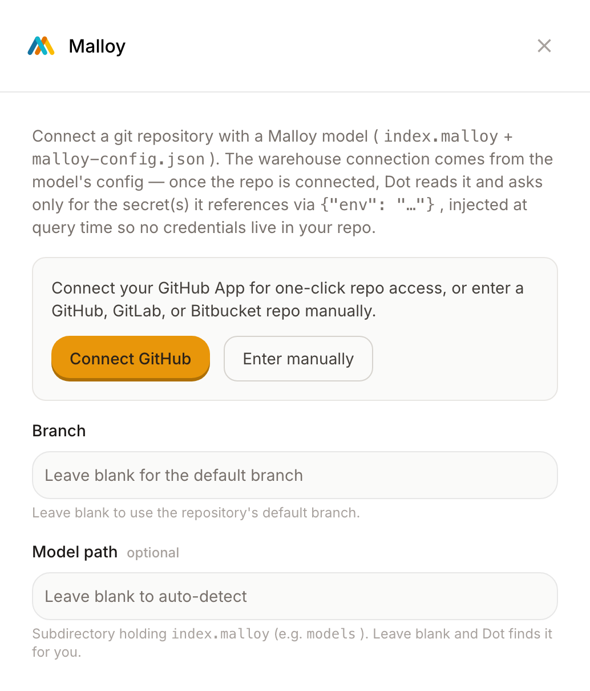

# Malloy

Malloy is a language for modeling your data. If your team already defines dimensions and measures in Malloy, you probably don't want to write them again inside Dot. So connect your Malloy model instead. Dot reads the definitions straight from your repository, and when someone asks a question, Dot answers using your metrics rather than its own guess at what a metric means.

The point is consistency. The numbers Dot gives back match the ones your Malloy model produces, because they come from the same place. You keep one source of truth for your metrics, and you edit it where you already work, in git.

## What you need

Your Malloy model lives in a git repository. That repo holds your model files, an `index.malloy` and a `malloy-config.json`, and the config is where the warehouse connection is defined. Dot connects to the repo, reads the model, and uses that same warehouse connection, so you don't set the database up twice.

Have this ready:

* The repository, on GitHub, GitLab, or Bitbucket
* A way for Dot to read it: connect the GitHub App for one-click access, or point Dot at the repo manually
* The branch, if it isn't the default one

## Connect it

1. Sign in to Dot as an admin.
2. Open Settings, then Connections, and find the Semantic Layers section.
3. Click Malloy.
4. Connect the repository. Use Connect GitHub for one-click access, or choose Enter manually for a GitHub, GitLab, or Bitbucket repo.
5. Leave the branch blank to use the default branch, or name a specific one.
6. If your model isn't at the root of the repo, put the folder that holds `index.malloy` in Model path. Leave it blank and Dot finds it for you.
7. Click Connect.

<figure><figcaption>
Connect the repo that holds your Malloy model. Dot reads the model and the warehouse connection from it.
</figcaption></figure>

Once the repo is connected, Dot reads the config. If the model references any secrets, like a warehouse password, Dot asks you for just those and keeps them out of your repo, filling them in when it runs a query. Then it turns your Malloy sources into tables it can query, with your dimensions and measures attached, and answers start using those definitions.

## Keeping it in sync

When you change the model in git, Dot picks up the change. You can also start a sync yourself from the connection card after you push an update.

## Row-level security

A Malloy source can carry its own access rules. If a source is filtered by group, Dot applies that filter for each person, so people only see the rows they are allowed to see. It works the same way as row-level permissions on your other tables. See [Permissions](../../whats-dot/permissions.md) for how groups and row-level filtering work.
