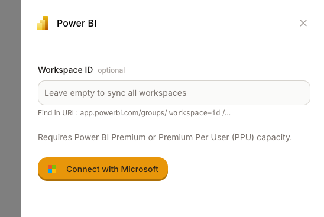

# Power BI Semantic Layer

Connect Dot to your Power BI semantic models to query your measures and dimensions using natural language. Dot syncs your workspaces, datasets, measures, and columns—including their descriptions—so you can ask questions about your data without writing DAX.


**Requirements**

* **Power BI Premium or Premium Per User (PPU)** capacity is required
* "Dataset Execute Queries REST API" must be enabled in your tenant settings
* You must have access to the workspaces you want to sync


## Connect to Power BI

<figure><figcaption></figcaption></figure>

1. Go to **Settings → Semantic Layers → Power BI**
2. (Optional) Enter a **Workspace ID** to sync only that workspace, or leave it empty to sync all workspaces you have access to
3. Click **Connect with Microsoft**
4. Sign in with your Microsoft account and grant access
5. Dot will start syncing your semantic models


**Finding your Workspace ID**

Open your workspace in Power BI. The Workspace ID is in the URL:
`https://app.powerbi.com/groups/{workspace-id}/...`


## What Gets Synced

When you connect Power BI, Dot imports:

* **Workspaces** — appear as schemas in Dot
* **Datasets / Semantic models** — appear as tables
* **Measures and columns** — with their descriptions and data types
* **Relationships** — connections between tables

Dot periodically re-syncs to pick up new or changed models. You can also trigger a manual sync from the connection settings.

## Limitations


**Known limitations**

* **Premium or PPU capacity required** — datasets on shared capacity cannot be queried via the API
* **Row-Level Security (RLS) not supported** — datasets with RLS enabled cannot be queried
* **Personal workspaces not supported** — "My Workspace" cannot be accessed via OAuth
* **Maximum 100,000 rows per query** — larger result sets are truncated
