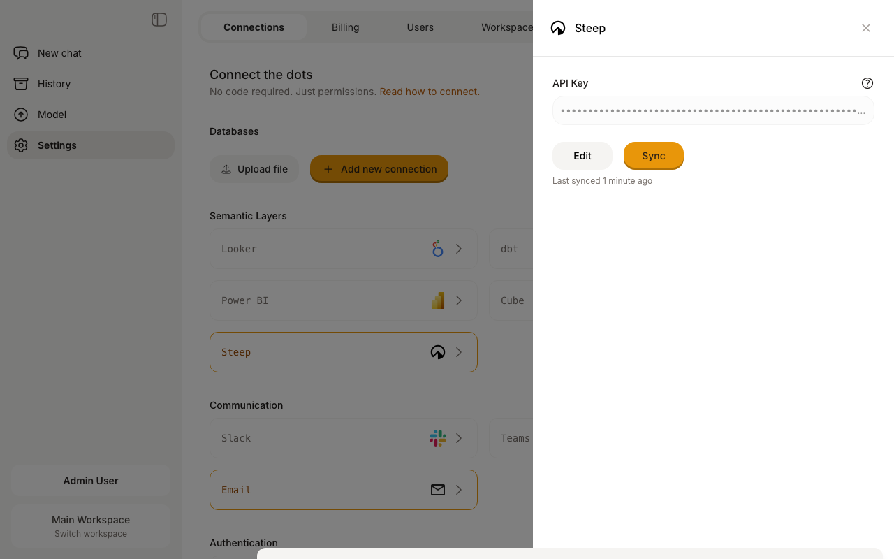

# Steep

Connect Dot to your [Steep](https://steep.app) semantic layer to query metrics, dimensions, and slices using natural language. Dot syncs your metric definitions, dimensions, and their descriptions so you can ask questions about your data without writing code.


**Requirements**

* A **Steep account** with at least one metric defined
* A **Steep API key** — generate one in Steep under **Settings → API**


## Connect to Steep

<figure><figcaption></figcaption></figure>

1. Go to **Settings → Semantic Layers → Steep**
2. Enter your **API Key**
3. Click **Connect**
4. Dot will sync your metrics and dimensions


**Generating an API key**

In Steep, go to **Settings → API** and create a new API key. Copy the key and paste it into Dot.


## What Gets Synced

When you connect Steep, Dot imports:

* **Metrics** — each metric appears as a table (e.g., revenue, order\_volume)
* **Dimensions** — appear as columns on each metric, with their data types
* **Descriptions** — metric and dimension descriptions are synced for context
* **Slices** — predefined filters listed in metric descriptions (e.g., "UK", "Enterprise")
* **Related metrics** — noted in descriptions so Dot can suggest complementary data

Dot periodically re-syncs to pick up new or changed metrics. You can also trigger a manual sync from the connection settings.

## How Queries Work

When you ask a question, Dot generates a `steep_query()` call that fetches data for one metric at a time. Queries support:

* **Breakdowns** — group results by up to 2 dimensions (e.g., by Country, by Product Category)
* **Filters** — narrow results to specific dimension values
* **Slices** — use predefined filters for common segments
* **Time ranges** — specify date ranges and time granularity (daily, weekly, monthly, quarterly, yearly)

