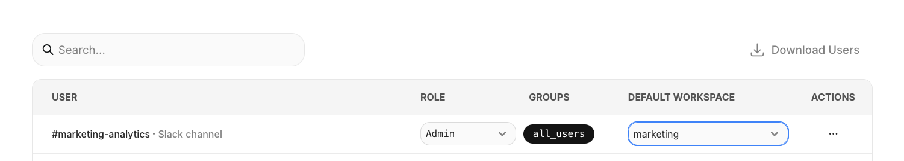

# Channel Routing

Each Slack workspace or Teams tenant connects to one Dot organization or workspace. Use channel routing to direct specific channels to different workspaces with their own data access.

### Two Approaches

- **Route channels within one connection** — Connect Slack/Teams to your main org, then route specific channels to workspaces (e.g., #sales → Sales workspace with CRM access)
- **Separate connections per workspace** — Connect different Slack workspaces or Teams tenants directly to different Dot workspaces

### How Routing Works

| Message type | Routing logic |
|--------------|---------------|
| **DMs** | Routed by sender's email to their preferred workspace |
| **Channels** | Each channel gets a virtual user — assign it to a workspace to route all messages |

### Route a Channel to a Workspace

1. @mention Dot in the channel (creates the channel user in Dot)
2. In the target workspace: **Settings → Users** → add the channel user
3. In your main org: find the channel user and set their default workspace
4. Test with another message

<figure><figcaption>
Set the default workspace for a channel or user
</figcaption></figure>

### Route Individual Users

Same process: add them to the workspace, then set their default workspace preference.

### Troubleshooting

| Problem | Fix |
|---------|-----|
| Messages going to wrong workspace | Check user/channel's default workspace setting |
| Bot not responding in channel | @mention Dot (required in channels, not DMs) |
| Bot not responding in Teams channel | Verify bot was added to the channel |
| "Already connected" error | That Slack/Teams is connected to another Dot org |
