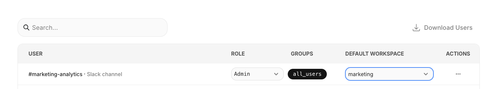

# Channel Routing

Each Slack workspace or Teams tenant connects to one Dot organization or workspace. Use channel routing to direct specific channels to different workspaces with their own data access.

### Two Approaches

- **Route channels within one connection** — Connect Slack/Teams to your main org, then route specific channels to workspaces (e.g., #sales → Sales workspace with CRM access)
- **Separate connections per workspace** — Connect different Slack workspaces or Teams tenants directly to different Dot workspaces

### How Routing Works

| Message type | Routing logic |
|--------------|---------------|
| **DMs** | Routed by sender's email to their preferred workspace |
| **Channels** | Each channel gets a virtual user — assign it to a workspace to route all messages |

### Route a Channel to a Workspace

1. **@mention Dot in the channel** — this automatically creates a channel user (e.g., `#sales-analytics · Slack channel`) in your main organization's user list. You don't need to create anything manually.

2. **Add the channel user to the target workspace** — go to **Settings → Workspaces**, find the target workspace, and click **Manage Users**. In the search dropdown, search for the channel name (e.g., `#sales`) and add it.

3. **Set the channel's default workspace** — go to **Settings → Users**, find the channel user in the list, and change the **Default Workspace** dropdown to the target workspace.

4. **Test** — send another message in the channel and verify Dot responds using the workspace's data.

<figure><figcaption>
Set the default workspace for a channel or user
</figcaption></figure>


Don't use the "Add User" button on the Users tab — that's for inviting new users by email. Channel users are created automatically when you @mention Dot. You just need to find them and assign them to a workspace.


### Route Individual Users

Same process: add them to the target workspace via **Settings → Workspaces → Manage Users**, then set their default workspace in **Settings → Users**.

### Troubleshooting

| Problem | Fix |
|---------|-----|
| Messages going to wrong workspace | Check user/channel's default workspace setting |
| Bot not responding in channel | @mention Dot (required in channels, not DMs) |
| Bot not responding in Teams channel | Verify bot was added to the channel |
| "Already connected" error | That Slack/Teams is connected to another Dot org |
