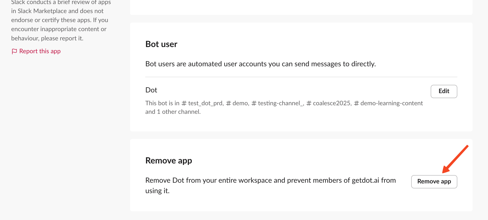
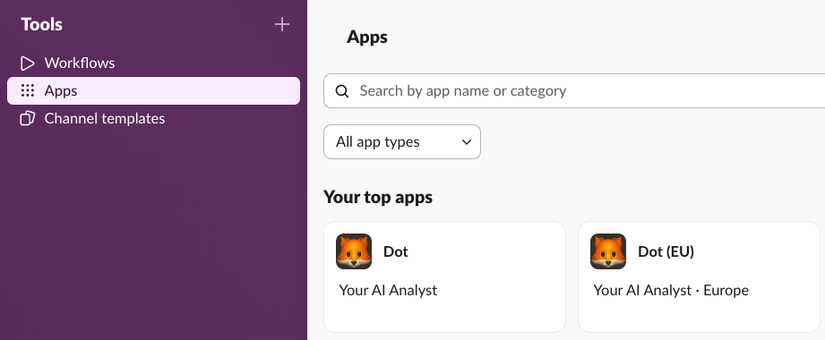
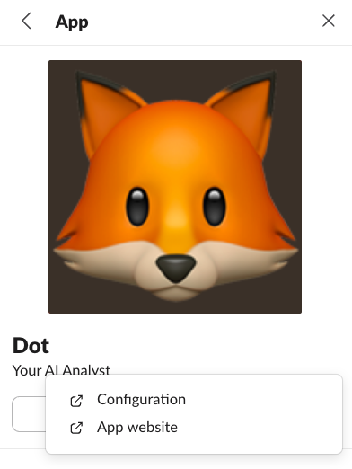
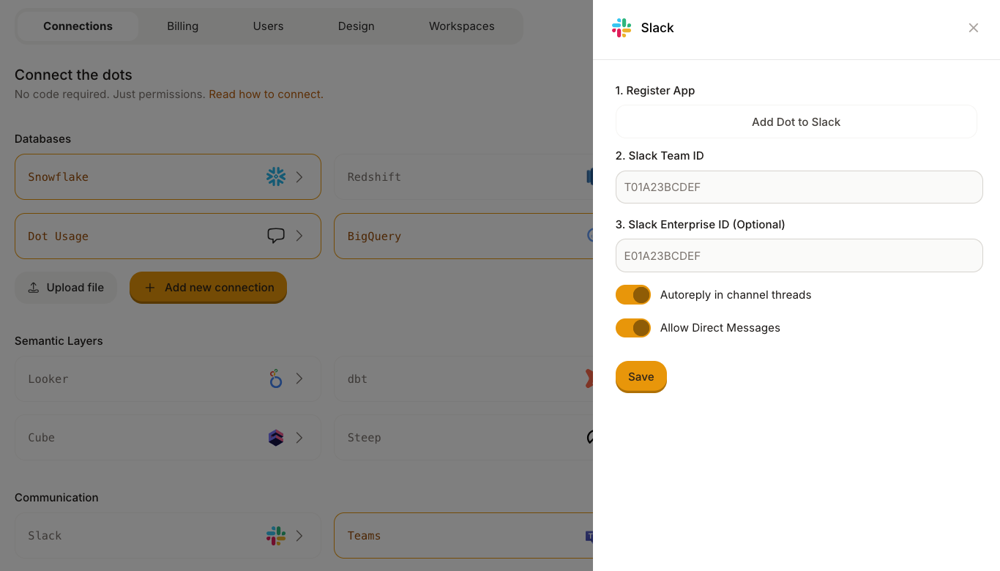

# Reinstall Slack App

Sometimes Dot's Slack app needs to be reinstalled — for example, when we update the app's permissions or fix a configuration issue. This guide walks you through the process step by step.


Reinstalling the app does **not** delete your chat history or any data in Dot. It only resets the Slack connection.


## Before You Start

**Note which channels Dot is currently in.** After reinstalling, Dot will need to be re-added to each channel manually.

You can find the full list on the Dot app's configuration page in Slack (see Step 1) — it shows all channels under **Bot user**:

<figure><figcaption>
The Bot user section lists all channels Dot is currently in. Note these down before removing.
</figcaption></figure>


Only **Slack Workspace Owners** and users with app management permissions can remove and install apps.


## Step 1: Remove the Dot App from Slack

1. In Slack, click your **workspace name** in the top-left corner
2. Go to **Tools & settings** → **Manage apps**
3. Click **Apps** in the left sidebar and find **Dot**

<figure><figcaption>
Find Dot in your installed apps.
</figcaption></figure>

4. Click on **Dot**, then click **Configuration**

<figure><figcaption>
Click Configuration to open the app settings.
</figcaption></figure>

5. Scroll down to **Remove app** and click **Remove app**
6. Confirm the removal when prompted

## Step 2: Reinstall Dot via Settings

1. Go to [Dot Settings](https://app.getdot.ai/settings)
2. Click on the **Slack** integration
3. Click **Add Dot to Slack**

<figure><figcaption>
Click "Add Dot to Slack" to start the reinstallation.
</figcaption></figure>

4. In the Slack authorization screen, select the channel where Dot should respond by default and click **Allow**

## Step 3: Re-add Dot to Your Channels

After reinstalling, Dot is only in the default channel you selected during installation. You need to manually re-add Dot to any other channels it was previously in.

To add Dot to a channel:

1. Open the Slack channel where you want Dot
2. Type `/invite @Dot` in the message field and press Enter

Repeat this for every channel from your list in the "Before You Start" step.


You can also add Dot to a channel by typing `@Dot` in the channel — Slack will prompt you to invite the app.


## Troubleshooting

### Dot doesn't appear in the install screen

Make sure the previous app was fully removed from Slack (Step 1). If the old installation is still active, the reinstall may not work correctly.

### Dot isn't responding in a channel

Verify that Dot has been invited to the channel (Step 3). Dot can only respond in channels where it has been explicitly added.

### Permission errors during install

Contact your Slack Workspace Owner — they may need to approve the Dot app before it can be installed.
