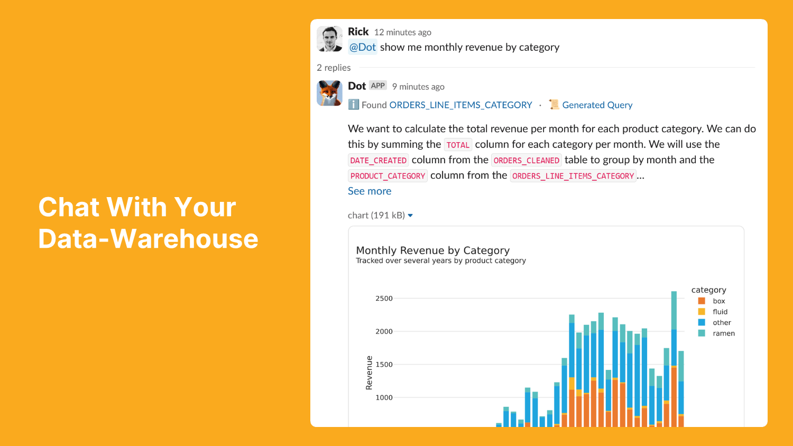

# Slack

<figure><picture><source srcset="../../.gitbook/assets/front-dark.png" media="(prefers-color-scheme: dark)"></picture><figcaption></figcaption></figure>

## Add @Dot to Slack

1. Click on Slack in [Settings ](https://app.getdot.ai/settings)

.png>)

2. Click on install

.png>)

3. Select the channel, where you want @Dot to respond to user requests and confirm

 (1) (1) (1).png>)

4. Chat with @Dot

<figure><figcaption></figcaption></figure>

### Slack Data Handling

What Dot reads

* Only messages where it’s invoked (@Dot) and, by default, subsequent messages in that thread while Dot is active there.
* Dot does not read unrelated channel messages.

Private channels

* Adding Dot to a private channel does not grant it access to past history.
* Dot can only see messages where it’s invoked or within threads it’s participating in.
* Non-Dot messages remain invisible to Dot.

Direct messages (optional)

* DMs can be enabled by admins. These interactions are stored like channel interactions and are auditable.

Retention & admin audit

* We securely store only interactions involving Dot to provide context and auditability.
* Admins can review them in Admin Console → History.
* Workspace data deletion is available on request.

