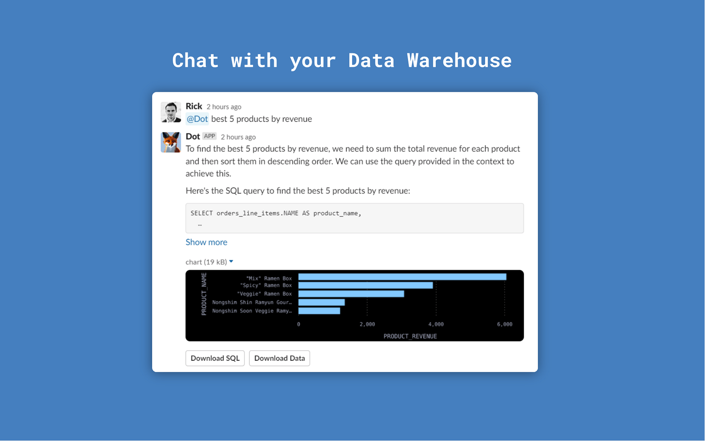

# Slack

<figure><figcaption></figcaption></figure>

## Add @Dot to Slack

1. Click on Slack in [Settings ](https://app.getdot.ai/settings)

.png>)

2. Click on install

.png>)

3. Select the channel, where you want @Dot to respond to user requests and confirm

 (1) (1).png>)

4. Chat with @Dot

<figure><figcaption></figcaption></figure>

## Dot Reactions

👀 - Dot saw your question and is collecting information

🧠 - Dot is thinking about the problem

✍️ -  Dot is writing the answer, executing SQL and painting charts

## Tips for talking with Dot

1. To speak about a new topic, start a new conversation with `@Dot` in the channel.&#x20;

.png>)

2.  Follow up questions can be directly asked in the thread using the whole thread as context

    Note 1: no @Dot is needed

    Note 2: Dot will only speak about 1 data source in the thread

.png>)

3. If Dot did not get it right, just rephrase your question and try again. It can help to look at the found data source to see which questions Dot can answer in this thread.

.png>)

4.  To analyze complex topics it can help to break the questions up in multiple parts:\
    **What's our total revenue per country and its percentage change over time?**

    -> Show me total revenue over time (1)\
    -> Split it by country (2)\
    -> Calculate percentage change of revenue over time (3)

    \
    This helps Dot to build up context first. Most great things are created iteratively. 🛶⛵🚢\

5. Dot is trained to analyze data, not to configure visualizations (yet). It can not build a pie chart. 🍰 But it can format the output data and thus influence the chart, e.g. filter by dimensions or aggregate data differently. The goal of Dot is to come up with the best visualization to answer the question itself.
