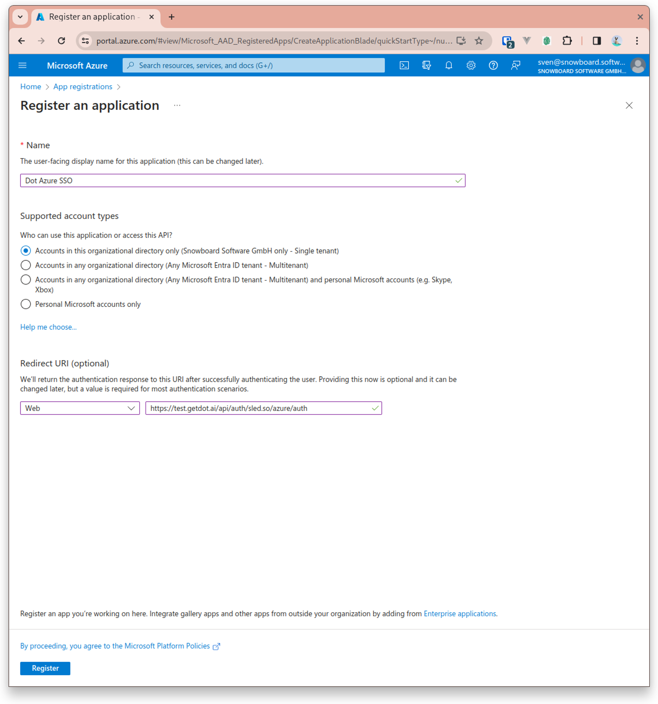
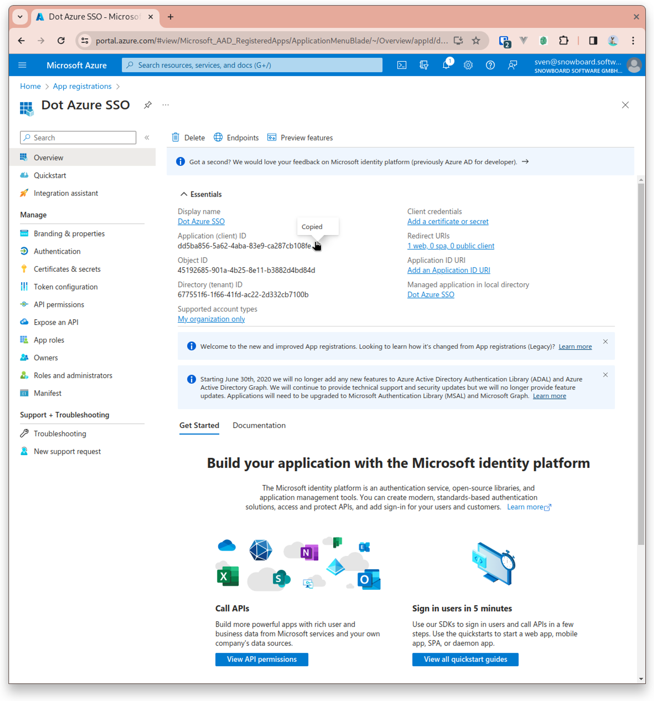
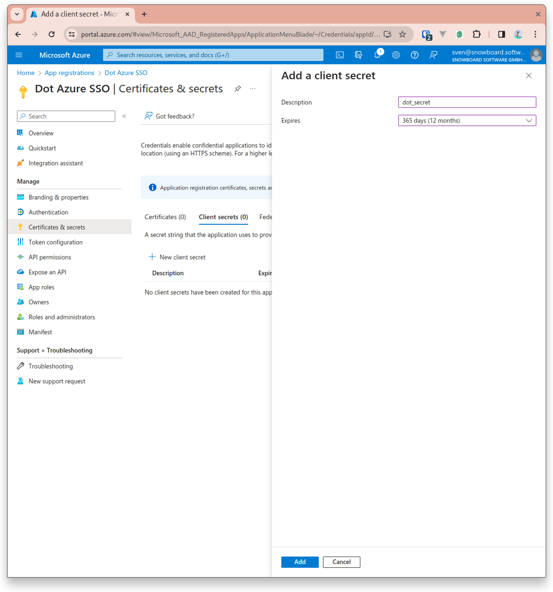
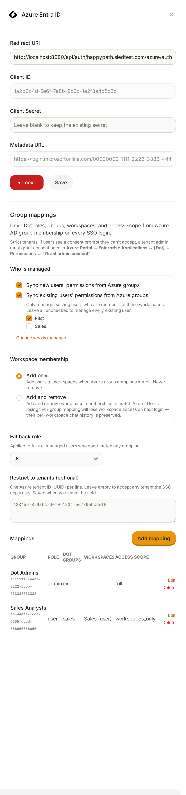
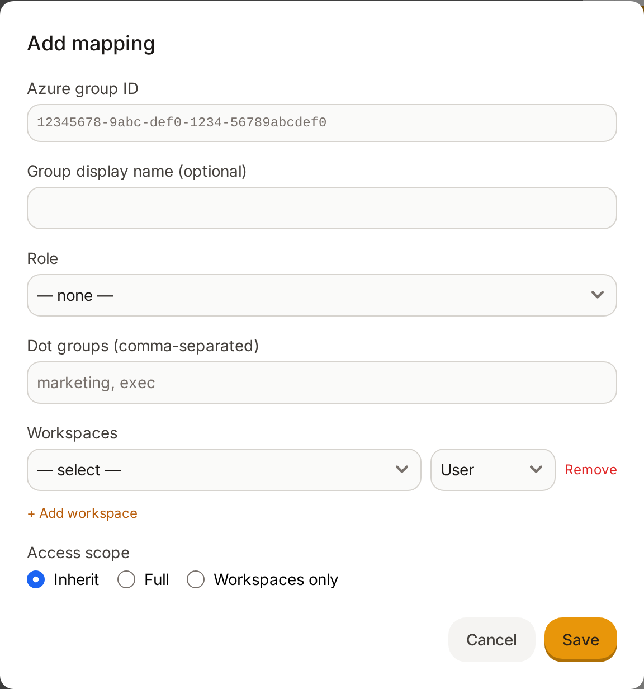
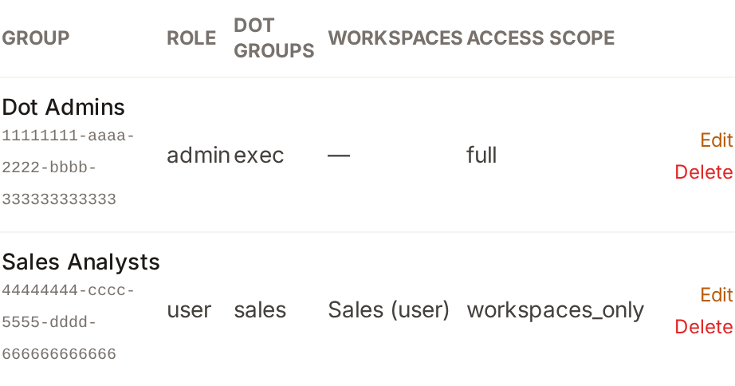
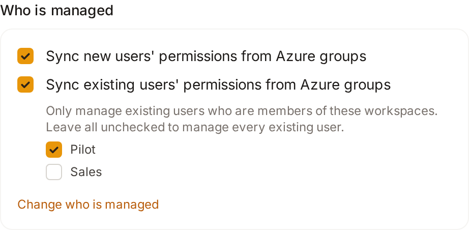
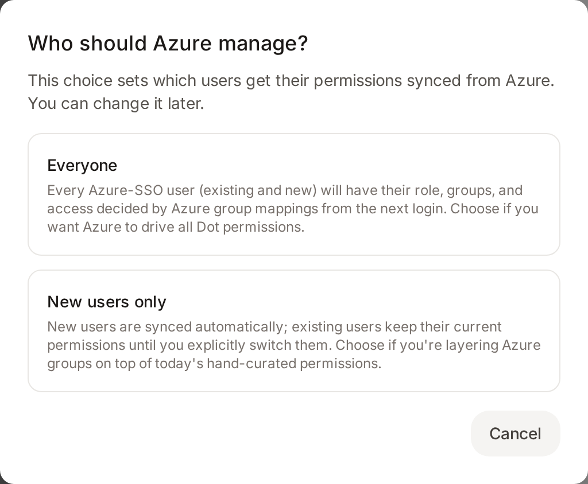

# Azure Active Directory

Dot integrates with Microsoft Entra ID (Azure AD) using OAuth 2.0 / OpenID Connect. You can use it for sign-in only, or go further and drive a user's **role, Dot groups, workspace memberships, and access scope** directly from their Azure AD group membership on every login.

This guide is in three parts:

1. **Part 1 - Azure configuration** - register the application in Azure.
2. **Part 2 - Connect Dot to Azure** - enter the credentials in Dot.
3. **Part 3 - Group mappings (optional)** - map Azure AD groups to Dot roles, groups, and workspaces, and control how the rollout reaches your users.

---

## Part 1: Azure Configuration

### Step 1: Register a New Application in Azure

1. Go to the Azure portal and navigate to **Azure Active Directory** > **App registrations**.
2. Click on **New registration**.

### Step 2: Application Registration

1. Enter the name of the application, for example, `Dot Azure SSO`.
2. Under **Supported account types**, select the relevant option for your organization (single tenant is the typical choice).
3. For the **Redirect URI**, select **Web** and enter the URI shown in Dot's **Azure Entra ID** card (Settings > Connections), where it appears as a read-only **Redirect URI** field. This URI is unique to your organization, so copy it exactly as Dot displays it.

<figure><figcaption></figcaption></figure>

### Step 3: Application Overview

1. Once the application is registered, you will be redirected to the application's overview page.
2. Copy the **Application (client) ID** and **Directory (tenant) ID** and save them for later use.

<figure><figcaption></figcaption></figure>

### Step 4: Certificates & Secrets

1. In the application's menu, click on **Certificates & secrets**.
2. Click on **New client secret**.
3. Add a description for the secret and set an expiry as required (12 or 24 months is recommended).
4. Once created, **immediately copy the secret Value** (not the Secret ID) - it is only shown once.

<figure><figcaption></figcaption></figure>

### Step 5: API Permissions

If you only need sign-in, the default `openid` / `email` / `profile` scopes are enough and you can skip ahead.

To use **group mappings** (Part 3), Dot reads the signed-in user's own group membership through Microsoft Graph. Add the delegated permission below:

| Permission | Type | Purpose | Admin consent |
|------------|------|---------|---------------|
| `User.Read` | Delegated | Read the signed-in user's profile and check their group membership on login | Usually not required |


On strict tenants, users may see a consent prompt they are not allowed to accept. In that case a tenant admin grants consent once in **Azure Portal > Enterprise Applications > [Dot] > Permissions > "Grant admin consent"**, and users will no longer be prompted.


### Step 6: Restrict Who Can Sign In (Optional)

To limit which users can use Dot SSO rather than allowing everyone in your tenant:

1. In Azure, go to **Enterprise Applications** and open the application created for Dot.
2. Go to **Manage** > **Users and groups** and click **Add user/group** to assign the users or groups that should have access.

<figure><figcaption></figcaption></figure>

3. Go to **Manage** > **Properties**.

<figure><figcaption></figcaption></figure>

4. Set **Assignment required?** to **Yes**. Now only explicitly assigned users or groups can authenticate.

---

## Part 2: Connect Dot to Azure

1. Log into Dot as an **admin** and open **Settings > Connections**.
2. Open the **Azure Entra ID** card and fill in:
   * **Client ID** - the Application (client) ID from Step 3
   * **Client Secret** - the secret value from Step 4 (leave blank later to keep the existing secret)
   * **Metadata URL**, built from your tenant ID:
     `https://login.microsoftonline.com/{tenant-id}/v2.0/.well-known/openid-configuration`
3. Click **Save** and test the sign-in.

Once SSO is active, the **Group mappings** section appears in the same card.

---

## Part 3: Group Mappings

Group mappings let Azure AD decide what a user can do in Dot. Without any mappings, SSO is sign-in only and permissions stay exactly as they are managed inside Dot today.

<figure><figcaption>The Azure Entra ID card: SSO credentials at the top, then the group-mapping controls</figcaption></figure>

### How It Works

1. On every SSO login, Dot checks the user's Azure AD group membership against your configured mappings.
2. All matching mappings are combined into one result:
   * **Role** - the highest-privilege role across all matched groups wins (Admin > Modeler > User).
   * **Dot groups** - the union of the Dot groups from every matched mapping.
   * **Workspaces** - the union of workspace memberships; if the same workspace appears in more than one matched group, the highest role for that workspace wins.
   * **Access scope** - if any matched group restricts the user to **Workspaces only**, that restriction applies; otherwise the user gets **Full** access.
3. If a managed user matches no mapping, they receive the **fallback role**.
4. Membership is re-evaluated on every login, so Azure AD changes take effect the next time the user signs in.

### Dot Roles

| Role | Typical permissions |
|------|---------------------|
| **Admin** | Full access, including settings and user management |
| **Modeler** | Curate and model data for a workspace |
| **User** | Ask questions and consume answers |

### Adding a Mapping

In the **Azure Entra ID** card, under **Mappings**, click **Add mapping** and fill in:

| Field | Meaning |
|-------|---------|
| **Azure group ID** | The Object ID (UUID) of the Azure AD security group. Find it in **Azure AD > Groups > [group] > Overview**. |
| **Group display name** | Optional friendly label for your own reference. |
| **Role** | Org-level role to grant (Admin, Modeler, User), or none if this group only controls workspaces. |
| **Dot groups** | Comma-separated Dot group names to add the user to (for example `marketing, exec`). |
| **Workspaces** | One or more workspaces, each with a role, that the user should belong to. |
| **Access scope** | **Inherit** (do not impose a scope from this group), **Full** (whole workspace/org), or **Workspaces only** (restrict the user to their mapped workspaces). |

<figure><figcaption>Adding a mapping</figcaption></figure>

#### Example

| Azure AD Group | Role | Dot groups | Workspaces | Access scope |
|----------------|------|-----------|------------|--------------|
| Dot Admins | Admin | - | - | Full |
| Sales Analysts | User | sales | Sales (User) | Workspaces only |

A member of "Dot Admins" becomes an Admin with full access. A member of "Sales Analysts" becomes a User in the Sales workspace, added to the `sales` Dot group, and limited to that workspace. A user in both groups becomes an Admin (highest role wins).

<figure><figcaption>Configured mappings</figcaption></figure>

### Fallback Role

The **Fallback role** (User, Modeler, or Admin) is applied to managed users who sign in but match none of your mappings. Set this to the least-privileged role that still makes sense for your organization.

### Workspace Membership: Add Only vs. Add and Remove

The **Workspace membership** setting controls how aggressively Dot syncs workspace memberships:

| Mode | Behavior |
|------|----------|
| **Add only** (default) | Add users to workspaces when a mapping matches. Memberships are never removed automatically. |
| **Add and remove** | Make Dot match Azure exactly. A user who loses a group mapping loses the corresponding workspace access on their next login. Their per-workspace chat history is preserved. |

Start with **Add only** while you validate your mappings, and switch to **Add and remove** once you want Azure AD to be the single source of truth.

### Restrict to Tenants (Optional)

Under **Restrict to tenants**, enter one Azure tenant ID (UUID) per line to accept logins only from those tenants. Leave it empty to accept any tenant the SSO app trusts.

---

## Controlling the Rollout: Who Is Managed

Turning on group mappings does not have to flip everyone at once. The **Who is managed** controls let you decide, separately, whether mappings apply to new users, existing users, or only a subset of existing users. This is the safest way to introduce Azure-driven permissions without disturbing the people already working in Dot.

There are two independent switches:

| Switch | Default | Effect |
|--------|---------|--------|
| **Sync new users' permissions from Azure groups** | On | Any user who signs in for the first time via SSO has their role, groups, workspaces, and access scope decided by the mappings. |
| **Sync existing users' permissions from Azure groups** | Off | Users who already exist in Dot keep their current, hand-curated permissions until you opt them in. |

When you turn on syncing for existing users, an additional **workspace scope** appears:

> *Only manage existing users who are members of these workspaces. Leave all unchecked to manage every existing user.*

This is the key to a controlled, gradual rollout.

<figure><figcaption>Existing users managed only in the checked workspace; everyone else keeps the status quo</figcaption></figure>

### The Recommended Rollout Pattern: Pilot in One Workspace First

A common and recommended way to adopt group mappings is to pilot them in a single workspace before rolling out organization-wide. The goal is:

* **New users** are managed by Azure from day one.
* **Existing users in the pilot workspace** are managed by Azure, so you can verify the mappings against real accounts.
* **Everyone else, including the main workspace, keeps the status quo** and is untouched until you are ready.

To set this up:

1. In Azure AD, create the security groups for the pilot workspace (for example one group per role) and add the pilot users.
2. In Dot's Entra ID card, add the corresponding **mappings** for those groups, pointing them at the pilot workspace with the appropriate roles.
3. Under **Who is managed**:
   * Keep **Sync new users' permissions from Azure groups** enabled.
   * Enable **Sync existing users' permissions from Azure groups**.
   * In the workspace scope list, check **only the pilot workspace**. Leave all other workspaces, including the main workspace, unchecked.
4. Set the **Fallback role** to a safe, low-privilege role so any managed pilot user who matches no mapping lands somewhere harmless.
5. Keep **Workspace membership** on **Add only** during the pilot.

With this configuration, only existing members of the pilot workspace are evaluated against Azure on login. Existing users everywhere else continue with exactly the permissions they have today. When the pilot is successful, widen the rollout by checking additional workspaces, or clear the workspace scope entirely to manage every existing user.

You can revisit this choice at any time through **Change who is managed**:

<figure><figcaption>The rollout chooser, reachable any time via "Change who is managed"</figcaption></figure>


The workspace scope only constrains **existing** users. New users are governed by the "Sync new users" switch regardless of which workspaces are checked. Keep that in mind if you want new users held back as well during a pilot.



Switching from a scoped rollout to managing **Everyone** clears the workspace scope, so from then on all existing SSO users are evaluated against your mappings on their next login. Re-check specific workspaces if you want to narrow it again.


---

## Testing

1. Log out of Dot and choose **Sign in with Microsoft** on the login page.
2. Authenticate with an Azure AD account (MFA and Conditional Access policies are enforced by Azure during this step).
3. After sign-in, confirm the user's role, Dot groups, and workspace memberships match what their Azure groups should grant.
4. Verify a few cases:
   * A user in a mapped Admin group has Admin access.
   * A user in a mapped workspace group lands in the right workspace with the right role.
   * A managed user in no mapped group receives the fallback role.
   * An existing user **outside** your rollout scope is unchanged.

---

## Troubleshooting

**"Failed to exchange code for token"** - The client secret is incorrect or expired. Verify it in Dot matches Azure, and create a new secret if it has expired.

**Roles or workspaces are not applied** - Confirm group mappings exist for the user's Azure groups, the group Object IDs match exactly, and the user is in scope under "Who is managed". Have the user sign out and back in, since mappings are evaluated on login.

**A rollout change did not take effect for some users** - Permissions are re-evaluated on the next login, not retroactively. Ask affected users to sign out and back in.

**Redirect URI mismatch** - The Redirect URI in Azure must match the one shown in Dot's **Azure Entra ID** card exactly, including protocol and path.

**Consent prompt the user cannot accept** - A tenant admin needs to grant admin consent once for the application's permissions (see Step 5).

---

## FAQ

**What happens if a user is in multiple mapped groups?**\
The results are merged: the highest-privilege role wins, Dot groups and workspaces are unioned, and any group that restricts access scope to "Workspaces only" applies.

**What if no group mappings are configured?**\
SSO is sign-in only. Permissions stay exactly as managed inside Dot.

**How quickly do Azure AD changes take effect?**\
On the user's next login. Dot reads group membership fresh each time. Azure AD itself may take a few minutes to propagate group changes.

**Can I try mappings on a few people before rolling out to everyone?**\
Yes. Manage new users only, or manage existing users scoped to specific workspaces. See "Controlling the Rollout" above.

**Does it work with MFA and Conditional Access?**\
Yes. Any MFA or Conditional Access policy in your tenant is enforced during the Microsoft login step. No special configuration is needed in Dot.
