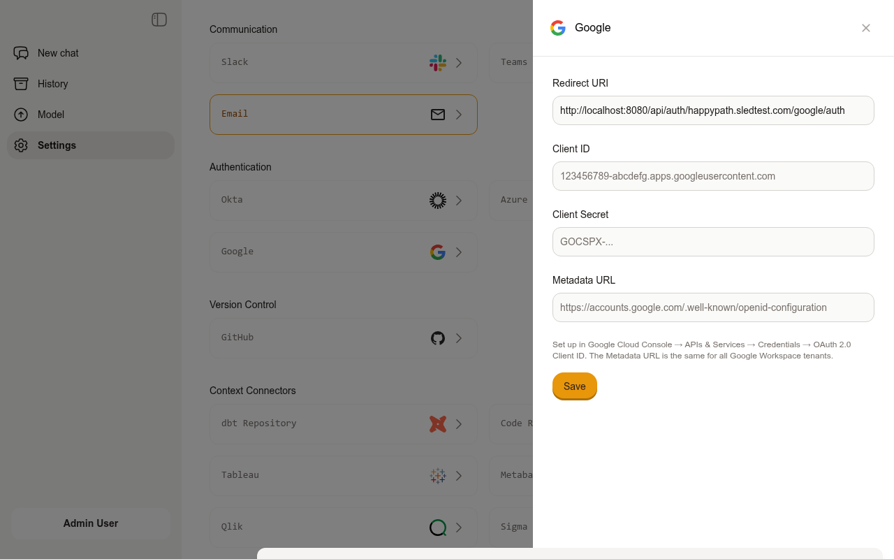
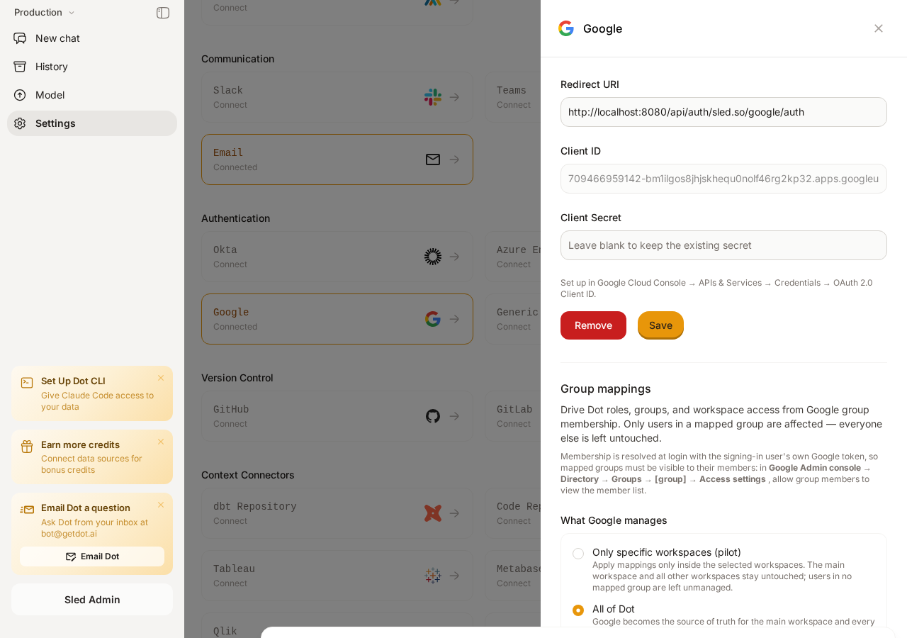
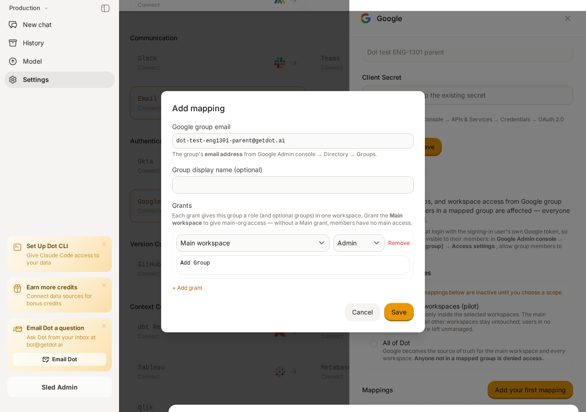

# Google

Dot integrates with Google using OAuth 2.0 / OpenID Connect. You can use it for sign-in only, or go further and drive a user's **role, Dot groups, and workspace memberships** directly from their Google group membership on every login — see [Group Sync](google.md#group-sync-optional) below.

## Integrating Single Sign-On (SSO) with Google for Dot

This guide walks you through setting up Google as an SSO provider for Dot using Google Cloud's OAuth 2.0 credentials.

### Step 1: Open Google Cloud Console

1. Go to the [Google Cloud Console](https://console.cloud.google.com/).
2. Select an existing project or create a new one for your organization.

### Step 2: Configure the OAuth Consent Screen

1. Navigate to **APIs & Services** > **OAuth consent screen**.
2. Select **Internal** (recommended for Google Workspace organizations — only users in your organization can sign in) or **External**.
3. Fill in the required fields: App name, User support email, and Developer contact email.
4. Click **Save and Continue** through the remaining steps.

### Step 3: Create OAuth 2.0 Credentials

1. Navigate to **APIs & Services** > **Credentials**.
2. Click **Create Credentials** > **OAuth client ID**.
3. Select **Web application** as the application type.
4. Give it a name, e.g., `Dot SSO`.

### Step 4: Set the Redirect URI

1. In a separate browser tab, go to your **Dot Settings** and click on the **Google** card under Authentication.
2. Copy the **Redirect URI** shown at the top of the form.
3. Return to Google Cloud Console and paste it into the **Authorized redirect URIs** field.

<figure><figcaption>
The Dot Google SSO configuration form showing the Redirect URI to copy
</figcaption></figure>

### Step 5: Copy Client ID and Client Secret

1. After creating the OAuth client, Google will display the **Client ID** and **Client Secret**.
2. Copy both values — you'll need them in the next step.

### Step 6: Configure Dot with Google Credentials

1. Go back to your **Dot Settings** > **Google** section.
2. Paste the **Client ID** and **Client Secret** into the respective fields.
3. Click **Save** to apply the settings.


The Google metadata URL (`https://accounts.google.com/.well-known/openid-configuration`) is automatically configured by Dot — no manual entry needed.


### Finalizing the Integration

Test the SSO integration by signing out and signing back in with Google.

By following these steps, you will have successfully set up SSO with Google for your Dot application. Ensure that all copied values are kept secure and are only shared with authorized personnel within your organization.

## Optional: Restrict Which Users Can Sign In

If you selected **Internal** for the OAuth consent screen in Step 2, only users within your Google Workspace organization can sign in — no further restriction is needed.

If you selected **External**, you can restrict access by:

1. Going to **APIs & Services** > **OAuth consent screen** in Google Cloud Console.
2. Under **Test users**, adding only the specific email addresses that should have access (while the app is in "Testing" status).
3. To allow all users, submit the app for verification to move it to "Production" status.

## Group Sync (Optional)

Group mappings let Google Workspace decide what a user can do in Dot. Without any mappings, SSO is sign-in only and permissions stay exactly as they are managed inside Dot today.

On every SSO login, Dot resolves the signing-in user's Google group membership (including **nested groups**) and applies the grants of every mapped group they belong to. Membership is re-evaluated on each login, so changes in Google Admin console take effect the next time the user signs in.

<figure><figcaption>The Google card: SSO credentials at the top, then the group-mapping controls</figcaption></figure>

### Google-Side Requirements

Two things must be true in your Google environment before enabling any rollout:

1. **Enable the Cloud Identity API** on the Google Cloud project that owns your OAuth client (**APIs & Services** > **Library** > *Cloud Identity API* > **Enable**). Dot resolves group membership through this API at login; if it is disabled, sign-in fails for managed users.
2. **Mapped groups must be visible to their members.** Dot queries membership with the signing-in user's own token, so in **Google Admin console** > **Directory** > **Groups** > *[group]* > **Access settings**, allow group members to view the member list (this is the default for most groups).


Group sync works on **all Google Workspace editions**. On Enterprise and Cloud Identity Premium editions Dot uses Google's transitive membership API; on Business-tier editions it automatically falls back to resolving nested groups step by step. No configuration is needed either way.


When group sync is rolled out, Dot requests one additional read-only OAuth scope at login (`cloud-identity.groups.readonly`). Users may see a one-time consent prompt for it.

### How Grants Work

A mapping binds one Google group (by its **email address**) to a list of **grants**. Each grant gives that group a role — and optionally Dot groups — in one workspace:

* Grant the **Main workspace** to give access to the main organization. Without a Main grant, members have no main-org access.
* Grant other workspaces to add members there with the given role.

When a user matches several mappings, the results merge: the **highest role wins** per workspace (Admin > Modeler > User) and Dot groups are unioned.

<figure><figcaption>Adding a mapping: group email + grants</figcaption></figure>

| Field | Meaning |
|-------|---------|
| **Google group email** | The group's email address, from **Google Admin console** > **Directory** > **Groups**. |
| **Group display name** | Optional friendly label for your own reference. |
| **Grants** | One or more rows of workspace + role + optional Dot groups. |

### Controlling the Rollout: What Google Manages

Mappings are inactive until you choose a rollout scope:

| Scope | Effect |
|-------|--------|
| **Off** (default) | Sign-in only. Mappings are configured but not applied. |
| **Only specific workspaces (pilot)** | Mappings apply only inside the selected workspaces. The main workspace and all other workspaces stay untouched; users in no mapped group are left unmanaged. This is the recommended starting point. |
| **All of Dot** | Google becomes the source of truth for the main workspace and every workspace. **Anyone not in a mapped group is denied access.** |


**All of Dot** is a default-deny mode. Dot refuses to enable it until at least one mapping grants **Admin on the Main workspace**, so you cannot lock out every administrator. Validate your mappings in a pilot first.


### Workspace Membership: Add Only vs. Add and Remove

Under **Advanced**, the **Workspace membership** setting controls how aggressively Dot syncs workspace memberships:

| Mode | Behavior |
|------|----------|
| **Add only** (default) | Add users to workspaces when a mapping matches. Memberships are never removed automatically. |
| **Add and remove** | Make Dot match Google exactly. A user who loses their mapping loses the corresponding workspace access on the next login. Their per-workspace chat history is preserved. |

### Exempting Individual Users

To take one user out of Google governance without changing any mapping, open **Settings** > **Users**, click the **⋯** menu on the user, and choose **Stop Google-managing this user**. Their permissions are then managed inside Dot again until you re-enable it.

### Troubleshooting

**"Couldn't verify your Google Workspace group membership"** — Dot could not resolve the user's groups, and denies the login rather than guessing (fail-closed). Check that the Cloud Identity API is enabled on the OAuth client's project and that the mapped groups let members view the member list.

**Roles or workspaces are not applied** — Confirm the mapping's group email matches exactly, the user is (transitively) a member, and a rollout scope is selected. Have the user sign out and back in, since mappings are evaluated on login.

**A user was denied after enabling All of Dot** — In full rollout, anyone in no mapped group is denied by design. Add the user to a mapped Google group, or switch back to a pilot scope.
