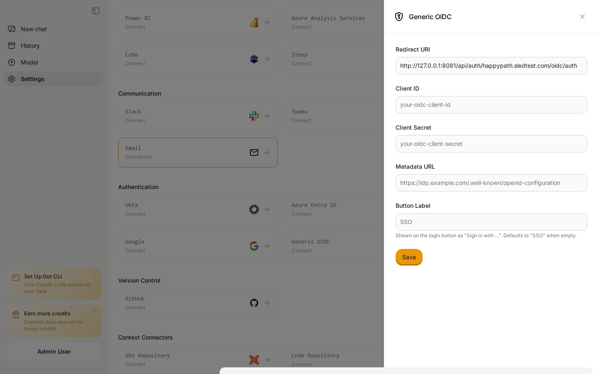
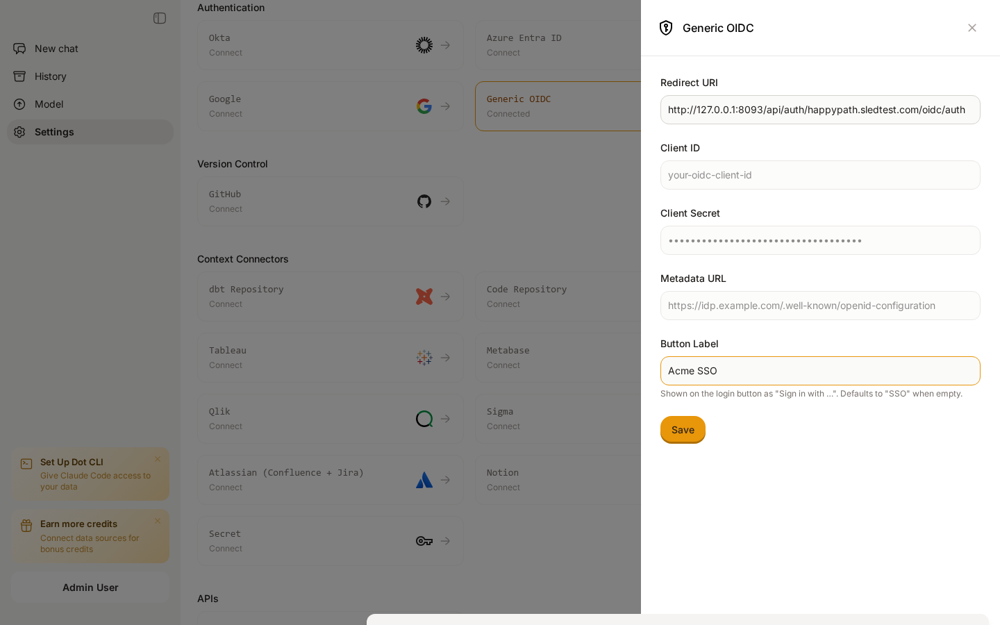
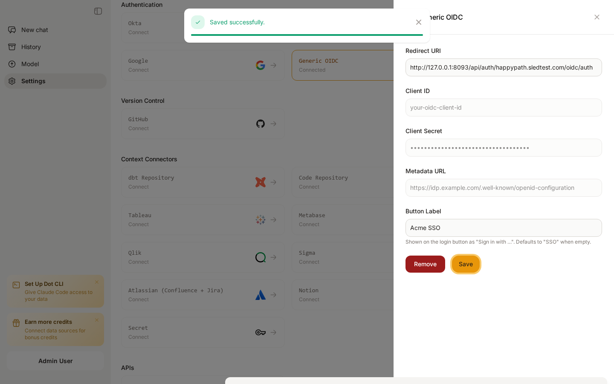
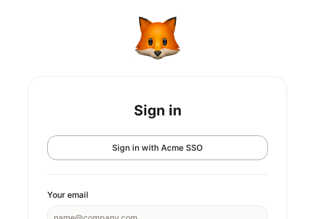

# Generic OIDC

## When to use this provider

Dot ships with dedicated tiles for the SSO providers most customers use — **Azure Active Directory**, **Okta**, and **Google**. If your identity provider isn't one of those — e.g. an in-house IdP, Auth0, Keycloak, Ping Identity, OneLogin, or JumpCloud — use the **Generic OIDC** tile instead. It speaks the same standard — OpenID Connect — and works with any IdP that publishes a discovery document.

If you're using one of the named providers, follow the dedicated guide instead — those use the same plumbing under the hood, but with the IdP-specific URL prefilled and a fixed button label.

## What you'll need from your IdP

Before opening the Dot admin panel, have these three values ready from your IdP:

* **Client ID** — issued when you register Dot as an OAuth/OIDC application
* **Client Secret** — issued alongside the Client ID; treat it like a password
* **Metadata URL** — also called the **OpenID configuration URL** or **discovery URL**. Always ends in `/.well-known/openid-configuration`. Examples:
  * Auth0: `https://{your-tenant}.auth0.com/.well-known/openid-configuration`
  * Keycloak: `https://{host}/realms/{realm}/.well-known/openid-configuration`
  * In-house / other: ask your IdP team for the discovery URL

The metadata URL is what makes this generic — Dot fetches the IdP's signing keys, authorization endpoint, and token endpoint from that one URL, so you don't have to enter them by hand.

## Step 1: Open the Generic OIDC tile in Dot

1. Sign in to Dot as an admin.
2. Open **Settings** → **Connections** → **Authentication**.
3. Click the **Generic OIDC** card.

<figure><figcaption><p>The Generic OIDC tile in Dot's admin Connections tab</p></figcaption></figure>

## Step 2: Copy Dot's Redirect URI into your IdP

The first field in the form is a read-only **Redirect URI** that looks like:

```
https://app.getdot.ai/api/auth/{your-org-id}/oidc/auth
```

In your IdP, register a new OAuth/OIDC application (sometimes called a "client" or "relying party") and paste this exact URL into the **Redirect URI** / **Callback URL** field. Most IdPs require this to match character-for-character — including the trailing path — or the login will fail with a redirect mismatch error.

If your IdP asks for the OAuth grant type, choose **Authorization Code** (with PKCE if offered). Dot doesn't use implicit or password grants.

## Step 3: Fill in the form in Dot

Back in the Dot admin form, fill in the remaining fields:

* **Client ID** — paste from your IdP
* **Client Secret** — paste from your IdP
* **Metadata URL** — the `/.well-known/openid-configuration` URL
* **Button Label** *(optional)* — what gets displayed on the login page. For example, set this to `Acme SSO` to render a button labelled **Sign in with Acme SSO**. Leave empty to fall back to the generic label **Sign in with SSO**.

<figure><figcaption><p>Filled-in Generic OIDC tile, with a custom button label set to <code>Acme SSO</code></p></figcaption></figure>

Click **Save**. After saving, the tile flips to **Connected**, the secret is masked, and the **Remove** button appears next to **Save** so you can disable the integration later.

<figure><figcaption><p>Saved Generic OIDC tile — secret is masked and the tile is marked Connected</p></figcaption></figure>

## Step 4: Verify the login button

Sign out of Dot, then open the login page for your organization. You should see your **Sign in with {Button Label}** button next to the email/password form.

<figure><figcaption><p>The login page renders the Generic OIDC button with the custom label</p></figcaption></figure>

Click it once to verify the round-trip: Dot redirects you to your IdP, you authenticate, the IdP redirects back to Dot, and you land in the app signed in.

## How user provisioning works

The first time a user signs in via Generic OIDC, Dot reads the `email` claim from the IdP's ID token and auto-provisions a new account if one doesn't already exist for your organization. Subsequent sign-ins from the same email reuse the same Dot user. New users are created with the default **Viewer** role — promote them to Editor or Admin from the **Users** tab as needed.

Make sure your IdP releases the `email` and (ideally) `name` claims to Dot. Most IdPs include both in the default profile scope; if yours doesn't, add `email profile` to the requested scopes on the application you registered in step 2.

## Troubleshooting

* **"redirect_uri mismatch"** — the URL in your IdP's allowed callback list doesn't exactly match the Redirect URI shown in Dot. Re-copy it; watch for a missing trailing path or a leading `https://` typo.
* **Login button doesn't appear** — make sure all three required fields (Client ID, Client Secret, Metadata URL) are saved. The button is gated on a successful save, not just on form input.
* **"invalid_client"** — the Client Secret is wrong or has been rotated in the IdP. Generate a new secret and re-save it in Dot.
* **Metadata URL fetch fails** — verify the URL works in a browser and returns a JSON document with `authorization_endpoint`, `token_endpoint`, and `jwks_uri` fields. If your IdP is on a private network, Dot's servers won't be able to reach it; expose the discovery endpoint publicly or use a named provider.

## Removing the integration

To stop accepting Generic OIDC sign-ins, click **Remove** on the tile. The button disappears from the login page immediately. Existing users provisioned via OIDC are kept and can still be reached if you re-enable any SSO provider — they aren't deleted with the integration.
