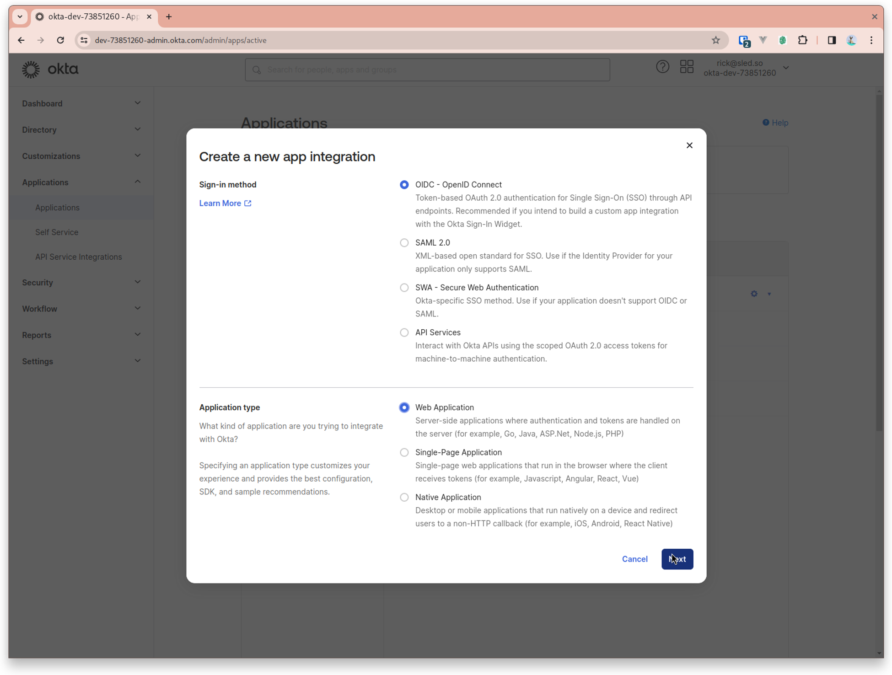
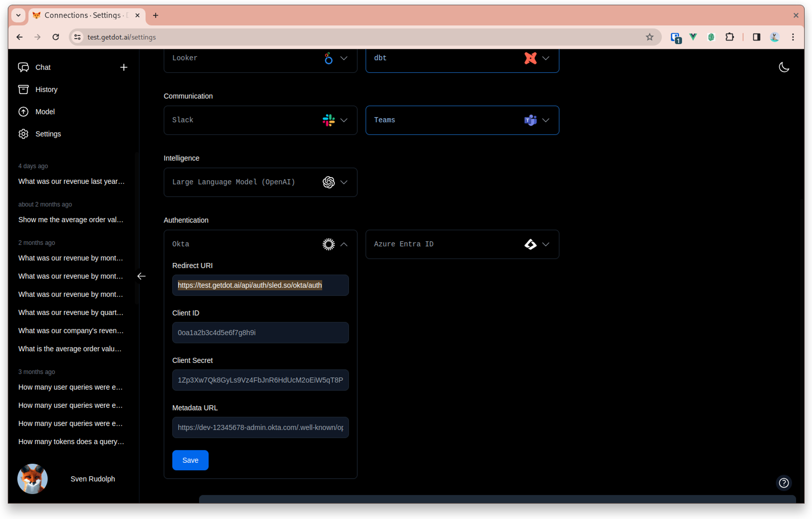
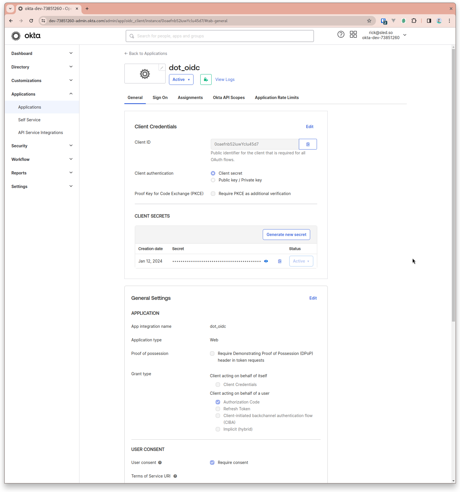
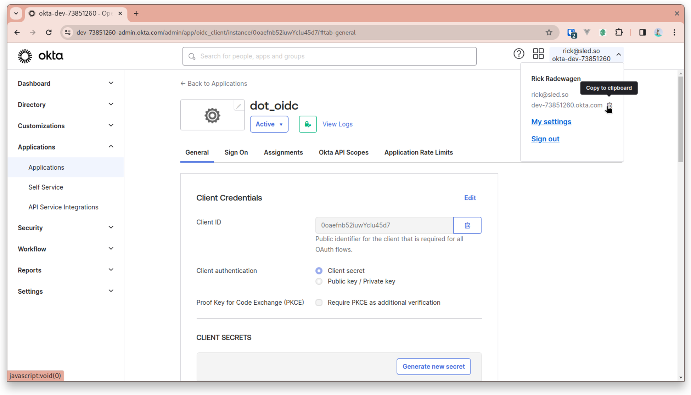

# Okta

## Integrating Single Sign-On (SSO) with Okta for Dot

This guide walks you through the process of creating an app integration in Okta and setting up SSO with Dot.

You can use Okta for sign-in only, or go further and let your **Okta groups become Dot groups**, so group membership is managed in Okta and never maintained twice — see [Group Sync](okta.md#group-sync-optional) below.

### Step 1: Create a New App Integration in Okta

1. Log in to your Okta admin dashboard.
2. Navigate to **Applications** > **Applications**.
3. Click on **Create App Integration**.

### Step 2: Configure the App Integration

1. Select the **OIDC - OpenID Connect** option.
2. Choose **Web Application** as the application type and click **Next**.

<figure><figcaption></figcaption></figure>

### Step 3: Set Redirect URI

1. In a separate browser tab, go to your **Dot Settings** > **Okta** section to copy the Redirect URI.
2. Return to the Okta tab and paste the copied URI into the **Sign-in redirect URIs** field.

<figure><figcaption></figcaption></figure>

### Step 4: Configure General Settings

1. Provide a name for your integration, e.g., `Dot SSO Integration`.
2. Add the Redirect URI from the Dot settings to **Sign-in redirect URIs**.
3. Set the **Sign-out redirect URI** to the base domain of Dot:
   * For EU: `https://eu.getdot.ai`
   * For US: `https://app.getdot.ai`
4. Set the logo



<figure><figcaption></figcaption></figure>

### Step 5: Assign Users or Groups

1. Choose to either **Assign** individual users or **Assign to groups** within your organization.

### Step 6: Copy Client Credentials

1. After saving the new app integration, navigate to the **General** tab of your newly created app. 2. Copy the **Client ID** and **Client Secret**.

<figure><figcaption></figcaption></figure>

### Step 7: Configure Dot with Okta Credentials

1. Go back to your Dot Settings > Okta section.
2. Paste the **Client ID** and **Client Secret** into the respective fields.

### Step 8: Metadata URL

1. The Metadata URL is essential for SSO operations. Construct it using your Okta domain:
   * Format: `https://{okta-url}/.well-known/openid-configuration`
   * Example: `https://dev-12345678.okta.com/.well-known/openid-configuration`
2. Your Okta URL can be found in the drop-down menu under your username at the top right corner of the Okta dashboard.

<figure><figcaption></figcaption></figure>

### Finalizing the Integration

After you have entered all the necessary information into Dot's Okta settings:

1. Click **Save** to apply the settings.
2. Test the SSO integration to ensure it's working as expected.

By following these steps, you will have successfully set up SSO with Okta for your Dot application. Ensure that all copied values are kept secure and are only shared with authorized personnel within your organization.

## Group Sync (Optional)

Group sync makes your **Okta groups** the groups Dot uses. A user signing in through Okta is placed in the Dot groups matching their Okta groups, so you manage membership in Okta only.

Unlike the Azure AD and Google integrations, there is **no mapping table to fill in**. Okta group names are used as Dot group names directly, so there is no list to keep in step on the Dot side. What Dot receives is decided in Okta, by a groups claim you add to the Dot app.

Group sync affects **group membership only**. It does not set roles, does not add or remove workspace memberships, and never blocks a login.

### Step 1: Add a Groups Claim in Okta

Dot reads group membership from the **ID token**, so Okta has to include it there.

1. In the Okta admin dashboard, go to **Applications** > **Applications** and open your Dot app.
2. Open the **Sign On** tab.
3. Under **OpenID Connect ID Token**, click **Edit**.
4. Set **Groups claim type** to **Filter**.
5. In **Groups claim filter**, set the claim name to `groups`.
6. Choose a matcher and value that selects the groups Dot should see (see below).
7. **Save**.


The claim must be on the **ID token**. A claim added only to the access token or only to the `/userinfo` endpoint will not reach Dot, and group sync will behave as if the user is in no groups.



The steps above apply to the **Okta org authorization server**, which is what the Metadata URL in [Step 8](okta.md#step-8-metadata-url) points at (`https://{okta-url}/.well-known/openid-configuration`). If you pointed Dot at a **custom authorization server** instead (a Metadata URL containing `/oauth2/{id}/`), the Sign On tab has no effect — add the `groups` claim under **Security** > **API** > **Authorization Servers** > *[your server]* > **Claims**, with **Include in token type** set to **ID Token**.


### Step 2: Choose Which Groups Dot Receives

The filter is your control over what Dot gets. Keep it narrow — send only the groups that should drive access in Dot.

| Matcher | Value | Sends |
|---------|-------|-------|
| **Starts with** | `dot-` | Only groups whose name begins with `dot-`. **Recommended.** |
| **Equals** | `analysts` | That one group. |
| **Matches regex** | `.*` | Every group the user belongs to. |


`Matches regex` `.*` works, but sends every group in your directory that the user belongs to. In a large directory that makes the token big and fills Dot with groups that mean nothing there. A prefix like `dot-` keeps the set deliberate.


Most Okta directories contain groups named for IT purposes — `vpn-users`, `office-oslo` — rather than for data access. If yours is like that, create a small set of purpose-made groups in Okta (for example `dot-commercial`, `dot-finance`), assign people to them, and filter on the `dot-` prefix.


The claim filter and the app assignment do different jobs. Okta only authenticates people the Dot app is assigned to (**Applications** > **Dot** > **Assignments**), so that governs **who can sign in**. The groups claim governs **what they can see** once inside. Widening the filter never grants anyone a login.


### Step 3: Turn On Group Sync in Dot

1. In Dot, go to **Settings** > **Connections** and open the **Okta** card.
2. Under **Group sync**, switch **Use Okta groups as Dot groups** on.

The setting only appears once Okta SSO is configured and saved.

### Step 4: Use the Groups

Synced groups behave exactly like groups created in Dot, so you can scope data with them. To restrict a table or Looker explore to a group:

1. Go to **Model** and click the table or explore.
2. Open the **Access** tab.
3. Add the groups that should have access, and remove `all_users` if it should no longer be visible to everyone.

Users then only see the tables and explores their groups grant. New tables default to `all_users`, so they are visible to everyone until scoped.

### How the Sync Behaves

* **Applied at every login.** Changes in Okta take effect the next time the user signs in, not immediately.
* **Names are used as-is**, lowercased. An Okta group `Commercial` becomes the Dot group `commercial`. Matching ignores case.
* **Removing someone from an Okta group** removes the matching Dot group on their next sign-in.
* **Groups you assign by hand in Dot are left alone** — sync only manages the groups it added. The exception is a name that is both hand-assigned and sent by Okta: Okta owns it, so removing it in Okta removes it in Dot.
* **Workspace identities are kept in step too.** A user who is a member of a workspace has their groups synced there as well, so revoking an Okta group also revokes the workspace access it granted. Roles and workspace memberships themselves are never changed.

### Troubleshooting

**Nobody gets any groups** — Almost always a missing or misplaced claim. Confirm the claim is named `groups`, is on the **ID token** (not the access token or `/userinfo`), and that the filter actually matches something. Have the user sign out and back in afterwards.

**A group is missing for one user** — Check they are a member of that group in Okta, and that the group matches your claim filter. A group excluded by the filter never reaches Dot, even though the user is in it.

**Groups arrived but the user still cannot see a table** — Group sync grants group membership, not data access. Scope the table or explore to that group under **Model** > *[table]* > **Access**.

**Users lost their groups unexpectedly** — If the claim is removed or renamed in Okta, Dot can no longer tell "in no groups" from "not configured". It removes the groups it had synced rather than leaving access standing on information it can no longer confirm, and records an error in the logs. Logins are not blocked. Restoring the claim restores the groups on the next sign-in.


Group sync does not deprovision accounts. Removing a user from the Dot app in Okta stops them signing in, but their Dot account remains until an administrator deletes it in **Settings** > **Users**.

