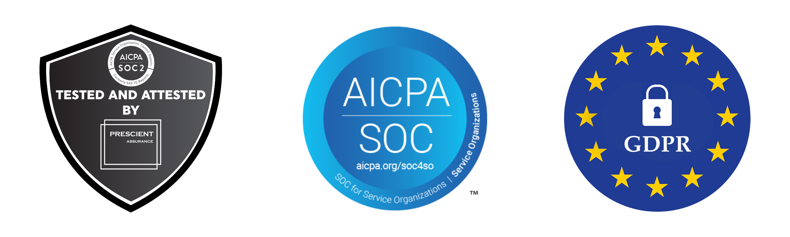

# Security & Privacy

Ensuring high standards to protect customer data is critical to operate successfully given rising IT security threads and increased privacy concerns.

We are continuously auditing our technical and organizational measures by monitoring our infrastructure and processes with [https://secureframe.com/](https://secureframe.com/).

We've successfully completed the AICPA Service Organization Control (SOC) 2 Type I audit. The audit confirms that Snowboard Software GmbH’s information security practices, policies, procedures, and operations meet the SOC 2 standards for security. The audit was conducted by [Prescient Assurance](https://www.prescientassurance.com/).

For all questions and documentation requests, you can contact our customer support team at [hi@sled.so](mailto:hi@sled.so).

## Organizational Security

**Information Security Program**

We have an Information Security Program in place that is communicated throughout the organization. Our Information Security Program follows the criteria set forth by the SOC 2 Framework. SOC 2 is a widely known information security auditing procedure created by the American Institute of Certified Public Accountants.

**Third-Party Audits**

Our organization undergoes independent third-party assessments to test our security and compliance controls.

**Third-Party Penetration Testing**

We perform an independent third-party penetration at least annually to ensure that the security posture of our services is uncompromised.

**Roles and Responsibilities**

Roles and responsibilities related to our Information Security Program and the protection of our customer’s data are well defined and documented. Our team members are required to review and accept all of the security policies.

**Security Awareness Training**

Our team members are required to go through employee security awareness training covering industry standard practices and information security topics such as phishing and password management.

**Confidentiality**

All team members are required to sign and adhere to an industry standard confidentiality agreement prior to their first day of work.

**Background Checks**

We perform background checks on all new team members in accordance with local laws.

## Cloud Security

**Cloud Infrastructure Security**

All of our services are hosted with Amazon Web Services (AWS). They employ a robust security program with multiple certifications. For more information on our provider’s security processes, please visit AWS Security.

**Data Hosting Security**

All of our data is hosted on Amazon Web Services (AWS) databases. These databases are located in the United States or Europe. Please reference the above vendor specific documentation linked above for more information.

**Encryption at Rest**

All databases are encrypted at rest.

**Encryption in Transit**

Our applications encrypt in transit with TLS/SSL only.

**Vulnerability Scanning**

We perform vulnerability scanning and actively monitor for threats.

**Logging and Monitoring**

We actively monitor and log various cloud services.

**Business Continuity and Disaster Recovery**

We use our data hosting provider’s backup services to reduce any risk of data loss in the event of a hardware failure. We utilize monitoring services to alert the team in the event of any failures affecting users.

**Incident Response**

We have a process for handling information security events which includes escalation procedures, rapid mitigation and communication.

Access Security

**Permissions and Authentication**

Access to cloud infrastructure and other sensitive tools are limited to authorized employees who require it for their role.

Where available we have Single Sign-on (SSO), 2-factor authentication (2FA) and strong password policies to ensure access to cloud services are protected.

**Least Privilege Access Control**

We follow the principle of least privilege with respect to identity and access management.

**Quarterly Access Reviews**

We perform quarterly access reviews of all team members with access to sensitive systems.

**Password Requirements**

All team members are required to adhere to a minimum set of password requirements and complexity for access.

**Password Managers**

All company issued laptops utilize a password manager for team members to manage passwords and maintain password complexity.

## Vendor and Risk Management

**Annual Risk Assessments**

We undergo at least annual risk assessments to identify any potential threats, including considerations for fraud.

**Vendor Risk Management**

Vendor risk is determined, and the appropriate vendor reviews are performed prior to authorizing a new vendor.

## Responsible Disclosure

At Sled, we consider the security of our systems a top priority. But no matter how much effort we put into system security, there can still be vulnerabilities present.

If you discover a vulnerability, we would like to know about it so we can take steps to address it as quickly as possible. We would like to ask you to help us better protect our clients and our systems.

Please do the following:

* E-mail your findings to security@sled.so,&#x20;
* Do not take advantage of the vulnerability or problem you have discovered, for example by downloading more data than necessary to demonstrate the vulnerability or deleting or modifying other people's data,
* Do not reveal the problem to others until it has been resolved,
* Do not use attacks on physical security, social engineering, distributed denial of service, spam or applications of third parties, and
* Do provide sufficient information to reproduce the problem, so we will be able to resolve it as quickly as possible. Usually, the IP address or the URL of the affected system and a description of the vulnerability will be sufficient, but complex vulnerabilities may require further explanation.

What we promise:

* We will respond to your report within 3 business days with our evaluation of the report and an expected resolution date,
* If you have followed the instructions above, we will not take any legal action against you in regard to the report,
* We will handle your report with strict confidentiality, and not pass on your personal details to third parties without your permission,
* We will keep you informed of the progress towards resolving the problem,
* In the public information concerning the problem reported, we will give your name as the discoverer of the problem (unless you desire otherwise), and
* As a token of our gratitude for your assistance, we offer a reward for every report of a security problem that was not yet known to us. The amount of the reward will be determined based on the severity of the leak and the quality of the report. The minimum reward will be a €25 gift certificate.

We strive to resolve all problems as quickly as possible, and we would like to play an active role in the ultimate publication on the problem after it is resolved.\

