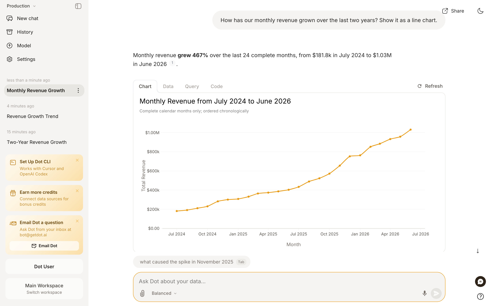
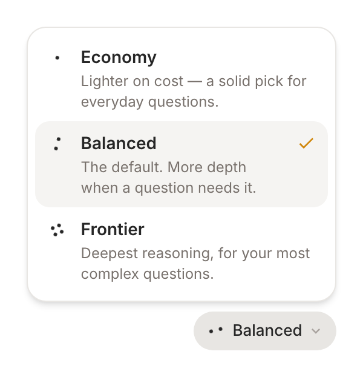

# Analyze

Your data lives in complex models, and the answers you need are scattered across hundreds of dashboards. The few people who can navigate all of it become a bottleneck.

Dot removes the bottleneck. Ask a question in your own words and Dot does the analysis: it understands your data model, writes and runs the SQL, checks its own work, and answers with a clear result you can trace back to the source. No ticket, no dashboard hunt, no waiting on the data team.

<figure><figcaption>
Ask in plain English → Dot investigates and answers, with every number traceable to its source.
</figcaption></figure>

## One place for every question

There's no mode to pick. A quick lookup and a deep investigation start the same way — you just ask. Dot reads the question and does as much work as it needs:

* **"What was revenue last month?"** → a direct answer with the number, a chart, and the query behind it.
* **"Why did revenue drop in Q3?"** → an autonomous investigation. Dot runs multiple queries, tests explanations, rules out dead ends, and comes back with a structured report — headline, key findings, supporting charts, and recommended next steps.

Under the hood Dot can understand your semantic model, write and run SQL, compute and reshape data, build visualizations, and search the web for context when a question needs it. The harder the question, the more of these it chains together on its own.

## Energy modes

One dial controls how much thinking Dot puts into an answer. Open the **energy mode** selector next to the message box:

* **Economy** — lighter on cost, a solid pick for everyday questions.
* **Balanced** — the default. More depth when a question needs it.
* **Frontier** — the deepest reasoning, for your most complex questions.

<figure><figcaption>
Pick the effort to match the question — Economy for quick looks, Frontier for the hard ones.
</figcaption></figure>

Your choice sticks to the conversation, so a follow-up keeps the same depth. Admins can set the default for the whole workspace and, if they prefer, lock it (see [Configuration](#configuration-admins)). When it's locked, everyone uses the workspace default, and your own pick, including the Slack and Teams keywords below, is ignored.


In Slack, Teams, and email you can set the mode with a keyword: start a message with `!economy`, `!balanced`, or `!frontier`. Adding **"go deep"** or **"ultrathink"** to any message bumps just that one to Frontier.


## Answers you can trust

Dot is grounded in your connected data, so it doesn't invent numbers — every answer is backed by a query you can inspect.

* **Trace any number.** Each answer carries **Chart / Data / Query / Code** views and a **Source** pill. Click through to see the exact SQL and the rows it ran on.
* **Cited claims.** Statements in a report link back to the data that supports them, so anyone can verify a finding instead of taking it on faith.
* **A full investigation log.** For multi-step work, open **Full logs** to see every query and step Dot took to reach its conclusion.

If an answer looks off, just say **"try again."** Dot is built on frontier models and is statistical by nature — a second pass often takes a different, better route. And if you're ever unsure, the data team can audit the query and the model behind any answer.

## Keep the conversation going

Dot holds context across a thread, so you refine instead of restarting:

* _"Drill into EMEA."_
* _"Show the top 10 customers driving this."_
* _"Now compare it to last year."_

You can also attach a file (like a CSV) to bring your own data into the analysis.

## Do something with the answer

Every answer is a starting point, not a dead end:

* **Share** a link with a colleague, or **schedule** it to run and deliver on a cadence.
* **Download as a presentation** to drop findings straight into a deck.
* **Turn it into an [App](apps/README.md)** — a living, interactive dashboard or report that stays connected to your data.

## How to get the best answers

Dot is good at figuring out intent, but a clear question gets a sharper answer. The more of these you include, the less Dot has to guess:

* **The metric** — revenue, active buyers, churn rate.
* **The entity** — customers, products, suppliers.
* **The time frame** — last month, Q1 2026, year to date.
* **The grain and cuts** — by month, by region, for Enterprise only.

So instead of _"How are sales?"_ ask _"What was Enterprise revenue by month for the first half of 2026, in euros?"_ And when you're not sure what's available or how to phrase something, just ask Dot for help — it knows your data model and will suggest a direction.

## Configuration (Admins)

In **Settings → Configure Dot**:

* **Default energy mode** — set the starting mode for the workspace, and optionally lock it so everyone uses the same depth.
* **Custom appendix** — append a disclaimer or contact details to every answer.

Deeper questions do more work, which uses more [Agent Compute Credits](agent-compute-credits.md). Admins can cap usage per user or group to keep spend predictable.
