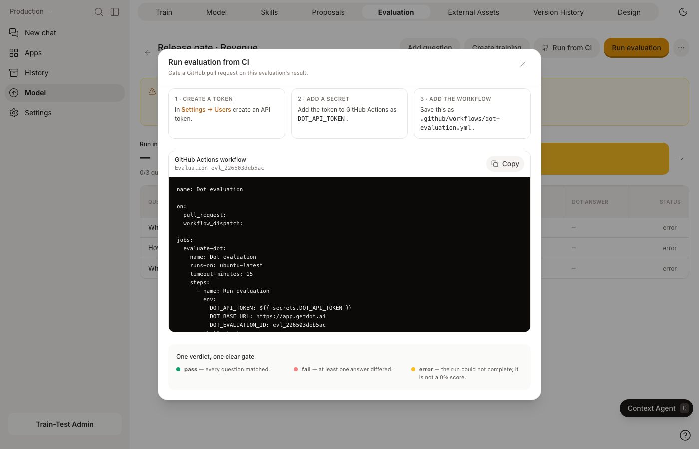
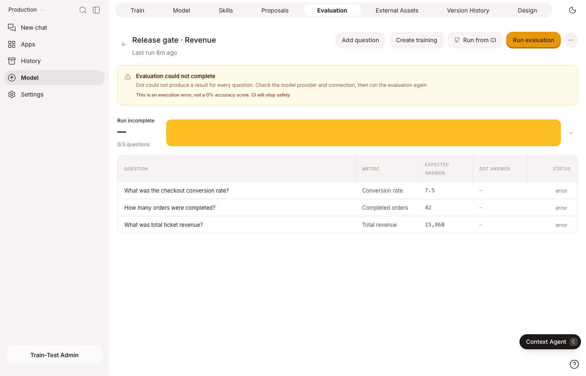

# Commonly used Endpoints

## Automatically Sync Dot

To keep Dot in sync with your production environment, it is recommended to trigger the following API endpoint


[OpenAPI dot-openapi](https://test.getdot.ai/openapi.json)


```javascript
// URL endpoint
https://{region}.getdot.ai/api/sync/{connection_type}/{connection_id}?user_id={user}&api_token={api_token}
```

* **Region**: `app` (US)  or `eu` (EU)
* **Connection Type**: `postgres`, `redshift`, `snowflake`, `mssql`, `bigquery`, `databricks`, `looker`, `dbt`
* **User ID**: usually email of the user [(url encoded)](https://www.urlencoder.io/)
* **API Token**: can get created (and overwritten) by clicking `Copy API Token` in Settings/Users/Actions/···

\
**Trigger with curl (CLI)**

```javascript
curl -X "POST" "https://eu.getdot.ai/api/sync/bigquery/my-bg-id?user_id=sync_user%40contoso.com&api_token=dot-42673584be9724a21e1550336d6fe509f4a04207461ec9a926ca2a27cbd27fa0
```


**Trigger with dbt webhooks**

Call the api endpoint after your dbt run completed.


Documentation how to setup a dbt webhooks



## Import External Assets

Inform Dot about key external knowledge assets, such as BI dashboards or custom data apps, so it can recommend them to users and assist with discovery and understanding. Authentication works similarly to the Sync Connection endpoint.


[OpenAPI dot-openapi](https://test.getdot.ai/openapi.json)



## Export Conversation History

Export all conversations together with relevant meta data fields such as number of messages or author.


[OpenAPI dot-openapi](https://test.getdot.ai/openapi.json)



## Ask Dot Automatically

`/api/agentic` is how you ask Dot anything. It is the same engine behind the app, Slack and Teams: Dot reads your model, writes and runs SQL, builds charts, and keeps going until it can answer. A one-line lookup and a multi-step investigation use this one endpoint — Dot decides how far to go.

Send a question with a `chat_id` you generate. The call returns the conversation once Dot has finished.


[OpenAPI dot-openapi](https://test.getdot.ai/openapi.json)


Follow up by posting to `/api/agentic_with_history` with the same `chat_id`, so Dot keeps the context of everything already asked.


[OpenAPI dot-openapi](https://test.getdot.ai/openapi.json)


Both take an optional `mode` — `economy`, `balanced` or `frontier` — the same dial as the [energy mode](../analyze.md#energy-modes) selector in the app. Left out, your workspace default applies.

To ask against an [environment](../environments.md) instead of production, send its id in the `X-Dot-Environment` header. That works on every endpoint on this page, not just these two.

The answer sits in the last message carrying a `formatted_result`: a list of parts, of which the `text` ones joined together are what a person reads. A long investigation can outlast the request, so fetch it later with `GET /api/c2/{chat_id}` using the same `chat_id`. There is a [worked example](use-cases-and-scripts.md) of both.


## Gate a GitHub Pull Request with an Evaluation

An Evaluation is a reusable set of questions with known numeric answers. Run it after a model or data change to catch an answer regression before users do. The GitHub workflow below starts one run, follows that exact run to completion, and passes only when every question matches.

### Set up the workflow

1. In Dot, open **Model → Evaluation** and select the evaluation you want to use as the gate.
2. In **Settings → Users → API Tokens**, create a token for a user who can run evaluations.
3. In the GitHub repository, open **Settings → Secrets and variables → Actions** and add the token as a repository secret named `DOT_API_TOKEN`.
4. Back in Dot, click **Run from CI** and copy the generated workflow.

<figure><figcaption><p>Dot fills in the correct host and evaluation ID. The token itself stays in GitHub Secrets.</p></figcaption></figure>

Save the workflow as `.github/workflows/dot-evaluation.yml`:

```yaml
name: Dot evaluation

on:
  pull_request:
  workflow_dispatch:

jobs:
  evaluate-dot:
    name: Dot evaluation
    runs-on: ubuntu-latest
    timeout-minutes: 15
    steps:
      - name: Run evaluation
        env:
          DOT_API_TOKEN: ${{ secrets.DOT_API_TOKEN }}
          DOT_BASE_URL: https://app.getdot.ai
          DOT_EVALUATION_ID: evl_your_evaluation_id
        shell: bash
        run: |
          set -euo pipefail
          start_file="$(mktemp)"
          trap 'rm -f "$start_file"' EXIT

          status="$(curl --silent --show-error \
            --output "$start_file" --write-out "%{http_code}" \
            --request POST \
            --header "X-API-KEY: $DOT_API_TOKEN" \
            --header "Content-Type: application/json" \
            --data '{"trigger":"api"}' \
            "$DOT_BASE_URL/api/evaluations/$DOT_EVALUATION_ID/runs")"

          if [ "$status" = "200" ]; then
            run_id="$(jq -r '.id' "$start_file")"
          elif [ "$status" = "409" ]; then
            run_id="$(jq -r '.detail.active_run_id // empty' "$start_file")"
            if [ -z "$run_id" ]; then
              cat "$start_file"
              exit 1
            fi
          else
            cat "$start_file"
            exit 1
          fi

          for attempt in {1..60}; do
            run="$(curl --fail-with-body --silent --show-error \
              --header "X-API-KEY: $DOT_API_TOKEN" \
              "$DOT_BASE_URL/api/evaluation_runs/$run_id")"
            echo "$run" | jq '{status, verdict, summary}'

            if [ "$(jq -r '.finished' <<<"$run")" = "true" ]; then
              break
            fi
            if [ "$attempt" = "60" ]; then
              echo "::error::Dot evaluation did not finish within 10 minutes"
              exit 1
            fi
            sleep 10
          done

          verdict="$(jq -r '.verdict' <<<"$run")"
          {
            echo "### Dot evaluation"
            echo
            echo "| Verdict | Passed | Failed | Errors |"
            echo "| --- | ---: | ---: | ---: |"
            jq -r '"| **\(.verdict)** | \(.summary.pass) | \(.summary.fail) | \(.summary.error) |"' <<<"$run"
          } >> "$GITHUB_STEP_SUMMARY"

          if [ "$verdict" != "pass" ]; then
            echo "::error::Dot evaluation verdict: $verdict"
            exit 1
          fi
```

Use `https://eu.getdot.ai` for an EU workspace. The **Run from CI** dialog automatically uses the host where your workspace is running.

### Read the result in GitHub

The action adds the verdict and question counts to the GitHub job summary without exposing the API token. It exits successfully only for `pass`, so it can be made a required status check in your branch protection rules.

| Verdict | Meaning | GitHub result |
| --- | --- | --- |
| `pass` | Every question matched its known answer. | Pass |
| `fail` | One or more answers differed from the known answer. | Fail |
| `error` | Dot could not complete the run, for example because a provider or connection was unavailable. This is not a 0% accuracy score. | Fail |
| `pending` | The run is still queued or running. | Keep polling |

The workflow deliberately checks `verdict == "pass"` instead of calculating a result from counts. A terminal run with a missing result therefore fails closed as `error`.

<figure><figcaption><p>Dot separates provider or connection errors from answer mismatches, so an unavailable dependency cannot be mistaken for 0% accuracy.</p></figcaption></figure>

If GitHub retries the job while the evaluation is already running, Dot returns `409` with that run's `active_run_id`. The workflow continues polling the same run instead of charging for or starting a duplicate.


GitHub does not pass repository secrets to `pull_request` workflows from forks. For external contributors, run this workflow manually after reviewing the code. Do not switch it to `pull_request_target` and check out untrusted pull-request code, because that can expose the token.


### Call the API directly

Start a run with `POST /api/evaluations/{evaluation_id}/runs`:

```bash
curl --request POST \
  --header "X-API-KEY: $DOT_API_TOKEN" \
  --header "Content-Type: application/json" \
  --data '{"trigger":"api"}' \
  "https://app.getdot.ai/api/evaluations/$DOT_EVALUATION_ID/runs"
```

Keep the returned `id`, then poll only that run:

```bash
curl --header "X-API-KEY: $DOT_API_TOKEN" \
  "https://app.getdot.ai/api/evaluation_runs/$RUN_ID"
```

The response includes `finished`, `verdict`, and `summary`:

```json
{
  "id": "evr_01k3…",
  "status": "completed",
  "finished": true,
  "verdict": "pass",
  "summary": { "total": 12, "pass": 12, "fail": 0, "error": 0, "pending": 0 }
}
```

## User Administration


[OpenAPI dot-openapi](https://test.getdot.ai/openapi.json)



[OpenAPI dot-openapi](https://test.getdot.ai/openapi.json)



[OpenAPI dot-openapi](https://test.getdot.ai/openapi.json)



[OpenAPI dot-openapi](https://test.getdot.ai/openapi.json)



[OpenAPI dot-openapi](https://test.getdot.ai/openapi.json)



[OpenAPI dot-openapi](https://test.getdot.ai/openapi.json)



[OpenAPI dot-openapi](https://test.getdot.ai/openapi.json)


## Automatically Authenticate Embedded Users

For embedded use cases that require SSO, where your end users have individual permissions you can use this endpoint to obtain an access token for users that is valid for 24h. Here is an example on how you can use it to [embed](../embed.md) Dot in your application. 

Please make sure that you enabled this flag on settings: **"Allow admins to authenticate for users to enable SSO in embeds".**


[OpenAPI dot-openapi](https://test.getdot.ai/openapi.json)

