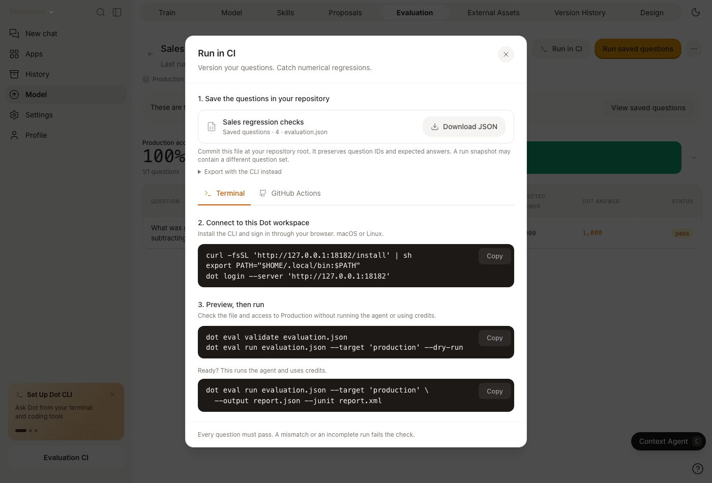

# Evaluations in CI

Run the same [evaluation](../evaluation.md) locally and in CI. The CLI submits the questions, waits for the run, checks the results, and writes reports. Your pipeline can fail when a trusted number changes or a previously passing question regresses.


Use Dot CLI **0.3.1 or later** with the matching evaluation-files API. Run `dot --version` to check your CLI and `dot update` after your workspace receives the release. Older installed CLIs retain basic creation and preview compatibility, but 0.3.1 also aligns saved-ID previews and baseline checks with an explicitly selected target.


## Before you start

* Install the [Dot CLI](../../integrations/cli.md).
* Create an [API token](README.md) for a user permitted to run evaluations. Use a full API token, rather than an MCP-only token.
* Connect the data and document the metrics Dot should use.
* Use a controlled data snapshot, or regenerate expected answers against the same data target immediately before testing.

Set credentials in your shell or CI secret store:

```bash
export DOT_API_BASE_URL="https://app.getdot.ai"
export DOT_API_TOKEN="YOUR_API_TOKEN"
export DOT_ENV="" # Read and create saved evaluations in Production.
```

Use `https://eu.getdot.ai` for an EU workspace. The CLI reads the token from the environment, so CI does not need an interactive login.

## Select the saved evaluation's environment

Evaluations are versioned model files, so their saved definitions are scoped to an environment. Set `DOT_ENV="YOUR_ENVIRONMENT_ID"` to create, list, show, or export a draft evaluation. Set `DOT_ENV=""` to use Production even if you have another environment saved in your CLI settings.

`--target` selects the context and warehouse overrides to test:

* **Suite file:** Dot reads the saved evaluation identity and provenance from `DOT_ENV`, then runs the file's question snapshot against `--target`. The target environment can predate the saved evaluation; you do not need to copy the definition there.
* **Evaluation ID:** Dot runs the saved questions at the target's committed revision. That target must contain the evaluation. Merge the definition into it, select an environment that contains it, or export and run a suite file instead.

If `--target` is omitted, execution uses the active environment, or Production when none is selected. Preview uses the same selection rules. Archiving the relevant saved definition prevents new runs while preserving previous results.

## Start with an existing evaluation

Open an evaluation and choose **Run in CI**. The setup dialog downloads the **saved questions**, shows the correct regional server, and provides terminal commands or a GitHub Actions workflow. Its commands also select the evaluation's source environment with `DOT_ENV`. It displays the saved-question count so you can distinguish it from a run that used a different file snapshot.

<figure><figcaption><p>Start with the saved suite, preview the target, then run the evaluation.</p></figcaption></figure>

You can also export from the terminal:

```bash
dot eval export YOUR_EVALUATION_ID --output suite.json
dot eval validate suite.json
dot eval run suite.json --target production --dry-run
dot eval run suite.json --target production \
  --output artifacts/evaluation.json \
  --junit artifacts/evaluation.xml
```

`validate` checks the suite file locally and needs no token or network. `--dry-run` reads the evaluation, target revision, and optional baseline, then shows what would run. Neither command starts an agent or spends evaluation credits. The final command executes the evaluation. Commit the downloaded or exported suite to keep its question IDs and expected answers under review.

Use a candidate environment ID in place of `production` when evaluating a context change before release. Export refuses to overwrite an existing file.

## Define a suite in code

Use **YAML** (`.yaml` or `.yml`) for comments and readable multiline questions, or **JSON** (`.json`) for generated suites. Both portable suite formats use the same fields and evaluation behavior. The automatically synced `evaluations/<evaluation-id>.yaml` files use a separate model-repository schema with audit metadata. Export a portable suite with `dot eval export`; renaming or copying a synced file is not a conversion. `validate`, `create`, and `run` accept either format; exported suites and run reports use JSON.

Generate a starter with `dot eval init --output suite.yaml` or `dot eval init suite.json`, or copy one of these equivalent starters. Their answers come from the [synthetic fixture below](#reproduce-the-example); replace them with reviewed values from your data before adopting the suite. The examples omit `evaluation_id` because `create` fills it in.

### Minimal starter

Only the suite name, question, and expected answer are needed to create a suite. Save either version and replace the example with a reviewed answer from your data.

YAML (`suite.yaml`):

```yaml
name: Revenue checks
questions:
  - question: What was net revenue in USD for completed orders in January 2026?
    expected_answer: 900
```

JSON (`suite.json`):

```json
{
  "name": "Revenue checks",
  "questions": [
    {
      "question": "What was net revenue in USD for completed orders in January 2026?",
      "expected_answer": 900
    }
  ]
}
```

`validate` accepts this draft offline. `create` assigns and writes stable question IDs plus `evaluation_id` into the same file. Keep those IDs for later runs: question wording can change while its identity stays the same. A wording, expected-answer, answer-type, or tolerance change still requires a fresh compatible baseline. `answer_type` is optional, and numeric tolerance defaults to 3%.

Check and save your chosen starter, then preview its target:

```bash
dot eval validate suite.yaml
dot eval create suite.yaml
dot eval run suite.yaml --target production --dry-run
```

Use `suite.json` instead if you chose JSON. The preview starts no agent; [run the saved suite](#save-once-then-run) when you are ready.

### Complete fixture with explicit types and exact comparisons

For the reproducible four-check fixture below, use either of these equivalent suites instead. Explicit IDs make this example easy to discuss; you can omit them before the first `create`.

#### YAML — save as suite.yaml

```yaml
name: Sales regression checks
description: >-
  Fixed January 2026 sales fixture. Exclude cancelled orders and subtract refunds from gross revenue.
questions:
  - id: january-net-revenue
    question: What was net revenue in USD for completed orders in January 2026?
    expected_answer: "900"
    answer_type: currency
    tolerance_pct: 0 # Exact match for this fixed fixture
    concept_name: Net revenue
    source:
      system: sql_fixture
      definition: >-
        Sum gross_amount minus refund_amount for completed orders from 2026-01-01 inclusive to 2026-02-01 exclusive.
  - id: january-completed-orders
    question: How many completed orders were placed in January 2026?
    expected_answer: "4"
    answer_type: count
    tolerance_pct: 0
  - id: january-refund-rate
    question: >-
      For completed orders in January 2026, what percentage of gross revenue was refunded?
    expected_answer: "10%"
    answer_type: percent
    tolerance_pct: 0
  - id: january-invalid-amounts
    question: >-
      How many completed orders in January 2026 have a negative gross amount,
      a negative refund amount, or refunds greater than gross amount?
      Return the count, including zero if there are none.
    expected_answer: "0" # Zero is a valid expected answer
    answer_type: count
    tolerance_pct: 0
```

#### JSON — save as suite.json

```json
{
  "name": "Sales regression checks",
  "description": "Fixed January 2026 sales fixture. Exclude cancelled orders and subtract refunds from gross revenue.",
  "questions": [
    {
      "id": "january-net-revenue",
      "question": "What was net revenue in USD for completed orders in January 2026?",
      "expected_answer": "900",
      "answer_type": "currency",
      "tolerance_pct": 0,
      "concept_name": "Net revenue",
      "source": {
        "system": "sql_fixture",
        "definition": "Sum gross_amount minus refund_amount for completed orders from 2026-01-01 inclusive to 2026-02-01 exclusive."
      }
    },
    {
      "id": "january-completed-orders",
      "question": "How many completed orders were placed in January 2026?",
      "expected_answer": "4",
      "answer_type": "count",
      "tolerance_pct": 0
    },
    {
      "id": "january-refund-rate",
      "question": "For completed orders in January 2026, what percentage of gross revenue was refunded?",
      "expected_answer": "10%",
      "answer_type": "percent",
      "tolerance_pct": 0
    },
    {
      "id": "january-invalid-amounts",
      "question": "How many completed orders in January 2026 have a negative gross amount, a negative refund amount, or refunds greater than gross amount? Return the count, including zero if there are none.",
      "expected_answer": "0",
      "answer_type": "count",
      "tolerance_pct": 0
    }
  ]
}
```

### Suite fields

| Field | Required? | Meaning |
| --- | --- | --- |
| `name` | Yes | A nonempty suite name, up to 160 characters. |
| `description` | No | Context for reviewers, up to 2,000 characters. |
| `evaluation_id` | After saving | Set by `create`; retain it for later runs. |
| `questions` | Yes | A nonempty list of test cases. |
| `questions[].id` | After saving | `create` writes the saved case ID, replacing any draft ID. Keep it unique and stable. Start with a letter or digit; use letters, digits, dots, underscores, colons, or hyphens. |
| `questions[].question` | Yes | The business question, up to 1,000 characters. |
| `questions[].expected_answer` | Yes | A finite number or ISO date (`YYYY-MM-DD`), as text or a JSON/YAML number. Zero is valid. |
| `questions[].answer_type` | No | `number`, `count`, `currency`, `percent`, `ratio`, or `date`. Omitted types infer `percent` from `%`, `currency` from `$`, `€`, `£`, or `¥`, `date` from an ISO date, and otherwise `number`. Set `count` and `ratio` explicitly; use `percent` when a bare number represents a percentage. |
| `questions[].tolerance_pct` | No | Percentage tolerance from 0 to 100; defaults to 3. Dates always use 0. |
| `questions[].concept_name` | No | Groups related questions by metric. |
| `questions[].source` | No | Records the origin of the expected answer; it does not execute a reference query. Preserve exported BI provenance. |

Initial IDs are optional and may use slugs. `create` assigns saved question IDs; commit those IDs and keep them stable when editing so file, UI, and exported runs refer to the same tests. A new question can start with a new unique slug.

Use one suite object per file. Field names are exact: unknown suite/question fields, duplicate question IDs, empty answers, booleans, prose answers, and invalid dates are rejected. Quote dates, currency, and percentages in YAML to preserve their intended text. YAML comments and folded questions (`>-`) make business logic easier to review. A saved suite needs IDs for every question when running; give newly added questions new unique IDs. Exported `concept_id` and source fields should be retained when editing an existing suite.

### Reproduce the example

Create the fixture in a test PostgreSQL database connected to Dot:

```sql
CREATE SCHEMA IF NOT EXISTS evaluation_ci;
CREATE TABLE evaluation_ci.orders (
  order_id integer PRIMARY KEY,
  order_date date NOT NULL,
  status text NOT NULL,
  gross_amount numeric(12, 2) NOT NULL,
  refund_amount numeric(12, 2) NOT NULL
);
INSERT INTO evaluation_ci.orders VALUES
  (1, '2026-01-03', 'completed', 100, 0),
  (2, '2026-01-10', 'completed', 200, 0),
  (3, '2026-01-18', 'completed', 300, 100),
  (4, '2026-01-31', 'completed', 400, 0),
  (5, '2026-01-15', 'cancelled', 500, 0),
  (6, '2026-02-01', 'completed', 700, 0);
```

Activate and scan this table in Dot. Add a note defining net revenue as gross amount minus refunds, using completed orders and `order_date` for the reporting period. Use a dedicated evaluation environment so these questions refer to the fixture rather than another orders table.

For January completed orders, gross revenue is 1,000 USD, refunds are 100 USD, and net revenue is 900 USD. There are four orders, refunds are 10% of gross revenue, and zero orders violate the amount checks. The cancelled order and February order catch missing status and date filters.

## Save once, then run

Check the file offline, then save the evaluation once. Use `suite.yaml` below if you chose YAML:

```bash
dot eval validate suite.json
dot eval create suite.json
dot eval run suite.json --target production --dry-run
```

The command saves the evaluation and updates the same file with its `evaluation_id` and the assigned question IDs and canonical fields. Commit that updated file to Git. Reuse it for subsequent CI runs; calling `create` again on a saved suite is rejected. You can run `dot eval validate suite.json` before saving to check the file without credentials.

```bash
dot eval run suite.json --target production \
  --output artifacts/evaluation.json \
  --junit artifacts/evaluation.xml
```

The command waits for completion and uses the questions in the file for that run, without changing the saved question set. Its run link opens those recorded questions in the web UI. You can also run an existing saved evaluation by supplying its ID instead of a suite file; its definition must exist at the target revision.

To start from a question set created in the web UI:

```bash
dot eval list
dot eval export YOUR_EVALUATION_ID --output suite.json
```

Export writes a new file and refuses to overwrite an existing one.

### Check a candidate environment

Use an environment ID to test context changes before promoting them. After confirming the intended changes have reached that environment, inspect its current revision without starting an evaluation:

```bash
DOT_EVALUATION_TARGET="YOUR_ENVIRONMENT_ID"
dot eval target --target "$DOT_EVALUATION_TARGET" --json > target.json
DOT_CONTEXT_COMMIT=$(jq -er '.target_commit' target.json)

dot eval run suite.json --target "$DOT_EVALUATION_TARGET" \
  --expect-commit "$DOT_CONTEXT_COMMIT" \
  --output artifacts/evaluation.json
```

Use `production` as the target to inspect Production. The target report contains `target`, `target_label`, `target_commit`, and `target_overrides`.

`--expect-commit` checks the Dot context revision being evaluated. Use the revision in Dot, which may differ from your application or dbt repository's Git commit. It does not sync a branch or pin warehouse data. Set up the environment and its [warehouse target](../environments.md#work-against-your-dbt-dev-target) first.

Preview the exact target and baseline before starting an agent:

```bash
dot eval run suite.json --target "$DOT_EVALUATION_TARGET" \
  --expect-commit "$DOT_CONTEXT_COMMIT" \
  --baseline YOUR_BASELINE_RUN_ID --dry-run
```

Add `--json` for a machine-readable preview. The preview checks configuration and baseline compatibility; the actual evaluation checks agent execution and warehouse access. The commit guard is checked again when submitting the real run.

### Set the release gate

The default minimum pass rate is 100%. To accept a lower rate, set it explicitly:

```bash
dot eval run suite.json --target production --min-pass-rate 95
```

Errors and incomplete runs always fail the gate, even with a lower pass-rate threshold. An empty or invalid suite is an error, not a passing run.

| Exit code | Meaning |
| --- | --- |
| `0` | The completed run satisfies the gate. |
| `1` | Numerical results do not satisfy the pass-rate or regression gate. |
| `2` | Configuration, execution, incomplete-run, or baseline-compatibility error. |

Do not use `continue-on-error` or `|| true` on the evaluation command when its result should block a release.

### Compare with a baseline

Choose a previously reviewed run as the baseline:

```bash
dot eval run suite.json --target YOUR_ENVIRONMENT_ID \
  --baseline YOUR_BASELINE_RUN_ID \
  --output artifacts/evaluation.json
```

A baseline must use the same question fingerprint as the new run. Changing the questions, expected answers, or tolerances requires a compatible baseline. The gate rejects a newly failing question that passed in the baseline, even when the overall pass rate remains above your threshold. Errors always fail closed.

### Bound execution

The default timeout is 1,800 seconds. Set another timeout for your pipeline:

```bash
dot eval run suite.json --target production --timeout 900
```

On timeout or interruption, the CLI requests cancellation and exits with code `2`. If cancellation cannot be confirmed, it prints the run ID and a cancellation command.

Use `--idempotency-key` when retrying the same logical run after a connection failure. Reuse the key with the same request; use a new key for a new run.

## Verify the gate end to end

After saving the example suite and connecting the synthetic fixture, run it against your test environment:

```bash
dot eval run suite.json --target YOUR_ENVIRONMENT_ID --output baseline.json
```

All four checks should pass. Read the baseline run ID from the report:

```bash
BASELINE_RUN_ID=$(python3 -c 'import json; print(json.load(open("baseline.json"))["run"]["id"])')
```

Introduce a known data regression in the synthetic fixture by removing the refund on order 3:

```sql
UPDATE evaluation_ci.orders SET refund_amount = 0 WHERE order_id = 3;
```

Run the unchanged suite again:

```bash
dot eval run suite.json --target YOUR_ENVIRONMENT_ID \
  --baseline "$BASELINE_RUN_ID" --output regression.json
```

The net-revenue answer is now 1,000 USD instead of 900 USD, and the refund rate is zero instead of 10%. Those two checks fail; the order-count and invalid-amount checks still pass. The command exits with code `1` and the report identifies both regressions.

Restore the fixture:

```sql
UPDATE evaluation_ci.orders SET refund_amount = 100 WHERE order_id = 3;
```

```bash
dot eval run suite.json --target YOUR_ENVIRONMENT_ID \
  --baseline "$BASELINE_RUN_ID" --output recovery.json
```

All four checks should pass again, with exit code `0`. This verifies a data regression and recovery through the same numerical gate used in CI.

## GitHub Actions

Commit `suite.json` with its saved `evaluation_id`. Add `DOT_API_TOKEN` as a GitHub Actions secret. This workflow runs on manual dispatch and pull requests within the same repository and saves both report formats even if a test fails. The CLI automatically appends the gate result, failures, context commit, and run link to `GITHUB_STEP_SUMMARY`.

```yaml
name: Evaluate Dot

on:
  workflow_dispatch:
  pull_request:
    paths:
      - 'suite.json'
      - '.github/workflows/evaluate-dot.yml'

permissions:
  contents: read

jobs:
  evaluate:
    if: github.event_name == 'workflow_dispatch' || github.event.pull_request.head.repo.full_name == github.repository
    runs-on: ubuntu-latest
    timeout-minutes: 35
    env:
      DOT_API_BASE_URL: https://app.getdot.ai
      DOT_ENV: "" # Saved evaluation is in Production.
      DOT_API_TOKEN: ${{ secrets.DOT_API_TOKEN }}
    steps:
      - uses: actions/checkout@v4

      - name: Install Dot
        shell: bash
        run: |
          curl -fsSL "$DOT_API_BASE_URL/install" -o "$RUNNER_TEMP/install-dot.sh"
          sh "$RUNNER_TEMP/install-dot.sh"
          echo "$HOME/.local/bin" >> "$GITHUB_PATH"

      - name: Evaluate
        id: evaluation
        shell: bash
        run: |
          dot --version
          dot eval validate suite.json
          dot eval run suite.json --target production \
            --timeout 1800 \
            --idempotency-key "gh-${GITHUB_RUN_ID}-${GITHUB_RUN_ATTEMPT}" \
            --output artifacts/evaluation.json \
            --junit artifacts/evaluation.xml

      - name: Upload reports
        if: always()
        uses: actions/upload-artifact@v4
        with:
          name: dot-evaluation-${{ github.run_id }}-${{ github.run_attempt }}
          path: artifacts/
          if-no-files-found: warn
```

This example tests Production against committed expectations. To gate candidate context, prepare an environment before the evaluation step, then supply its ID and expected Dot context commit. Add your context or metric files to the workflow's `paths` filter as appropriate.

Fork pull requests skip this job because GitHub does not provide the workspace secret to them. The job's artifacts remain available after numerical failures. If setup fails before a report exists, the failed job and its logs identify the error.

## Inspect a report

Progress goes to stderr. Add `--json` for JSON-only stdout; `--output` saves the same report to a file. Reports include `schema_version`, `run_url`, the gate decision in `gate`, and the API run with its question results in `run`.

When you provide a compatible baseline, `comparison` records regressions and recoveries with the previous and current answers. The terminal and GitHub summary show those changes, including questions that are passing again. Recoveries do not cancel out a regression in the release gate. Failed questions in GitHub summaries and JUnit evidence link directly to their conversations.

```bash
dot eval results YOUR_RUN_ID --json
dot eval compare YOUR_BASELINE_RUN_ID YOUR_RUN_ID --output comparison.json
dot eval cancel YOUR_RUN_ID
```

`results` and `compare` read stored results and apply the gate without asking the agent again. JUnit reports include question results and a release-gate failure/error when the overall check does not pass. Files may contain business questions and answers; use your normal access and retention settings for CI artifacts.

## Use dbt in the same pipeline

Run `dbt build` against your test target before evaluating. If your expected values come from dbt or MetricFlow, use your existing tooling to calculate them and write the numerical answers into `suite.json`. Point the Dot environment at that same target.

Keep the metric definition revision and data snapshot with your CI evidence. `--expect-commit` verifies Dot's context revision; it does not establish that the dbt build or warehouse snapshot is identical.

## Troubleshoot a failed check

* **Numeric mismatch:** compare expected and observed values, then open the linked conversation to inspect the query and business logic.
* **No usable answer:** inspect the conversation for missing data, permissions, or an ambiguous question. Evaluation can send one follow-up before reporting the result.
* **Authentication failure:** check the token, API scope, user permissions, and regional server URL.
* **Commit mismatch:** finish syncing the intended Dot context and use its actual revision.
* **Baseline mismatch:** compare the suite definitions and choose a baseline for the same question fingerprint.

## Call the API directly

Read the current context revision with `GET /api/evaluations/target`. Add `?environment_id=YOUR_ENVIRONMENT_ID` for an environment; omit it for Production. This is the read-only endpoint used by `dot eval target`.

For an existing evaluation, start a run with the same regional URL and API token:

```bash
curl --fail-with-body \
  -H "X-API-KEY: $DOT_API_TOKEN" \
  -H 'Content-Type: application/json' \
  "$DOT_API_BASE_URL/api/evaluations/YOUR_EVALUATION_ID/runs" \
  --data '{"trigger":"api","target":{"kind":"production"},"idempotency_key":"release-42-attempt-1"}'
```

Use the returned `id` to poll `GET /api/evaluation_runs/{id}` or request cancellation with `POST /api/evaluation_runs/{id}/cancel`. A run status of `completed` does not establish that the answers passed; inspect the results and error count, or use `dot eval results` to apply the CLI gate.

The create-run request accepts these optional fields:

| Field | Purpose |
| --- | --- |
| `target` | `{"kind":"production"}` or `{"kind":"environment","environment_id":"…"}`. |
| `questions` | A per-run question snapshot, using the suite's question objects and stable IDs. The saved evaluation is read from `X-Dot-Environment` (Production when absent). Omit to use the questions at the target's committed revision. |
| `expected_target_commit` | Full lowercase 40-character Dot context SHA that must match the target. |
| `idempotency_key` | Reattach to an accepted run when replaying the same request. |
| `metadata` | String key/value pairs for your source revision and CI job identifiers. |
| `trigger` | `api`, `cli`, or `manual`; use `api` for direct integrations. |

For saved-definition CRUD requests, use `X-Dot-Environment: YOUR_ENVIRONMENT_ID` to select an environment; omit it for Production. Creation no longer stores a default run target. Older clients may send `target` on creation only when it matches that selected environment. API responses retain derived `status` and `target` fields for older CLIs; `archived_at` and `version` describe the saved file.

A run exposes `data.evaluation_commit` for the saved definition used, `target_commit` for the tested context, and `data.question_snapshot` for the exact questions graded. A suite file can override the saved questions for that run, so the snapshot is the authoritative evidence of what was tested. Reuse an idempotency key only for the same request and source environment.

The CLI records GitHub repository, source SHA, run ID, and attempt from the GitHub Actions environment when present. Those identifiers are separate from the captured Dot target commit.

See the [evaluation API reference](https://test.getdot.ai/redoc#tag/evaluations) for saved-evaluation creation, question management, and complete request/response schemas.
