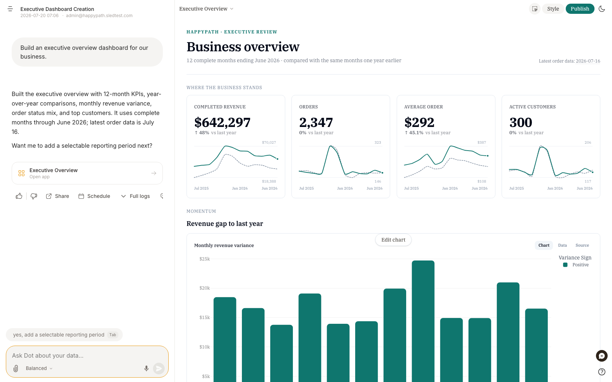
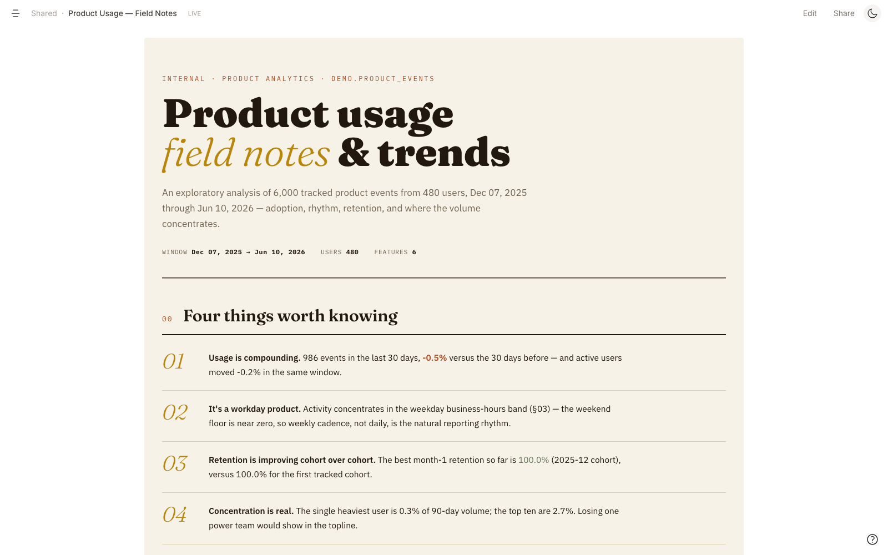
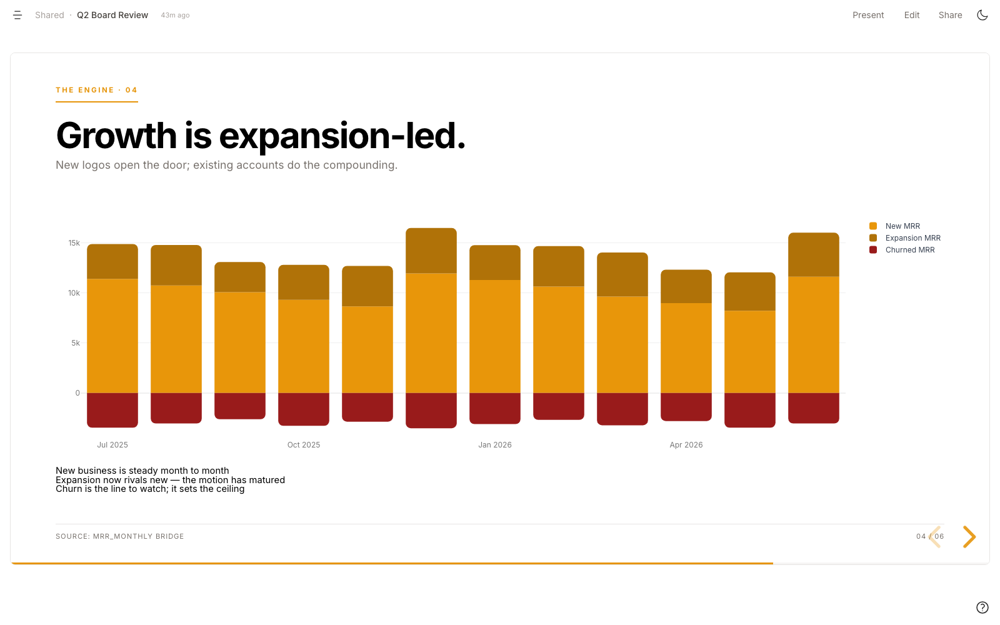

# Build apps

A chat answer is a snapshot in time. A Dot **app** turns that analysis into a **living data product**: you ask for it in plain English, Dot builds it, and it stays connected to your data — fast, interactive, shareable, and traceable to the source.

Apps sit between hand-configuring a BI dashboard and coding one from scratch. You describe what you want; Dot writes the queries, compiles them to real SQL once, and pins the result. Every view then re-runs the real query against live data — **no AI in the render path**, so it's fast and deterministic — while everything stays editable in plain English.

<figure><figcaption>
Ask in plain English → Dot builds the app → publish, share, schedule.
</figcaption></figure>

## What you can build

Apps are one format with several modes — **dashboards are just the most common one**:

* **Dashboards** — track KPIs and trends: filterable grids of metrics, charts, and tables.
* **Reports** — written, editorial analyses ("state of the business", post-mortems, field notes) where every number is cited.
* **Presentations** — live web slide decks for a QBR or board review, with a **Present** button.
* **Data essays** — scrollytelling narratives where a single graphic evolves as you scroll.

They all share the same engine, primitives, and data connections — the difference is a layout choice, not a different tool.

<figure><figcaption>
A <strong>report</strong> — the same data, as a written, cited analysis.
</figcaption></figure>

<figure><figcaption>
A <strong>presentation</strong> — a live board deck you can present full-screen.
</figcaption></figure>

## How you make one

1. **Ask in chat** — "build an executive overview dashboard", "turn this into a board deck". (Or click **New App**.)
2. **Dot builds it** — it compiles your plain-English questions to SQL, dry-runs them, and shows a live preview with an **Open app** card.
3. **Refine conversationally** — "add a region filter", "make it a report", "change the theme". Every edit rebuilds and re-previews.
4. **Publish** — the app appears on your **Apps** page, either personal or shared with the workspace.

## Live, interactive, and yours to edit

* **Always current** — every view runs the pinned SQL against live data. Refresh on demand or on a [schedule](../scheduling.md).
* **Interactive** — a declarative filter threads through every card whose data has that column and cross-filters the rest automatically; view controls (log/linear, time window, smoothing, show/hide series) flip instantly, client-side, with no re-query.
* **Editable** — AI-built, but fully human-editable: the text, layout, style, and the queries themselves — in chat or by hand.

## Share it anywhere

* **Share link** — a private link you can revoke at any time.
* **Embed** — drop an app into your wiki, portal, or product.
* **PDF** — a board-ready export that still links back to the live app.
* **Present** — full-screen live slides straight from the browser.

## Trust and governance

* **Every number traces to its source.** Click any value to open the exact query and its compiled SQL; each card carries a **Source** pill, and the data-lineage view maps an app back through its queries, tables, dbt models, and sources.
* **Certification.** An admin or modeler can mark an app **Certified** — and the badge drops automatically if the underlying source changes without re-review, so a trust signal never goes stale silently.
* **Permissions & usage.** Folder-based view/edit control, per-app view counts, and auto-archiving of apps no one opens anymore.

## Apps as code

For teams who review changes like software, every app is a plain `.app` file you can version-control. Pull and edit it locally, push to recompile the SQL, and open a pull request — with model changes branched and merged through environments.

See [CLI & AI Agent Skill](../../integrations/cli.md) for `dot apps` and `dot env`, and [GitHub Sync](../version-control/github.md) for keeping apps in your repo.


"Dashboard" is one kind of app. The feature grew from dashboards → reports → **apps**, which is now the umbrella for all of them.

