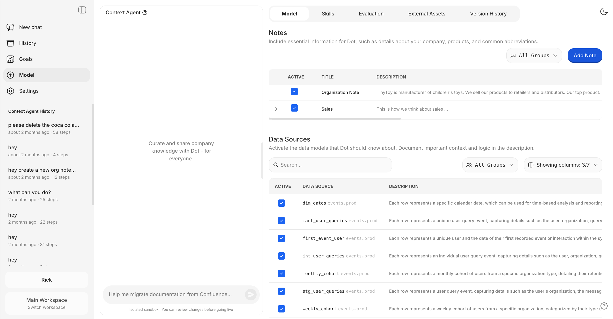

# Root: Context Agent

Root is an AI agent that helps you build, maintain, and evolve your organization's knowledge base. It runs in an isolated sandbox with access to your connected tools—databases, BI dashboards, and past conversations—and can create documentation automatically.

<figure><figcaption><p>Root helps you curate and share company knowledge with Dot</p></figcaption></figure>

**Why this matters**: Building a comprehensive knowledge base manually takes months. Root accelerates this by extracting business logic from your existing systems and learning from how your team actually uses data.

---

## Workflow

1. **Open Context Agent** from the sidebar
2. **Describe what you need** in natural language—Root understands complex requests
3. **Approve tool use** when Root needs to query data or make changes
4. **Review the diff** to see exactly what changed
5. **Merge to production** when satisfied—or discard and try again

All changes happen in an isolated sandbox. Nothing goes live until you explicitly merge.

---

## Use Cases

### 1. Extract Metrics from BI Tools

**Problem**: Your Tableau/Metabase dashboards contain business logic, but it's not documented anywhere Dot can use.

**Solution**: Give Root access to your most trusted dashboards and ask it to create a metric glossary.

```
Here are our five most trusted Metabase dashboards—analyze them and
create a glossary of key metrics with their definitions.
```

Root will:
- Connect to your BI tool via API
- Extract calculations, filters, and business logic
- Create standardized metric definitions Dot can use

---

### 2. Learn from Past Conversations

**Problem**: You don't know what questions your team asks most or what's missing from your documentation.

**Solution**: Ask Root to analyze past Dot conversations.

```
Analyze the last 30 days of conversations. What are the most
common questions? Are there patterns in failed queries?
```

Root will:
- Export and analyze conversation history
- Identify frequently asked questions
- Find gaps where Dot couldn't answer
- Suggest documentation improvements

---

### 3. Audit Existing Documentation

**Problem**: Your table descriptions were written months ago. Are they still accurate?

**Solution**: Ask Root to find inconsistencies.

```
Are there inconsistencies in our documentation or data source
descriptions? Check if sample values match descriptions.
```

Root will:
- Read your current documentation
- Query actual data to verify descriptions
- Flag mismatches between docs and reality
- Suggest fixes

---

### 4. Interview-Based Knowledge Capture

**Problem**: Tribal knowledge exists in people's heads, not in documentation.

**Solution**: Let Root interview domain experts and capture their knowledge.

```
Interview me about how we handle sales and create a note.
```

Root will:
- Ask targeted questions about your process
- Capture answers in structured notes
- Create documentation that reflects actual practice

---

### 5. Bulk Table Documentation

**Problem**: You have hundreds of tables but no descriptions.

**Solution**: Point Root at your schema and let it document everything.

```
Activate all tables in the 'REPORTING' schema. Add descriptions
based on column names and sample values.
```

Root will:
- Query database metadata
- Analyze column names, types, and sample data
- Generate descriptions for each table and column
- Save as documentation Dot can use

---

### 6. Migrate Documentation

**Problem**: Your documentation lives in Confluence/Notion, not where Dot can use it.

**Solution**: Ask Root to migrate it.

```
Here's a link to our Confluence space. Extract the key business
definitions and create notes for Dot.
```

Root will:
- Fetch content from external sources
- Extract relevant business context
- Create notes in Dot's format

---

## How It Works

1. **Start a session** from the sidebar (Context Agent)
2. **Ask Root** what you need—it understands natural language
3. **Review changes** before they go live (git-based versioning)
4. **Merge to production** when you're satisfied

All changes are version-controlled. You can pause, resume, or discard work at any time.

---

## What Root Can Access

| Source | Capability |
|--------|------------|
| **Databases** | Execute SELECT queries, analyze structure |
| **BI Tools** | Read Tableau/Metabase dashboards via API |
| **Past Conversations** | Analyze Dot usage patterns |
| **Web** | Search for documentation and best practices |
| **Your Notes** | Read and edit existing documentation |

---

## Tips

- **Start specific**: "Document the orders table" works better than "document everything"
- **Iterate**: Root can refine its work—ask for changes if the first draft isn't right
- **Review diffs**: Always review changes before merging to production
- **Use interviews**: For complex processes, let Root interview you rather than trying to explain everything upfront
