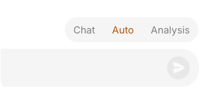

# Deep Analysis

While Chat mode handles quick lookups, some questions require deeper investigation. Deep Analysis is Dot's research mode—an autonomous AI analyst that explores your data from multiple angles.

Instead of answering directly, Dot runs multiple queries, investigates root causes, validates findings, and delivers a comprehensive report with visualizations and recommendations.

### When to Use Deep Analysis

| Use Deep Analysis | Use Chat |
|-------------------|----------|
| "Why did revenue drop in Q3?" | "What's this quarter's revenue?" |
| "What's driving the increase in churn?" | "Show me monthly churn rate" |
| "Compare YoY performance across segments" | "Chart revenue by month" |

**Rule of thumb:** Use Deep Analysis for "why" questions and multi-step investigations. Use Chat for quick lookups.

### How It Works

1. **Select Analysis mode** in the chat interface
2. **Ask your question** as you normally would
3. **Watch the investigation** — you'll see each query and tool in real-time
4. **Receive a structured report** with findings, charts, and recommendations

Analysis typically takes 1-5 minutes depending on complexity.

<figure><figcaption>
Toggle between Chat and Analysis mode
</figcaption></figure>

### The Report

Deep Analysis delivers:

- **Headline** — A single quantified finding
- **Executive Summary** — 2-3 key insights
- **Supporting Analysis** — Detailed sections with embedded charts and tables
- **Recommendations** — Specific next steps
- **Assumptions** — Time periods, definitions, caveats

All claims link to source data so you can verify any finding.

### Exporting Results

- **PowerPoint** — Click "Download as Presentation" to generate slides
- **Shareable links** — Share the analysis with colleagues

### Tips for Better Results

**Be specific about what you're investigating:**

_"Why did sales in Enterprise decline in Q4 vs Q3, and what factors are contributing?"_

**Ask follow-ups** — Deep Analysis maintains context:
- _"Drill deeper into EMEA"_
- _"Show the top 10 customers driving this"_

### Configuration (Admins)

In **Settings > Configure Dot**:

- **Intelligent triggering** — Auto-detect complex questions and switch modes automatically
- **Power Mode** — Use more capable AI models
- **Custom appendix** — Add disclaimers or contact info to reports
