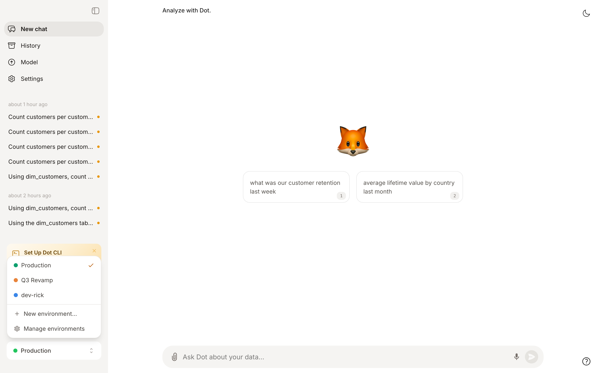
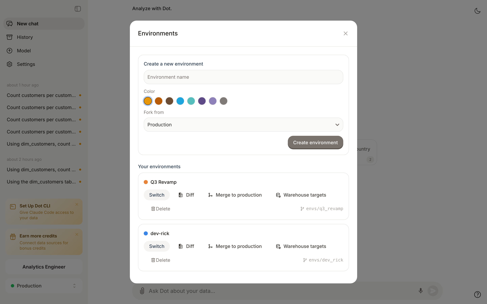
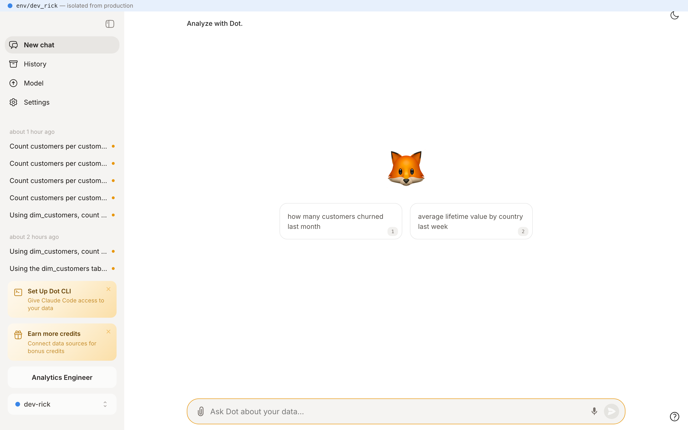
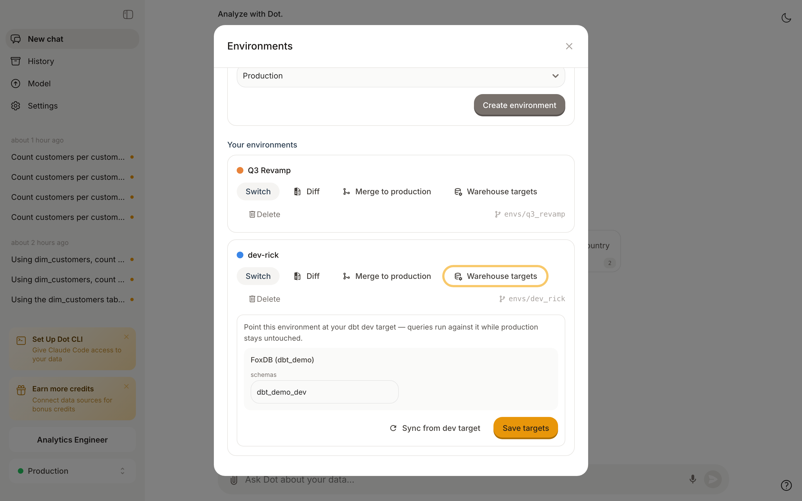
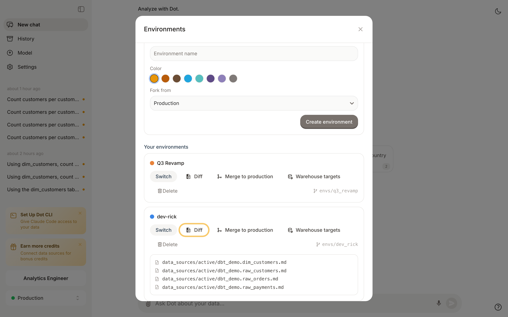

# Environments

Environments let you change Dot's knowledge — table documentation, notes, relationships, skills — without touching what your colleagues see. Each environment is an isolated copy of your data model, backed by its own git branch. You switch in, make changes, test them against real questions, and merge back to production in one click.

If you work with dbt, this will feel familiar: an environment is to Dot what a dev target is to dbt. You can even point an environment at your dbt dev schema, so Dot and dbt develop against the same data.

<figure><figcaption><p>Switch environments from the bottom of the sidebar — Production stays untouched while you work</p></figcaption></figure>

**Why this matters**: Your team relies on Dot's answers. Editing documentation live means every half-finished description and experimental relationship immediately shapes production answers. Environments give you a place to get it right first:

* **Safe iteration** — remodel a domain, rewrite descriptions, or test new notes while production answers stay stable.
* **Test with real questions** — chat with Dot inside the environment and verify answers before anyone else is affected.
* **dbt-style workflows** — point the environment at your dev schema/database, develop dbt models and Dot docs together, and promote both when ready.
* **Reviewable changes** — every environment is a git branch. See the exact file diff before merging, just like a pull request.


Environments are available to **admins and modelers**. Regular users always see production.


## What's isolated, what's shared

| Isolated per environment                                      | Shared with production              |
| ------------------------------------------------------------- | ----------------------------------- |
| Table documentation, notes, relationships, reports, skills    | Database connections (overridable)  |
| Warehouse target overrides (dev schema/database)              | Users, permissions, and groups      |
| [Root](context-agent.md) sessions and their changes           | Chat history (tagged with the environment) |

Chats you run inside an environment appear in the regular History page, tagged with the environment's name — so usage stays visible in one place.

## Create and switch

1. Click the environment switcher at the bottom of the sidebar (it shows **Production** by default).
2. Choose **Manage environments**.
3. Name the environment, pick a color, and click **Create environment**. The new environment forks from production (or from another environment via **Fork from**).
4. Click **Switch** on the environment to start working in it.

<figure><figcaption><p>Create, switch, diff, merge, and delete environments in one place</p></figcaption></figure>

While an environment is active, every page shows a slim banner with the environment's color so you always know where you are. The switcher in the sidebar shows the same colored dot.

<figure><figcaption><p>The banner at the top tells you this tab works in <code>env/dev_rick</code>, isolated from production</p></figcaption></figure>

Environments are per-tab: switching in one browser tab doesn't affect your other tabs, so you can keep production open side by side.

## Quick fixes from a chat

You don't need to create an environment for small fixes. When you start a [Root](context-agent.md) session from production, Dot automatically creates a throwaway environment behind the scenes. Root makes its changes there, you verify the result in the chat, and when you apply the changes to production the throwaway environment is cleaned up automatically.

This means production documentation is never edited in place — every change, however small, goes through an isolated branch.

## Work against your dbt dev target

By default an environment reads from the same warehouse schemas as production. For dbt-style development you can point it at your **dev target** instead:

1. In **Manage environments**, click **Warehouse targets** on the environment.
2. Enter the same values your dbt dev target uses (for example schema `dbt_demo_dev` instead of `dbt_demo` — for Snowflake: database/schema, for BigQuery: project/dataset).
3. Click **Save targets**.

<figure><figcaption><p>Point the environment at your dbt dev schema — queries run against it while production stays untouched</p></figcaption></figure>

From now on, questions asked inside this environment run against your dev schema. Dot follows dbt's defer semantics: **tables that exist in your dev schema are read from there; everything else falls back to production**. You can run `dbt build` on just the model you're changing — exactly like `dbt build --defer`.

After you've built or changed models in the dev schema, click **Sync from dev target** (or run `dot env sync-target`) to refresh the environment's table documentation from the dev schema — new columns and new tables show up in the environment only.


Target overrides redirect **queries and metadata sync** for that environment only. The connection itself — credentials, host, warehouse — is still shared with production.


## Review and merge

When the work is ready:

1. Open **Manage environments** and click **Diff** to see every file the environment changed compared to production.
2. Click **Merge to production** and confirm. Dot merges the environment's branch into the production model.
3. Optionally delete the environment after merging — or keep it for the next iteration.

<figure><figcaption><p>The diff shows exactly which documentation files changed before you merge</p></figcaption></figure>

Admins can always merge. Modelers need the "Can merge changes to production" permission, which admins grant under Settings, then Advanced Settings, then Modeler Permissions.

### Promote with a pull request instead

If you connect a Git provider and want changes to go through review, you don't have to merge inside Dot. You can open a pull request instead. On the environment, click **Open pull request**, and Dot opens a PR from the environment's branch into your production branch on GitHub or GitLab. Your team reviews the diff there and merges when it's ready, and Dot picks up the change. Anyone can open a pull request. Merging to production is the part that needs the permission.


This works when Dot is mirroring environments to Git, which it does by default. Each lasting environment gets its own branch in the same repository as production, named `dot/env-<slug>`. You can turn this off with the "Mirror environments to Git" toggle under Settings, then Version Control. The throwaway environments Root creates for quick fixes aren't mirrored.


## For coding agents: CLI & API

Environments are fully scriptable, which makes them the natural unit of work for AI coding agents: create an environment, make changes, verify, merge — without ever touching production. The [Dot CLI](../integrations/cli.md) ships an `env` command group:

```bash
dot env list                          # Production + all environments
dot env create "dev-rick" --color "#3A86E8"
dot env use dev-rick                  # all following CLI commands run in this env
dot env target set dev-rick db.getdot.ai:5432:db --schema dbt_demo_dev
dot env sync-target dev-rick          # refresh env docs from the dev schema
dot env diff                          # changed files vs production
dot env conflicts                     # predict merge conflicts
dot env merge dev-rick --confirm      # promote to production
dot env delete dev-rick --confirm
```

The active environment (`dot env use`) is sent as an `X-Dot-Environment` header on every request. Override it per command with `--env <id>` or the `DOT_ENV` environment variable.

Using the [REST API](api/README.md) directly, send the same header with the environment's id:

```bash
# Everything below is scoped to the environment — production is untouched
curl -H "X-API-KEY: $DOT_API_KEY" -H "X-Dot-Environment: $ENV_ID" \
  -H "Content-Type: application/json" https://app.getdot.ai/api/ask \
  -d "{\"messages\": [{\"role\": \"user\", \"content\": \"Which columns does dim_customers have?\"}], \"chat_id\": \"$(uuidgen)\"}"
```

| Endpoint                              | Purpose                                  |
| ------------------------------------- | ---------------------------------------- |
| `GET /api/environments`               | List environments                        |
| `POST /api/environments`              | Create (`{"name", "color", "source_env_id"}`) |
| `GET /api/environments/{id}/diff`     | Changed files vs production              |
| `GET /api/environments/{id}/conflicts`| Predict merge conflicts                  |
| `PUT /api/environments/{id}/targets`  | Set warehouse target overrides           |
| `POST /api/environments/{id}/sync_target` | Sync env docs from the dev target    |
| `POST /api/environments/{id}/merge`   | Merge to production (`{"confirm": true}`) |
| `DELETE /api/environments/{id}?confirm=true` | Delete                            |

A typical agent recipe — fix documentation for a model you just changed in dbt:

```bash
dot env create "fix-customer-tier" && dot env use fix-customer-tier
dot env target set fix-customer-tier <connection-id> --schema dbt_dev_alice
dbt build --select dim_customers     # build the model into the dev schema
dot env sync-target fix-customer-tier
dot ask "Which columns does dim_customers have?"   # verify Dot sees the dev version
dot env merge fix-customer-tier --confirm --delete-after
```
