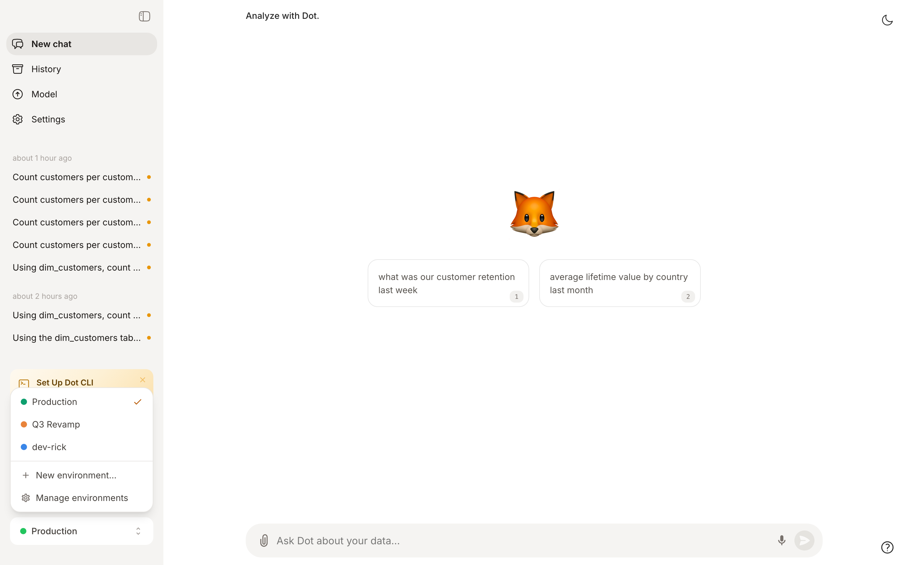
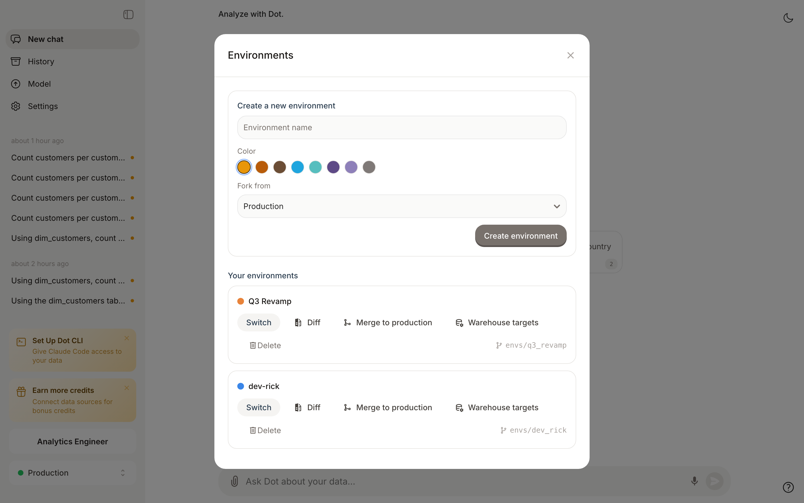
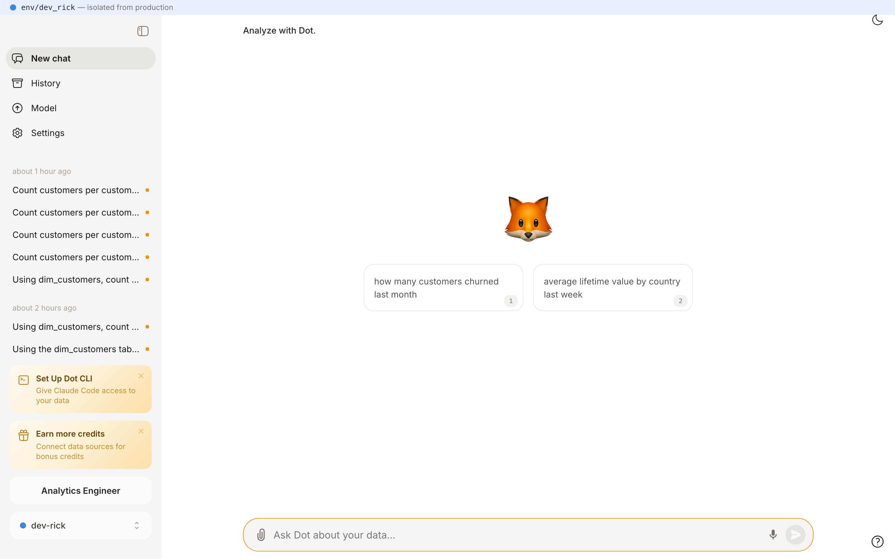
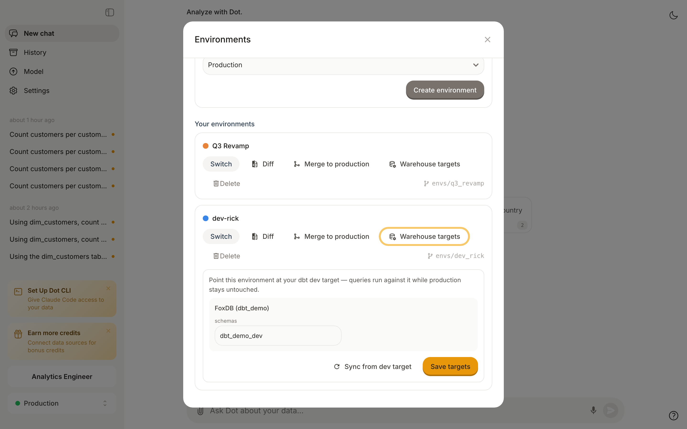
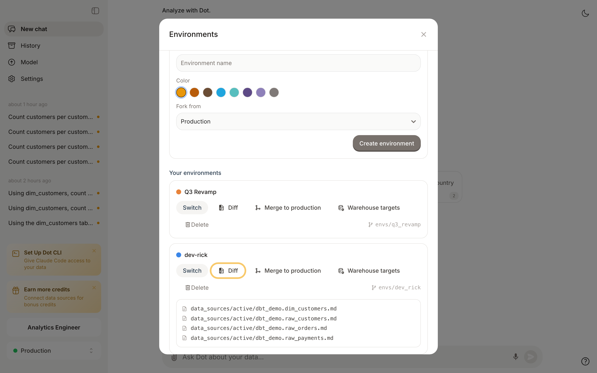
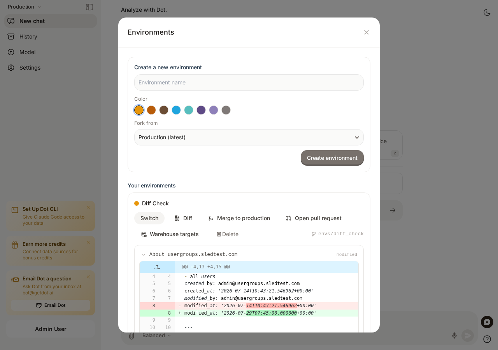

# Environments

Environments let you change Dot's knowledge — table documentation, notes, relationships, skills — without touching what your colleagues see. Each environment is an isolated copy of your data model, backed by its own git branch. You switch in, make changes, test them against real questions, and merge back to production in one click.

If you work with dbt, this will feel familiar: an environment is to Dot what a dev target is to dbt. You can even point an environment at your dbt dev schema, so Dot and dbt develop against the same data.

<figure><figcaption><p>Switch environments from the top of the sidebar. Production stays untouched while you work</p></figcaption></figure>

**Why this matters**: Your team relies on Dot's answers. Editing documentation live means every half-finished description and experimental relationship immediately shapes production answers. Environments give you a place to get it right first:

* **Safe iteration** — remodel a domain, rewrite descriptions, or test new notes while production answers stay stable.
* **Test with real questions** — chat with Dot inside the environment and verify answers before anyone else is affected.
* **dbt-style workflows** — point the environment at your dev schema/database, develop dbt models and Dot docs together, and promote both when ready.
* **Reviewable changes** - every environment is a git branch. See the exact file diff before anything reaches production.


Environments are available to **admins and modelers**. Regular users always see production.


## What's isolated, what's shared

| Isolated per environment                                      | Shared with production              |
| ------------------------------------------------------------- | ----------------------------------- |
| Table documentation, notes, relationships, reports, skills, evaluation definitions    | Database connections (overridable)  |
| Warehouse target overrides (dev schema/database)              | Users, permissions, and groups      |
| [Root](context-agent.md) sessions and their changes           | Chat history (tagged with the environment) |

Evaluation definitions live in `evaluations/<evaluation-id>.yaml` and follow the environment's Git history. Merging promotes their questions and expected answers to Production. Evaluation runs and results remain shared records with their own question snapshots and target revisions; merging does not rewrite past runs. CLI and API snapshots stay immutable; eligible manual runs can be regraded by expected-answer or tolerance corrections in the UI.

Chats you run inside an environment appear in the regular History page, tagged with the environment's name — so usage stays visible in one place.

## Create and switch

1. Click the environment switcher at the top of the sidebar (it shows **Production** by default).
2. Choose **Manage environments**.
3. Name the environment, pick a color, and click **Create environment**. The new environment forks from production, from another environment, or from a past version of production, whichever you pick under **Fork from**.
4. Switch to it with the arrows button on its row, or pick it in the switcher. The tab switches in place without reloading.

<figure><figcaption><p>Create, switch, review, merge, and delete environments in one place</p></figcaption></figure>

While an environment is active, a thin band in the environment's color runs across the top of every page, and the switcher shows the environment's name, so you always know where you are.

<figure><figcaption><p>The colored band at the top tells you this tab works in <code>env/dev_rick</code>, isolated from production</p></figcaption></figure>

Environments are per-tab: switching in one browser tab doesn't affect your other tabs, so you can keep production open side by side.

## Quick fixes from a chat

You don't need to create an environment for small fixes. When you start a [Root](context-agent.md) session from production, Dot automatically creates a throwaway environment behind the scenes. Root makes its changes there, you verify the result in the chat, and when you apply the changes to production the throwaway environment is cleaned up automatically.

This means production documentation is never edited in place — every change, however small, goes through an isolated branch.

A throwaway environment is disposable on purpose. Dot deletes it after seven days without activity, and it never gets a branch in your Git repository, even when you have environment mirroring on.

A throwaway environment is private to you. To hold on to one and share it, open **Manage environments** and click **Keep and share** on the environment. Dot then treats it like any environment you created yourself: other admins and modelers can see it, it stays until you delete it, Root leaves it alone when the chat finishes, and it gets its own `dot/env-<slug>` branch if environment mirroring is on.

## Work against your dbt dev target

By default an environment reads from the same warehouse schemas as production. For dbt-style development you can point it at your **dev target** instead:

1. In **Manage environments**, click **Warehouse targets** on the environment.
2. Enter the same values your dbt dev target uses (for example schema `dbt_demo_dev` instead of `dbt_demo` — for Snowflake: database/schema, for BigQuery: project/dataset).
3. Click **Save targets**.

<figure><figcaption><p>Point the environment at your dbt dev schema — queries run against it while production stays untouched</p></figcaption></figure>

From now on, questions asked inside this environment run against your dev schema. Dot follows dbt's defer semantics: **tables that exist in your dev schema are read from there; everything else falls back to production**. You can run `dbt build` on just the model you're changing — exactly like `dbt build --defer`.

After you've built or changed models in the dev schema, click **Sync from dev target** (or run `dot env sync-target`) to refresh the environment's table documentation from the dev schema — new columns and new tables show up in the environment only.


Target overrides redirect **queries and metadata sync** for that environment only. The connection itself — credentials, host, warehouse — is still shared with production.


## Review and merge

When the work is ready:

1. Open **Manage environments** and click **Review changes** to see every file the environment changed compared to production. Each file is marked `added`, `modified` or `deleted`.
2. Click a file to read the change itself, line by line, with additions in green and removals in red. One file stays open at a time, so click another to switch. You don't have to leave Dot to see what a merge would do.
3. Click **Merge to production** and confirm. Dot merges the environment's branch into the production model.
4. Optionally delete the environment after merging — or keep it for the next iteration.

<figure><figcaption><p>The diff lists every documentation file the environment changed</p></figcaption></figure>

<figure><figcaption><p>Click a file to read its changes line by line</p></figcaption></figure>

Admins can always merge. Modelers can merge by default, and admins can turn off "Can merge changes to production" under Settings, then Advanced Settings, then Modeler Permissions.

The merge is done once the change lands in production. If something that follows, such as updating an app, fails, Dot says what is still updating and keeps trying on its own. You don't need to retry.

### Promote with a proposal instead

If you want someone to review the changes before they reach production, open a proposal. On the **Review changes** page, click **Open proposal**. Nothing is proposed until you do. The proposal lands in the Proposals inbox, and a reviewer can merge it, merge only the files they pick, or reject it. Anyone who can use environments can open a proposal. Merging is the part that needs the permission.

If you connect GitHub and Dot mirrors environments to Git, a reviewer who can merge also sees **Open as GitHub pull request** on the proposal. Your team reviews the diff on GitHub, and Dot picks up the change once it is merged.


Mirroring is on by default. Each lasting environment gets its own branch in the same repository as production, named `dot/env-<slug>`. You can turn this off with the "Mirror environments to Git" toggle under Settings, then Version Control. The throwaway environments Root creates for quick fixes aren't mirrored, unless you keep one.


### When production moves on

If production changes the same files while a proposal is open, the proposal shows which files conflict. Click **Resolve with Dot** and Root works through each file, keeping the intent of both sides. For an environment's proposal, Root brings production's changes into the environment and updates the same proposal. Production itself does not change. You can then merge as usual.

### Test a proposal before you merge it

On a proposal made from a chat, click **Test in environment**. Dot makes a private temporary environment with the proposal's changes on top of production, and switches you into it so you can ask Dot real questions first. It needs the changes to apply cleanly to production, so resolve any conflicts first.

The environment is yours alone, and it can never be merged into production directly. The proposal still merges as before. If production or the proposal changes later, the environment is marked stale. Click it again to bring it up to date. If your own edits there stand in the way, Dot asks before it opens a new one in its place.

## For coding agents: CLI & API

Environments are fully scriptable, which makes them the natural unit of work for AI coding agents: create an environment, make changes, verify, merge — without ever touching production. The [Dot CLI](../integrations/cli.md) ships an `env` command group:

```bash
dot env list                          # Production + all environments
dot env create "dev-rick" --color "#3A86E8"
dot env use dev-rick                  # all following CLI commands run in this env
dot env target set dev-rick db.getdot.ai:5432:db --schema dbt_demo_dev
dot env sync-target dev-rick          # refresh env docs from the dev schema
dot env diff                          # changed files vs production
dot env conflicts                     # predict merge conflicts
dot env merge dev-rick --confirm      # promote to production
dot env delete dev-rick --confirm
```

The active environment (`dot env use`) is sent as an `X-Dot-Environment` header on every request. Override it per command with `--env <id>` or the `DOT_ENV` environment variable.

Using the [REST API](api/README.md) directly, send the same header with the environment's id:

```bash
# Everything below is scoped to the environment — production is untouched
curl -H "X-API-KEY: $DOT_API_KEY" -H "X-Dot-Environment: $ENV_ID" \
  -H "Content-Type: application/json" https://app.getdot.ai/api/agentic \
  -d "{\"messages\": [{\"role\": \"user\", \"content\": \"Which columns does dim_customers have?\"}], \"chat_id\": \"$(uuidgen)\"}"
```

| Endpoint                              | Purpose                                  |
| ------------------------------------- | ---------------------------------------- |
| `GET /api/environments`               | List environments                        |
| `POST /api/environments`              | Create (`{"name", "color", "source_env_id"}`) |
| `GET /api/environments/{id}/diff`     | Changed files vs production              |
| `GET /api/environments/{id}/conflicts`| Predict merge conflicts                  |
| `PUT /api/environments/{id}/targets`  | Set warehouse target overrides           |
| `POST /api/environments/{id}/sync_target` | Sync env docs from the dev target    |
| `POST /api/environments/{id}/merge`   | Merge to production (`{"confirm": true}`) |
| `POST /api/environments/{id}/proposal` | Open a proposal for review |
| `POST /api/environments/{id}/update_from_production` | Bring production's changes into the environment |
| `DELETE /api/environments/{id}?confirm=true` | Delete                            |

A typical agent recipe — fix documentation for a model you just changed in dbt:

```bash
dot env create "fix-customer-tier" && dot env use fix-customer-tier
dot env target set fix-customer-tier <connection-id> --schema dbt_dev_alice
dbt build --select dim_customers     # build the model into the dev schema
dot env sync-target fix-customer-tier
dot ask "Which columns does dim_customers have?"   # verify Dot sees the dev version
dot env merge fix-customer-tier --confirm --delete-after
```
