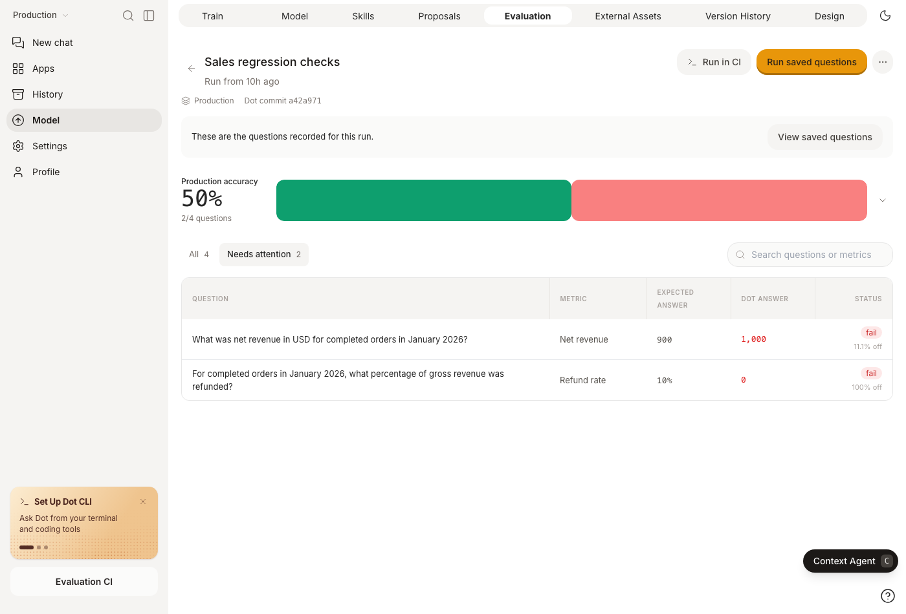

# Evaluation

Evaluations check whether Dot answers your business questions correctly. Start with a few questions that matter—revenue, paying customers, conversion—and pair each with a trusted answer from a dashboard, reviewed SQL, or a governed metric.

## Create and run

1. Open **Model → Evaluation → New evaluation** and follow the setup conversation.
2. Give each question a clear metric, time period, and relevant filters. Use the same data snapshot for the expected answer and Dot's query.
3. Run the evaluation. It tests the active environment, so use the [environment switcher](environments.md) to choose a saved version first.
4. Open **Needs attention** to inspect failures and their linked conversations.

Dot compares the observed and expected values. Numeric tolerance defaults to **3%**; set it to **0** for an exact check. A completed run can still contain failures or errors. Evaluations use Economy mode and may make one follow-up attempt when the first answer needs clarification.

<figure><figcaption>
Inspect the expected and observed answers, then open the conversation to understand a failure.
</figcaption></figure>

Fix missing context or incorrect metric definitions, then rerun. Change an expected answer only when its business definition or source data changes.

## Versions and environments

Evaluations are saved as `evaluations/<id>.yaml` in the model repository. Each save creates a version. Changes stay in their environment until merged to Production and participate in [GitHub](version-control/github.md) or [GitLab](version-control/gitlab.md) sync.

Use **History** to inspect or restore an older version. Archiving preserves the file, history, and previous runs. CLI/API runs keep their submitted questions and results; correcting expected answers or tolerances can regrade eligible manual runs. A frozen training keeps grading its pinned evaluation version.

## Run in CI

Choose **Run in CI** to export the saved questions and copy terminal commands or a GitHub Actions workflow. CLI suites use JSON or YAML and are separate from the model repository's file format.

Follow [Evaluations in CI](api/evaluations-in-ci.md) for setup and examples.
