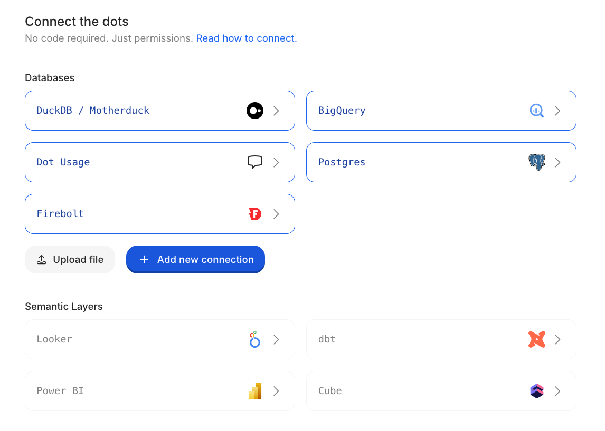

# Getting Started

Not using Dot yet? [Sign up for free.](https://app.getdot.ai/register)

---

## 1. Connect Your Data

Go to **Settings → Connections** and add your data warehouse, semantic layer, or BI tool.

No code required—just permissions.

<figure><figcaption></figcaption></figure>

[See all integrations →](../integrations/README.md)

---

## 2. Describe What You Need

Open the **Context Agent** and tell it what you're trying to accomplish. It will interview you, explore your data, and set things up.

<figure><figcaption></figcaption></figure>

You don't need to configure everything upfront—start with one use case and expand from there.

[Learn more about the Context Agent →](context-agent.md)

---

## 3. Start Asking Questions

Ask in plain English. Dot queries your data, visualizes results, and explains what it found.

You can ask questions directly in Dot, or connect Slack or Microsoft Teams so your whole team can get answers where they already work.

<figure><figcaption></figcaption></figure>

[Set up Slack & Teams →](../integrations/slack-and-teams/)

---

## What's Next

**Fine-tune how Dot understands my data**\
[Model →](model/)

**Control who can access what**\
[Permissions →](permissions.md)

**Schedule recurring reports**\
[Scheduling →](scheduling.md)
