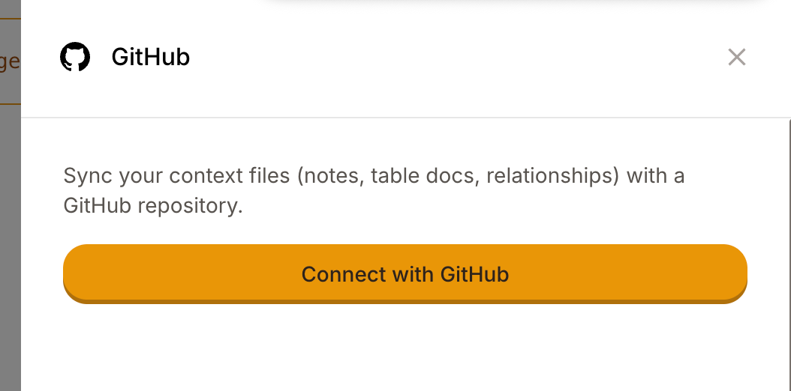
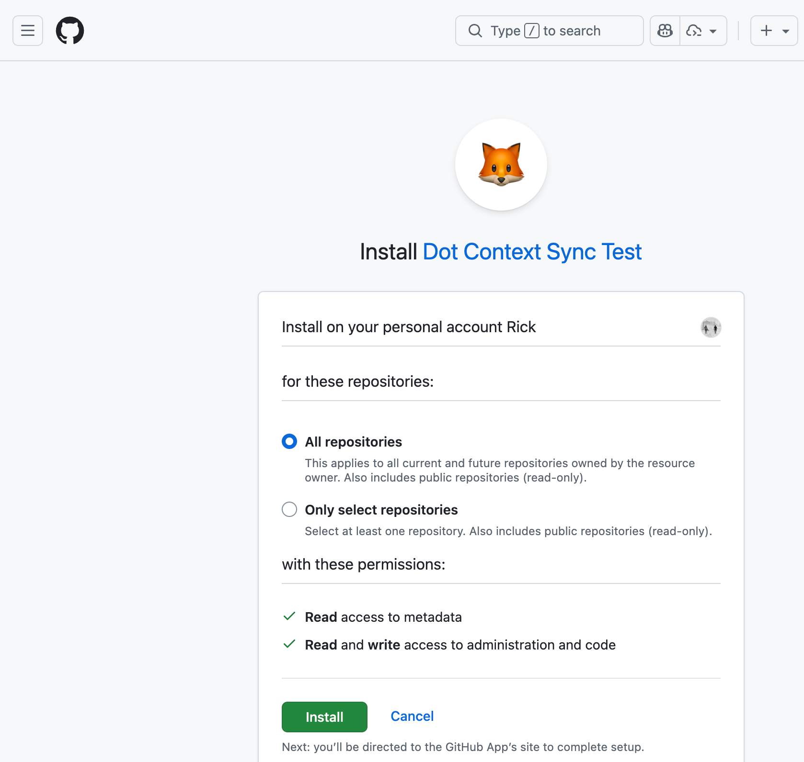

# GitHub Sync

GitHub Sync enables bidirectional synchronization between Dot's context files and a GitHub repository.

## Why GitHub Sync Matters

The real power lies in **interoperability**. By storing context in GitHub using open formats (Markdown with YAML frontmatter), you enable:

- **Coding agents** (Claude Code, Cursor, GitHub Copilot) to read and contribute to the same context Dot uses
- **CI/CD pipelines** to validate or transform documentation automatically
- **Team collaboration** through pull requests and code review

Your data documentation becomes a shared asset that multiple AI assistants can leverage.

## What Gets Synced

```
notes/
├── active/          # Active notes
└── inactive/        # Archived notes

data_sources/
├── active/          # Active table documentation
└── inactive/        # Archived table documentation

relationships.yaml   # Table relationships
```

All files use Markdown (`.md`) with YAML frontmatter, or plain YAML.


Only context files are synced. Database connections, user settings, and chat history remain in Dot.


## Setting Up GitHub Sync

### Prerequisites

- Admin access to your Dot organization
- A GitHub account with permission to install GitHub Apps

### Step 1: Connect with GitHub

1. Go to **Settings** > **Version Control** > **GitHub**
2. Click **Connect with GitHub**

<figure><figcaption><p>Click Connect with GitHub to start the setup</p></figcaption></figure>

3. Install the **Dot Context Sync** GitHub App
4. Choose repository access — either **All repositories** or **Selected repositories**

<figure><figcaption><p>Choose repository access during installation</p></figcaption></figure>


Both "All repositories" and "Selected repositories" work. If you choose "Selected repositories", you'll need to create your sync repository manually on GitHub first (see Step 2).


### Step 2: Configure Your Repository

**Select existing repository** (recommended): Select a repository and branch from the list. This works with both "All repositories" and "Selected repositories" access.


**Tip**: If you use "Selected repositories" access, create an empty private repository on GitHub first. When you install or update the GitHub App, make sure the repository is included in the App's access list. It will then appear in Dot's repository dropdown.


**Create new repository**: Enter a name, choose a branch, and Dot will create a private repo with all your existing context. This option requires the GitHub App to be installed with "All repositories" access.


If your repository already has files (like a README), Dot will preserve them. Dot only manages files in the `notes/`, `data_sources/`, and `relationships.yaml` paths.


### Step 3: Enable Auto-Sync

Toggle **Auto-sync enabled** to automatically push changes when you update context in Dot's UI.

## How Sync Works

**Push (Dot → GitHub)**: Changes in Dot automatically commit to GitHub when auto-sync is enabled. When you first configure a repository, Dot pushes all existing context files immediately.

**Pull (GitHub → Dot)**: Changes in GitHub (commits, merged PRs) automatically sync to Dot via webhooks.


**Collaboration workflow**: Team members or AI coding assistants can submit pull requests. Once merged, changes automatically appear in Dot.


**Manual sync**: Force push or pull all files from Settings if needed.

## Limitations

- **One repository per workspace**, syncing with a single branch
- **Markdown and YAML only** in the specified directories
- **Last write wins** for simultaneous edits (no conflict resolution UI)

**Not synced**: Database credentials, user accounts, chat history, scheduled reports, organization settings.

## Troubleshooting

| Issue | Solution |
|-------|----------|
| Sync not working | Check Settings > GitHub for connection status and auto-sync toggle |
| Permission errors | Verify the GitHub App has access to your repo in GitHub Settings > Applications |
| Files not appearing | Ensure files are in `notes/`, `data_sources/`, or `relationships.yaml` with correct extensions |
| Can't create repository | This requires "All repositories" access. Create the repo manually on GitHub and select it instead |
| Sync disabled unexpectedly | If you remove a repository from the GitHub App's access, Dot automatically disables sync. Re-add the repo and re-enable sync in Settings |

## Security

Repositories created by Dot are private. Uses secure GitHub App tokens with scoped access. All webhook payloads are cryptographically verified.
