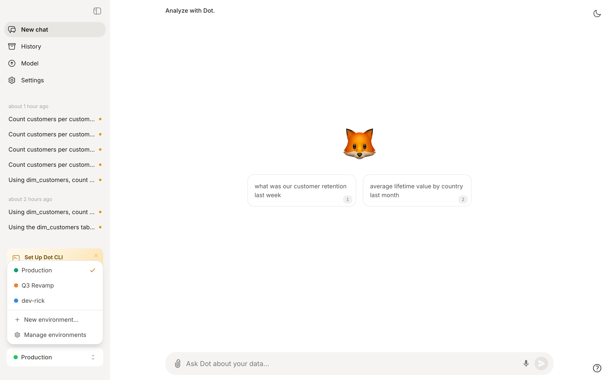

# Maintaining Dot

Setting Dot up gets you answers. Maintaining Dot is what makes people trust them.

**Why this matters**: four things make Dot better over time. The models improve, we improve the agent around them, and your users get better at asking — but the fourth is yours, and it is the one that compounds. A clean data model with well-written notes pays twice: better answers, and lower cost, because Dot iterates and backtracks less. It is also where the problems are. A disappointing answer used to mean the model could not reason well enough; today that is rare. Nine times out of ten it is missing or ambiguous context. What you are really building is an environment in which the agent finds it hard to be wrong.

This page is for whoever owns Dot. If you are a user who wants better answers, read [Dot-Maxxing](https://www.getdot.ai/blog/dot-maxxing) instead.

---

## Fix things at the source first

When something is confusing, the instinct is to write a note explaining it. Write the note — but fix the source first, or you end up maintaining an explanation of a problem you could have removed.

A data source that joins everything to everything, a thousand fields where only half are maintained, two revenue fields that differ in ways nobody remembers — that is *accidental* complexity. Your business has genuine complexity and you have to model it; accidental complexity is technical debt that crept in, and it is worth attacking directly. Narrower sources, consistent names, fewer ambiguous fields. Every hour spent there pays off in every answer afterwards.

Then write the note. Some things you cannot remove — a legacy field that still feeds a report someone depends on — and that rule belongs in the text: which field to use when, and why the other one still exists.

Be careful what you feed Dot, too. An exported Confluence space is human-readable, not agent-ready. Documentation dumped in wholesale is one of the most common causes of vague answers.

---

## Write notes the way an agent reads them

- **One topic per note.** Atomic notes are easier to update, easier to retrieve, and cheaper to load.
- **Split anything oversized.** A very large note — past roughly 50,000 characters — gets pulled in whole when only a paragraph was needed. Break it up and only the relevant piece loads.
- **Organize so ownership is obvious.** In a small setup, grouping by type works well: organization information, behaviour and formatting rules, metrics glossary. Once you are big enough that no single person can own all of it, split by team or domain first — marketing, finance, supply — and group by type inside each. What you are after is being able to say "this team owns this folder"; ownership gets much harder when the structure cuts across teams.
- **Say what is out of scope — and where to go instead.** A note that politely refuses off-topic questions, gives a few counter-examples, and names the right tool for them ("for technical documentation, use X") beats a bare refusal: people learn the boundary instead of hitting it repeatedly. Expect to iterate on it; you will not anticipate everything up front. Notes take effect within seconds, so this is cheap to tune.

---

## Training is agreeing on a source of truth

Training Dot does not mean fine-tuning a model. It means aligning Dot with the numbers your company already trusts.

The principle underneath: there is no accuracy in a vacuum. If nobody has defined how a metric should be calculated, no agent can be right about it, and you have nothing to benchmark against.

So work one domain at a time:

1. Pick two to five dashboards you trust end to end.
2. Give that domain one owner.
3. Ask Dot the questions those dashboards already answer.
4. Treat every disagreement as a work item. Either Dot is missing context, or your dashboard and your warehouse disagree — which is worth finding out either way.

If the same question asked two different ways returns two different numbers, treat it as a high-value problem rather than a quirk. Nothing destroys trust faster.


A good ritual: collect five to ten conversations where Dot got it wrong and root-cause them together in one sitting. Patterns show up quickly, and a single fix usually closes several of them.


---

## Feedback: the thumbs-down is the valuable one

Dot learns from corrections, not from praise. 👍 saves a good query for reuse. 👎 tells you the knowledge base is missing something — which is the more useful signal.

Once a week:

- Filter History for conversations marked `problem` and fix the context behind them.
- Review [Root's](context-agent.md) proposals. Work **bottom-up rather than newest-first** — later proposals often build on earlier ones, and approving out of order creates conflicts.
- Put it on a fixed day so a backlog never builds. Friday or Monday both work.

<figure><figcaption>
Conversations with a dislike show up as <code>problem</code> in the admin History
</figcaption></figure>

---

## Prune with the numbers Dot already gives you

Open **Full logs → Lineage** on an answer and you can see which notes were actually used, and which were merely loaded into context.

- Loaded often **and** used often: valuable. Keep it accurate.
- Loaded often but rarely used: it is charging you on nearly every question. Retire it.
- Never loaded at all: ask why it exists.

Context also goes stale — the business moves and the note does not. Re-read your foundational notes on a schedule rather than waiting for someone to notice.

---

## Change things safely

Never change production directly. Create an [environment](environments.md), make the change there, test it by chatting inside it, and merge when you are convinced. You do not have to merge at all — an environment is a fine place to just try something.


Two things that surprise people:

* **Settings are workspace-global, not per environment.** Changing a setting while inside a dev environment takes effect in production immediately.
* **Reconnecting a data source and syncing erases the context Dot learned on it.** Reconnect only when you mean to.


Everything is [version controlled](version-control/README.md), so a change that makes things worse is one revert away.

<figure><figcaption>
Work in an environment while production stays untouched
</figcaption></figure>

---

## Spend

More usage costs more, and that is fine — it means people are getting answers. What you want is for the spend to land on work worth doing, and a good part of that is configuration.

- Default to the economical energy mode and escalate deliberately. Most questions do not need the frontier.
- Set per-user credit limits. Constraints are useful: they push people to spend their budget on what actually matters to them.
- Usage follows a power law — a handful of people account for most of the spend. Talk to them rather than emailing everyone.

---

## The routine, and who owns it

**Weekly, twenty minutes, one named owner.** The problem conversations, the pending proposals, and a skim of what new users asked — first questions from new people are the best signal for what your documentation assumes but never says.

**Every second week, forty-five minutes, with the people who ask the questions.** One domain, its trusted dashboards, and the questions it needs answered. It also shows the people whose questions these are that somebody is tending the system.

| Role | Owns |
| --- | --- |
| Admin | Connections, [permissions](permissions.md), and merging proposals — modelers can review them too, if you let them |
| Modeler | Notes, the data model, metric definitions, playbooks, canonical sources |
| User | Feedback on answers, and saying "remember this" when Dot gets it wrong |

The most common failure is not a bad data model. It is that nobody in particular owns any of this. Put one name against the weekly twenty minutes.
