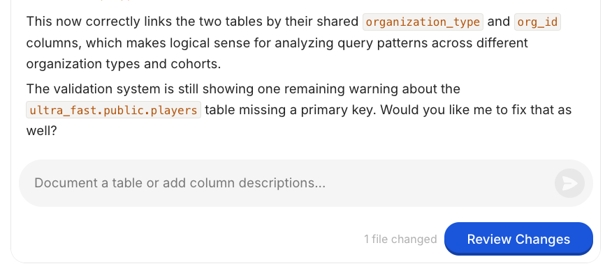

# Maintaining Dot

Setting Dot up gets you answers. Maintaining Dot is what makes people trust them.

**Why this matters**: the teams that get the most out of Dot are not the ones with the biggest data model. They are the ones where somebody spends twenty minutes a week looking at what Dot got wrong and fixing the context behind it. That loop is the whole difference between "we tried an AI analyst" and "I ask Dot before I ask a colleague".

This page is for whoever owns Dot — usually an admin or a modeler. If you are a user who wants better answers, read [Dot-Maxxing](https://www.getdot.ai/blog/dot-maxxing) instead.

---

## The weekly twenty minutes

Three things, in this order.

**1. Read the thumbs-down.** Every 👎 is either missing context or missing data. Missing context you fix in minutes with a note. Missing data goes on your roadmap. Open History as an admin and filter for conversations marked `problem`.

<figure><figcaption><p>Conversations with a dislike show up as <code>problem</code> in the admin History</p></figcaption></figure>

**2. Review the proposals.** When Dot notices something worth remembering — a corrected metric, a renamed table — it sends a proposal to [Root](context-agent.md) instead of silently editing. Merge the good ones, reject the rest. Rejecting is not a failure; it is the review working.

<figure><figcaption><p>Review what changed before anything goes live</p></figcaption></figure>

**3. Skim what new people asked.** First questions from new users are your best signal for what your documentation assumes and never says.

---

## Teach Dot how you think, not just what your columns mean

Most weak answers are not model failures. They are a colleague being asked to do an analysis nobody explained to them.

The trick is to give enough context and to teach Dot how *you* approach a problem. One mobility customer wrote their A/B testing playbook down as a note — how they evaluate lift, which guardrail metrics matter, when a result counts as real. Every experiment analysis now follows that pattern instead of being reinvented per question.

Be blunt when precision matters. A note can say exactly this:

```
ALWAYS: when someone asks for ERP sales targets, use SALES_PLAN_REVENUE_INTERNAL_NET_DAILY
from CORE.FCT_SALES_BUDGETS_DAILY.
```

And tell Dot what it *cannot* see. A short note listing the data you do not expose stops Dot from improvising around a gap — it will say the question is out of scope instead.

---

## One question, one answer

The fastest way to lose trust is two defensible numbers for the same question.

It usually looks like this: two tables both legitimately describe revenue, a colleague asks the same question twice a week apart, and the answers differ. Both queries are correct. The setup is wrong.

Pick the canonical source for each important metric and say so in a note. Then, after any bulk change to your context or model, re-ask your ten most important questions and check the numbers still match what you expect. Bulk changes are exactly when defaults move quietly.


Ask Dot the same question in two different phrasings once in a while. If the numbers disagree, you have found a context problem before your CFO does.


---

## Keep the context lean

More notes is not more knowledge. Dot loads notes by relevance, so a bloated knowledge base means more competing context on every question — slower, more expensive, and less precise.

A pattern worth avoiding: a bulk rewrite split a tidy set of notes into far more, smaller ones. Nothing looked broken, but the median number of notes pulled into each question went from around a dozen to over fifty, cost per question climbed, and a default table quietly changed along the way.

So, every few weeks:

- Delete notes that duplicate each other, and merge the near-duplicates.
- Check that references between notes still resolve — renamed files leave dead pointers behind.
- Ask whether a note has ever shaped an answer. Open **Full logs → Lineage** on a few answers to see which notes actually got used.

---

## Change things safely

You do not have to experiment in production.

Create an [environment](environments.md), write your notes there, and chat inside it to see whether answers improve. Nothing you do there touches what your team sees, and you only merge when you are convinced. You are not obliged to merge at all — an environment is a fine place to just try something.

<figure><figcaption><p>Work in an environment while production stays untouched</p></figcaption></figure>

When an answer is wrong, capture the correct query. A wrong answer plus its ground truth is the single most useful thing you can hand to Dot — far more useful than a description of what went wrong. Everything is [version controlled](version-control/README.md), so a change that makes things worse is one revert away.

---

## The bi-weekly working session

Twenty minutes a week keeps Dot healthy. If you want it to get noticeably better, book forty-five minutes every second week with the people who actually ask the questions.

Bring one real use case: the business questions a team asks each week, and the dashboard that already answers them. Ask Dot those questions. Where Dot and the dashboard disagree, you have your work list — and the dashboard's own logic is usually the context that was missing.

That session also does something a solo review cannot: it shows the people whose questions these are that somebody is tending the system.

---

## Who owns what

| Role | Owns |
| --- | --- |
| Admin | Connections, [permissions](permissions.md), and merging proposals — modelers can review them too, if you let them |
| Modeler | Notes, the data model, metric definitions, playbooks, canonical sources |
| User | Feedback on answers, and saying "remember this" when Dot gets it wrong |

The most common failure is not a bad model. It is that nobody in particular owns any of this. Put one name against the weekly twenty minutes.
