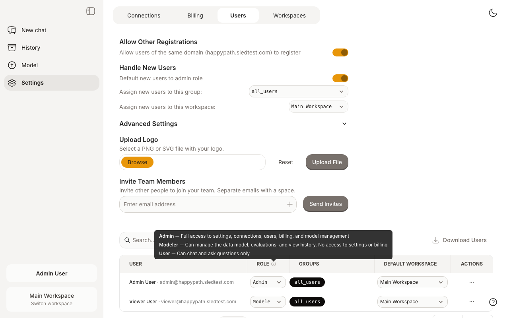
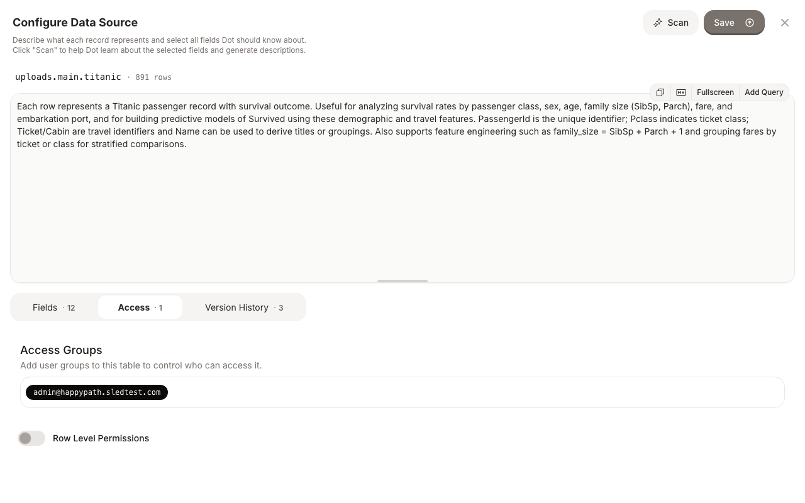
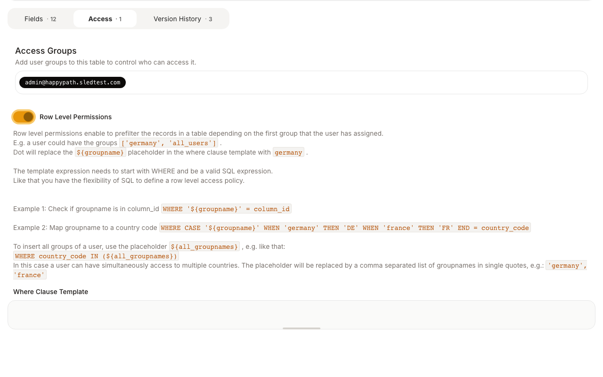

# Permissions

## Roles in Dot

There are three roles that control what you can do in Dot:

* **Admin** — Full access to settings, connections, users, billing, and model management.
* **Modeler** — Can manage the data model, run evaluations, and view chat history. No access to settings, billing, or user management.
* **User** — Can chat and ask questions only.

Roles are managed by admins on the Settings > Users page. Hover over the info icon next to the Role column to see a summary of each role.

<figure><figcaption><p>Users page with role descriptions tooltip</p></figcaption></figure>

### Access Matrix

| Feature | Admin | Modeler | User |
|---|:---:|:---:|:---:|
| Chat | Yes | Yes | Yes |
| History | Yes | Yes | — |
| Model page | Yes | Yes | — |
| Evaluation | Yes | Yes | — |
| Settings | Yes | — | — |
| Connections | Yes | — | — |
| Billing | Yes | — | — |
| User management | Yes | — | — |

## Data Access Control

Groups manage who gets access to what data. A user can only query a table if they share at least one group with that table.

* A user can belong to multiple groups and a table can also belong to multiple groups.
* By default, new tables are assigned the group `all_users` and new users are also added to this group.
* An admin can configure that new users don't automatically get the `all_users` group if your organization operates on a "need to know" basis.

To manage groups for a table, open the table on the Model page and click the **Access** tab.

<figure><figcaption><p>Access groups for a table on the Model page</p></figcaption></figure>

## Row Level Permissions

Groups can also be used to apply row-level filtering on tables.

To enable row level permissions, open a table on the Model page, go to the **Access** tab, enable the **Row Level Permissions** toggle, and specify a where clause template.

The where clause should contain the placeholder `${groupname}`, which is replaced by the user's first group name at query time. You can also use `${all_groupnames}` to match against all of a user's groups.

**Examples:**

```sql
-- Filter by a single group
WHERE '${groupname}' = country_code

-- Map group names to values
WHERE CASE '${groupname}' WHEN 'germany' THEN 'DE' WHEN 'france' THEN 'FR' END = country_code

-- Match any of the user's groups
WHERE country_code IN (${all_groupnames})
```

<figure><figcaption><p>Row Level Permissions configuration on the Access tab</p></figcaption></figure>
