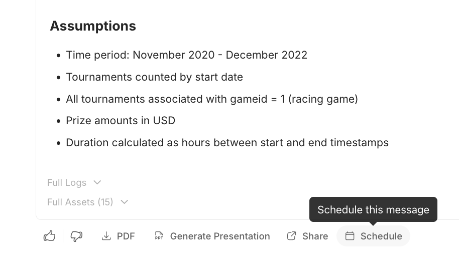
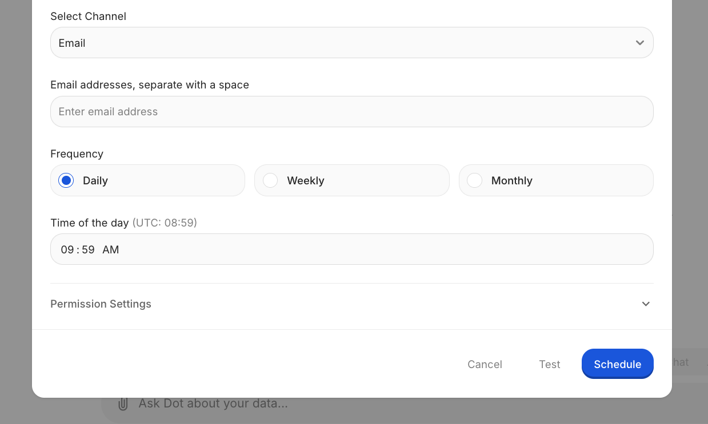

# Scheduling

Schedule Deep Analysis reports to be delivered automatically via Email, Slack, or Teams.

Unlike dashboard snapshots that show numbers, scheduled reports explain what changed and why—with trends, anomalies, and recommendations included.

### Use Cases

**Meeting prep**: Schedule 30 minutes before recurring meetings. Your team gets context without manually checking dashboards.

**Weekly reviews**: "What changed this week?" delivered Monday morning to Slack—ready for discussion.

**Replace dashboard check-ins**: Instead of pulling data, insights come to you.

### Creating a Schedule

1. Run a Deep Analysis query
2. Click the **Schedule** button on the response

<figure><figcaption>
Click Schedule to set up recurring delivery
</figcaption></figure>

3. Choose delivery channel (Email/Slack/Teams)
4. Add recipients
5. Set frequency: Daily, Weekly (pick day), or Monthly (pick date)
6. Click **Schedule**

<figure><figcaption>
Configure channel, recipients, and frequency
</figcaption></figure>

Click **Test** to send a preview before committing.

### Managing Schedules

Open the schedule modal on any scheduled message to:
- Edit frequency or recipients
- View run history (past deliveries and costs)
- Delete the schedule

### Costs & Limits

- **1 ACC** (Agent Compute Credit) per scheduled run
- **Maximum frequency**: 2 times per day

### Admin Feature: Run As User

Admins can schedule reports to run as another user—useful for delivering reports with that user's data permissions.
